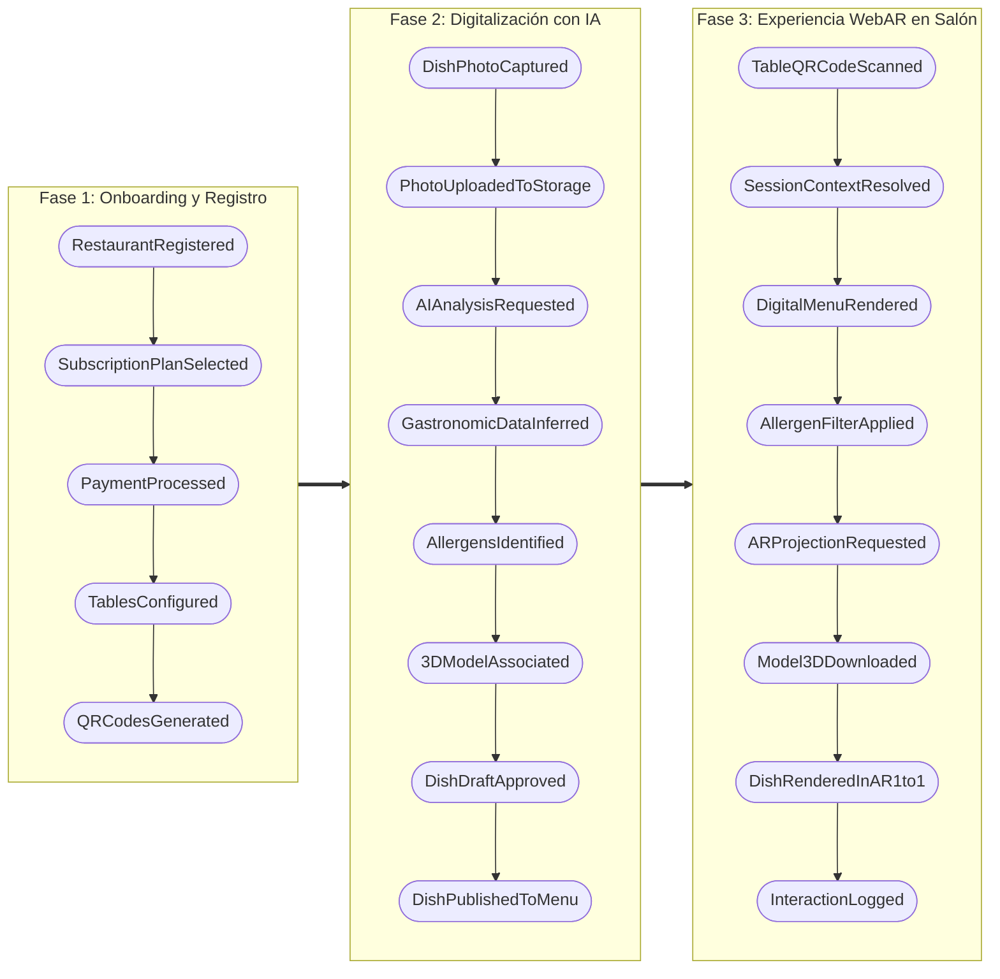
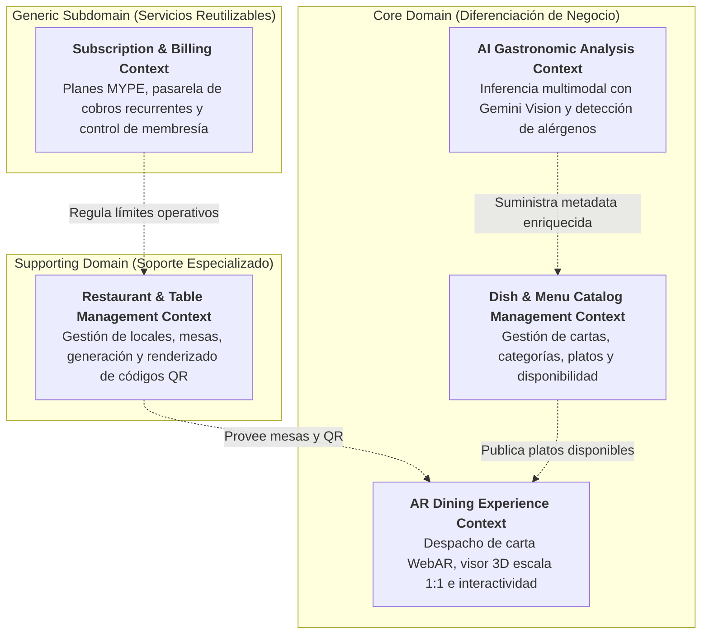
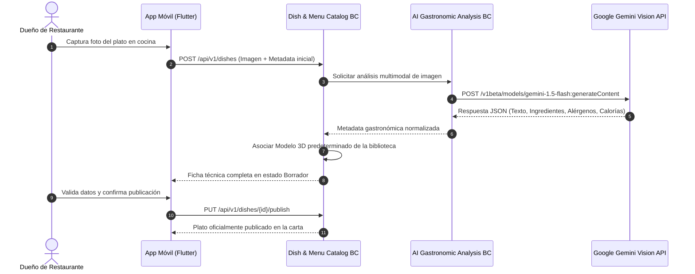
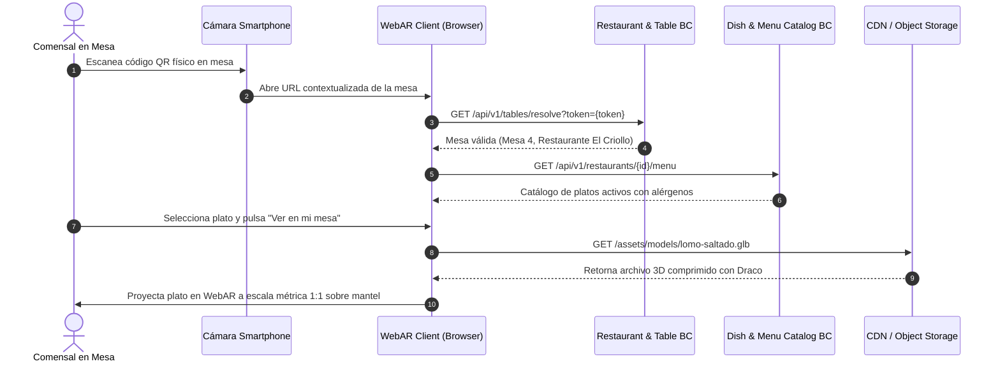
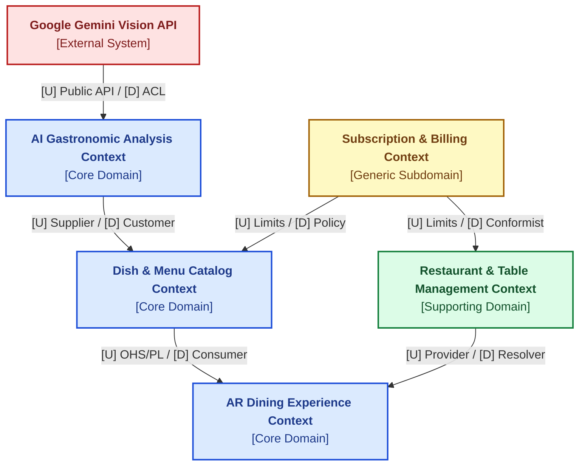
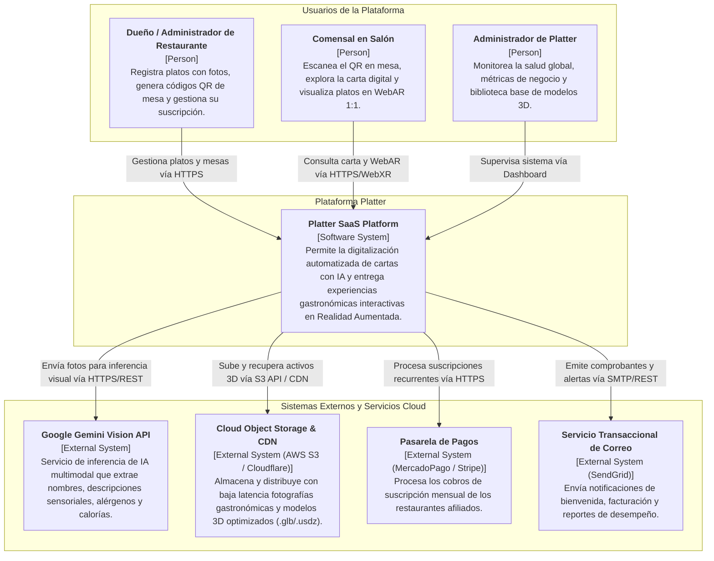
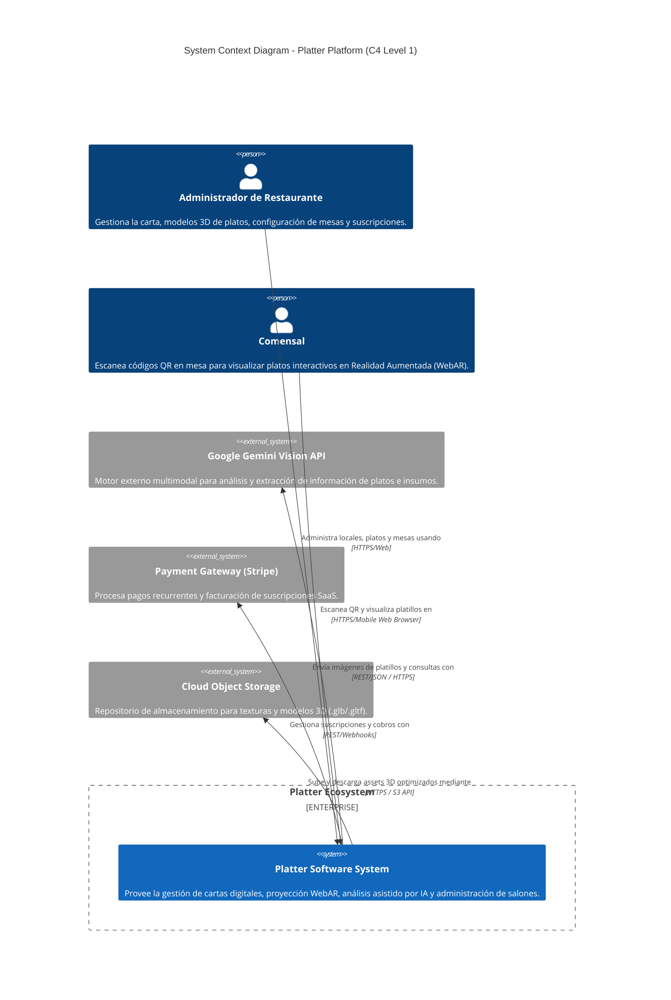
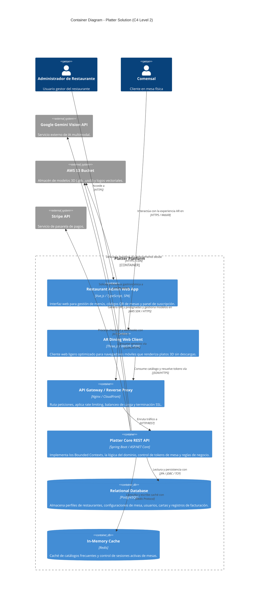
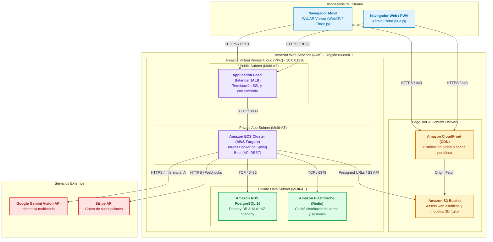

  

<h3 align="center">
Universidad Peruana de Ciencias Aplicadas
</h3>

<h3 align="center">
Ingeniería de Software
  
1ASI0728 Arquitecturas de Software Emergentes
202620
  
NRC: 9046
  
Docente: Rojas Malasquez, Royer Edelwer
  
<strong>Informe de Trabajo Final</strong>  
  
Producto: Platter
  
  
<strong>Integrantes</strong>  
  
Alvarado De La Cruz , Juan Carlos (U202216150) 
  
Duran Diaz, Antonio Rodrigo (U202215721)
  
Nakasone Gomes, Marco Antonio (U202210790)
  
Teves Samaniego, Joan Fernando (U202117303)
  
 

**Septiembre - 2026**

</h3>

# Contenido

## Tabla de contenidos

- [Registro de versiones del informe](#registro-de-versiones-del-informe)

- [Project Report Collaboration Insights](#project-report-collaboration-insights)

- [Contenido](#contenido)

- [Student Outcome](#student-outcome-1)

- [Capítulo I: Introducción](#capitulo-i-introduccion)

# Student Outcome

# Capítulo I: Introducción

## 1.1. Startup Profile

### 1.1.1. Descripción de la Startup

### 1.1.2. Perfiles de integrantes del equipo

## 1.2. Solution Profile

### 1.2.1 Antecedentes y problemática

### 1.2.2 Lean UX Process.

#### 1.2.2.1. Lean UX Problem Statements.

#### 1.2.2.2. Lean UX Assumptions.

#### 1.2.2.3. Lean UX Hypothesis Statements.

#### 1.2.2.4. Lean UX Canvas.

## 1.3. Segmentos objetivo.

# Capítulo II: Requirements Elicitation & Analysis

## 2.1. Competidores.

### 2.1.1. Análisis competitivo.

### 2.1.2. Estrategias y tácticas frente a competidores.

## 2.2. Entrevistas.

### 2.2.1. Diseño de entrevistas.

### 2.2.2. Registro de entrevistas.

### 2.2.3. Análisis de entrevistas.

## 2.3. Needfinding.

### 2.3.1. User Personas.

### 2.3.2. User Task Matrix.

### 2.3.3. Empathy Mapping.

### 2.3.4. As-is Scenario Mapping.

## 2.4. Ubiquitous Language.

# Capítulo III: Requirements Specification

## 3.1. To-Be Scenario Mapping

## 3.2. User Stories.

## 3.3. Impact Mapping.

## 3.4. Product Backlog.

# Capítulo IV: Strategic-Level Software Design

## 4.1. Strategic-Level Attribute-Driven Design.

### 4.1.1. Design Purpose

El propósito del diseño arquitectónico para **Platter** consiste en establecer la estructura estratégica, táctica y operativa de una plataforma SaaS concebida para revolucionar la digitalización de cartas gastronómicas en el segmento de micro y pequeñas empresas (MYPE) y brindar una experiencia inmersiva sin fricción a los comensales en salón mediante Realidad Aumentada (WebAR) e Inteligencia Artificial multimodal.

La problemática diagnosticada en los capítulos precedentes evidencia que la mayoría de los restaurantes MYPE carecen de recursos técnicos y financieros para implementar cartas interactivas tridimensionales: los métodos actuales basados en cartas físicas o documentos PDF accesibles mediante códigos QR estándar resultan estáticos, tediosos de actualizar y fallan en comunicar la volumetría real, ingredientes críticos y alérgenos de los platos. Por otro lado, las soluciones de Realidad Aumentada pioneras en el mercado internacional demandan procesos de fotogrametría manual con costos prohibitivos (superiores a £49 por plato) y exigen que el comensal descargue aplicaciones móviles nativas pesadas en su teléfono personal, generando una severa fricción que desalienta su uso en mesa.

Frente a esta brecha, el diseño de software de Platter satisface las necesidades de negocio y de los segmentos objetivo a través de los siguientes pilares de arquitectura:
1. **Digitalización Automatizada e Inteligente:** Un pipeline de procesamiento en el backend que consume la API de **Google Gemini Vision** para transformar una simple fotografía tomada con un smartphone en una ficha gastronómica estructurada (nombre comercial, descripción sensorial, desglose de ingredientes, detección de alérgenos normados y cálculo calórico estimado) en un tiempo inferior a 3.5 segundos.
2. **Biblioteca Gastronómica 3D Normalizada:** Un catálogo centralizado de modelos tridimensionales fotorrealistas optimizados en formatos estándar (GLB y USDZ) calibrados a escala métrica 1:1, eliminando la barrera económica del modelado individual para restaurantes pequeños.
3. **Acceso WebAR sin Descargas ni Registro:** Una arquitectura de consumo público sin estado que permite a cualquier comensal escanear un código QR en mesa y proyectar de manera instantánea el plato en Realidad Aumentada mediante estándares web nativos (**WebXR Device API** para Android y **AR Quick Look** para iOS), prescindiendo totalmente de autenticación y de descargas de aplicaciones en tiendas de apps.
4. **Arquitectura Limpia y Modular en Spring Boot:** Un núcleo de servicios RESTful desacoplados, resilientes y de alta disponibilidad construidos sobre Java 21, siguiendo los principios de Domain-Driven Design (DDD) y garantizando escalabilidad elástica ante la concurrencia propia de los horarios pico de salón.

---

### 4.1.2. Attribute-Driven Design Inputs.

El proceso de diseño arquitectónico se fundamenta en la metodología **Attribute-Driven Design (ADD 3.0)** desarrollada por el *Software Engineering Institute (SEI)*. ADD es un enfoque sistemático basado en atributos de calidad que guía la toma de decisiones mediante iteraciones sucesivas, donde las estructuras y patrones arquitectónicos se eligen con el propósito explícito de satisfacer los requerimientos funcionales críticos, los atributos de calidad priorizados y las restricciones de entorno y negocio.

A continuación, se documentan los tres insumos esenciales que alimentan el proceso de diseño arquitectónico de Platter: la Funcionalidad Primaria (Primary Functionality), los Escenarios de Atributos de Calidad (Quality Attribute Scenarios) y las Restricciones del Sistema (Constraints).

#### 4.1.2.1. Primary Functionality (Primary User Stories).

En concordancia con las pautas del método ADD, no todos los requerimientos funcionales poseen la misma relevancia para la arquitectura. En esta sección se seleccionan aquellas Historias de Usuario del Product Backlog que introducen los mayores desafíos estructurales, determinan la asignación de responsabilidades entre capas y contenedores, o imponen integraciones críticas con sistemas externos de procesamiento en la nube e inferencia de Inteligencia Artificial.

| Epic / User Story ID | Título | Descripción | Criterios de Aceptación | Relacionado con (Epic ID) |
| :--- | :--- | :--- | :--- | :--- |
| **US06** | Sugerencia Inteligente de Descripción y Categoría con IA | Como dueño de restaurante, deseo que la plataforma analice la imagen del plato mediante Inteligencia Artificial multimodal para obtener una descripción comercial atractiva y su categoría sugerida en segundos. | **Scenario 1: Inferencia exitosa de descripción** **Given** que una fotografía gastronómica válida ha sido cargada al sistema, **When** se invoca el motor de análisis multimodal de Gemini Vision, **Then** el sistema retorna una propuesta de nombre comercial, categoría sugerida y descripción sensorial de entre 40 y 70 palabras adaptada a la gastronomía local.  **Scenario 2: Fotografía difusa o no gastronómica** **Given** que el usuario subió una imagen con baja iluminación o sin elementos gastronómicos discernibles, **When** el motor de IA procesa la imagen y obtiene un nivel de confianza menor al umbral mínimo, **Then** el sistema solicita amablemente al usuario una nueva toma más clara o la opción de completar los datos de forma manual. | EP02 |
| **US10** | Asignación de Modelo 3D a Escala Real desde Biblioteca | Como dueño de restaurante, deseo vincular un modelo 3D fotorrealista a escala 1:1 desde la biblioteca gastronómica predeterminada de Platter para que el plato disponga de visualización en Realidad Aumentada sin costo adicional de modelado. | **Scenario 1: Asociación automática por categoría** **Given** que el plato registrado pertenece a una categoría con modelos estándar disponibles (ej. cebiche, lomo saltado, hamburguesa artesanal), **When** el sistema clasifica el plato, **Then** vincula por defecto el modelo 3D optimizado (GLB/USDZ) configurado con dimensiones físicas exactas en metros.  **Scenario 2: Selección manual alternativa** **Given** que el usuario desea asignar una representación 3D diferente a la sugerida, **When** navega por la galería de modelos gastronómicos y escoge un activo alternativo, **Then** la asociación se actualiza y la vista previa 3D refleja el nuevo modelo elegido. | EP02 |
| **US11** | Generación de Códigos QR con Identificador de Mesa | Como dueño de restaurante, deseo generar códigos QR individuales asociados a cada una de las mesas de mi restaurante para que los comensales accedan de manera contextualizada a la carta digital. | **Scenario 1: Generación masiva por rango de mesas** **Given** que el administrador ingresa la cantidad de mesas de su salón (ej. Mesas 1 a 20), **When** solicita la generación de códigos QR, **Then** el sistema genera identificadores criptográficos únicos vinculados al restaurante y al número de mesa correspondiente, dejándolos listos para consulta y descarga.  **Scenario 2: Incorporación de una nueva mesa** **Given** que el local amplía su capacidad con una mesa adicional, **When** el administrador añade la mesa identificada como "Terraza 01", **Then** se genera de forma instantánea el QR respectivo sin alterar los códigos de las mesas previamente existentes. | EP03 |
| **US13** | Acceso Inmediato a Carta Digital sin Registro ni App | Como comensal en la mesa del restaurante, deseo acceder a la carta digital interactiva inmediatamente al escanear el código QR con mi teléfono móvil sin tener que crear cuentas ni instalar aplicaciones. | **Scenario 1: Escaneo y carga exitosa en navegador** **Given** que el comensal escanea el código QR de su mesa mediante la aplicación de cámara de su smartphone (iOS o Android), **When** se abre la URL en el navegador móvil predeterminado, **Then** la carta del restaurante carga en menos de 2 segundos, mostrando el número de mesa identificada y las categorías del menú sin solicitar autenticación previa.  **Scenario 2: Acceso a mesa no configurada o inactiva** **Given** que un comensal escanea un código QR deshabilitado o con identificador inválido, **When** el navegador intenta resolver la dirección web, **Then** el sistema muestra una pantalla amigable indicando que la mesa no está activa y ofreciendo visualizar el menú general del restaurante. | EP04 |
| **US14** | Proyección del Plato en Realidad Aumentada (WebAR) a Escala 1:1 | Como comensal, deseo proyectar el modelo 3D del plato sobre la superficie de mi mesa con dimensiones reales a escala 1:1 para evaluar su presentación y tamaño antes de solicitarlo. | **Scenario 1: Activación de Realidad Aumentada en Android (WebXR / Scene Viewer)** **Given** que el comensal navega en la carta desde un dispositivo Android compatible con ARCore, **When** selecciona "Ver en Realidad Aumentada" en la ficha de un plato, **Then** el navegador ejecuta el visor nativo sin aplicaciones intermedias, detecta la superficie horizontal de la mesa y ubica el modelo 3D fotorrealista a escala 1:1.  **Scenario 2: Activación de Realidad Aumentada en iOS (AR Quick Look)** **Given** que el comensal utiliza un dispositivo iPhone o iPad compatible con ARKit, **When** activa la visualización en AR, **Then** iOS despliega el visor AR Quick Look en formato USDZ permitiendo interactuar con el modelo y rotarlo 360 grados sobre el mantel.  **Scenario 3: Dispositivo móvil sin compatibilidad AR** **Given** que el smartphone del comensal no posee soporte de hardware para Realidad Aumentada, **When** intenta ingresar a la experiencia AR, **Then** el sistema activa automáticamente un visor 3D interactivo en pantalla donde puede rotar y hacer zoom sobre el plato en 360°. | EP04 |
| **US21** | Inferencia Multimodal RESTful con Gemini Vision (Technical Story) | Como Developer, deseo disponer de un servicio RESTful en Spring Boot que reciba la imagen binaria del plato y se comunique con la API de Google Gemini para retornar la metadata estructurada en JSON. | **Scenario 1: Inferencia procesada exitosamente** **Given** que el cliente envía una petición `POST` al endpoint `/api/v1/dishes/analyze` con un archivo de imagen válido en multipart/form-data y token JWT autorizado, **When** el servicio procesa la solicitud con la API externa de IA en menos de 3.5 segundos, **Then** la API responde con código HTTP `200 OK` y un cuerpo JSON con los campos `suggestedName`, `description`, `category`, `ingredients` (array), `allergens` (array) y `estimatedCalories` (rango min-max).  **Scenario 2: Excedido tiempo de respuesta o fallo de API de IA** **Given** que la API externa experimenta latencia o falta de disponibilidad temporal, **When** la petición excede el tiempo límite de timeout configurado (5000 ms), **Then** el microservicio aplica el patrón Circuit Breaker, responde con código HTTP `503 Service Unavailable` y devuelve una estructura de error estandarizada indicando la opción de reintento. | EP07 |
| **US22** | Despacho y Caché de Activos 3D Optimizados (Technical Story) | Como Developer, deseo implementar un endpoint optimizado para servir modelos 3D (GLB/USDZ) con compresión Draco y cabeceras de caché HTTP agresivas para garantizar cargas WebAR en menos de 1.5 segundos en redes móviles. | **Scenario 1: Petición de activo con compresión y caché activa** **Given** que el visor WebAR solicita un activo 3D mediante petición `GET` a `/api/v1/assets/models/{modelId}.glb`, **When** el servidor resuelve el archivo optimizado desde el almacenamiento de objetos, **Then** responde con código HTTP `200 OK`, cabecera `Content-Type: model/gltf-binary`, cabecera `Cache-Control: public, max-age=31536000, immutable` y tamaño comprimido inferior a 3.0 MB.  **Scenario 2: Validación de caché no modificada (ETag / If-None-Match)** **Given** que el navegador del comensal ya posee una copia local del modelo y envía una cabecera `If-None-Match` con el ETag correspondiente, **When** el servidor comprueba que el activo no ha variado, **Then** responde inmediatamente con código HTTP `304 Not Modified` sin reenviar el cuerpo binario, minimizando el consumo de datos móviles del comensal. | EP07 |

#### 4.1.2.2. Quality Attributes Scenarios.

Los atributos de calidad representan los requerimientos no funcionales que determinan el éxito operativo, la experiencia del usuario y la robustez del sistema. Para Platter, se han formulado los siguientes escenarios iniciales de calidad que actúan como inputs del proceso de diseño:

1. **Rendimiento y Latencia (Performance):**
   * *Escenario QA-01 (Despacho WebAR):* Cuando un comensal escanea el código QR de una mesa en condiciones normales de red móvil 4G (latencia promedio de 50 ms), el sistema debe descargar el modelo tridimensional comprimido (GLB/USDZ < 3.0 MB) y activar la proyección WebAR sobre la mesa en menos de **1.5 segundos**.
   * *Escenario QA-02 (Inferencia de IA):* Cuando el administrador del restaurante envía una fotografía de un plato desde la app móvil, el servicio de backend debe coordinar la inferencia multimodal con la API de Google Gemini y devolver la ficha técnica estructurada en menos de **3.5 segundos** en el 95% de los casos.
2. **Disponibilidad y Tolerancia a Fallos (Availability & Fault Tolerance):**
   * *Escenario QA-03 (Degradación elegante ante fallos de IA):* Si la API externa de Google Gemini experimenta una caída de servicio o una latencia superior a 5000 ms, el sistema debe abrir el circuito (Circuit Breaker) en menos de 100 ms, responder con código HTTP 503 controlado y permitir que el usuario continúe registrando el plato de manera manual sin bloquear la aplicación móvil ni afectar las operaciones en salón.
   * *Escenario QA-04 (Alta disponibilidad en salón):* El servicio de consulta de cartas por QR y visualización WebAR debe mantener una disponibilidad anual mínima del **99.5%** durante el horario de atención gastronómica (11:00 a 23:00 horas).
3. **Usabilidad y Accesibilidad (Usability):**
   * *Escenario QA-05 (Zero-Friction Access):* Un comensal debe ser capaz de acceder a la carta digital interactiva y activar la visualización 3D en su mesa realizando un máximo de **2 toques** en su pantalla tras el escaneo del código QR físico, sin pantallas intermedias de inicio de sesión, consentimiento de cookies invasivo ni redirección a tiendas de aplicaciones.
4. **Escalabilidad (Scalability):**
   * *Escenario QA-06 (Concurrencia en hora pico):* Durante los horarios pico de almuerzo (13:00 - 15:30) y cena (20:00 - 22:30), el backend debe soportar una carga sostenida de hasta **500 peticiones concurrentes por segundo** de consulta de carta y descarga de metadatos sin que el tiempo de respuesta del servidor exceda los 250 ms.
5. **Seguridad (Security):**
   * *Escenario QA-07 (Control de acceso y protección de activos):* Las operaciones de administración y carga de fotos deben estar estrictamente autenticadas mediante tokens JWT con expiración configurable (1 hora) y algoritmos HMAC-SHA256, mientras que los enlaces de almacenamiento para subida de fotos deben utilizar URLs prefirmadas (Pre-signed URLs) con validez no mayor a 5 minutos.

#### 4.1.2.3. Constraints.

Las restricciones de diseño representan decisiones prefijadas impuestas por el contexto académico, tecnológico y de mercado que acotan el espacio de soluciones posibles:

* **CON-01 (Backend Framework):** El backend de servicios debe desarrollarse utilizando el framework **Spring Boot** sobre la versión **Java 21 LTS**, aplicando patrones de arquitectura limpia y exponiendo interfaces de comunicación estrictamente basadas en **APIs RESTful** con serialización JSON.
* **CON-02 (Estándar WebAR sin Aplicación):** La experiencia de Realidad Aumentada para el comensal debe ejecutarse exclusivamente en el navegador web móvil mediante estándares abiertos (**WebXR Device API / Scene Viewer** para dispositivos Android y **AR Quick Look** sobre Safari para dispositivos iOS), quedando prohibido exigir la instalación de paquetes APK/IPA nativos en el dispositivo del comensal.
* **CON-03 (Aplicación Móvil de Gestión):** La aplicación de gestión operativa para el dueño y administrador de restaurante debe construirse en **Flutter** (Dart), asegurando una experiencia nativa homogénea y acceso directo a la cámara fotográfica del dispositivo tanto en Android (versión 10+) como en iOS (versión 14+).
* **CON-04 (Persistencia y Almacenamiento de Archivos):** La persistencia transaccional de catálogos, restaurantes, mesas y suscripciones debe gestionarse en un motor relacional **PostgreSQL**, mientras que los activos binarios voluminosos (fotografías gastronómicas y modelos 3D en formatos `.glb` y `.usdz`) deben alojarse en un servicio de almacenamiento de objetos en la nube (**Cloud Object Storage**, compatible con Amazon S3 o Google Cloud Storage).
* **CON-05 (Motor de Inferencia de Inteligencia Artificial):** El servicio de análisis gastronómico automatizado debe integrarse con los modelos multimodales **Google Gemini 1.5 Flash / Pro** a través de su API oficial en la nube, optimizando el consumo de cuota y costos por token.
* **CON-06 (Perfil Económico y Técnico MYPE):** La solución está dirigida al mercado gastronómico peruano de micro y pequeñas empresas. Por ende, los costos operativos de infraestructura en la nube deben mantenerse en niveles mínimos (tier gratuito o infraestructura ligera serverless/paas) para viabilizar planes de suscripción mensuales asequibles (entre S/ 49 y S/ 129 al mes).

---

### 4.1.3. Architectural Drivers Backlog.

El **Architectural Drivers Backlog** consolida y prioriza todos los factores determinantes de la arquitectura identificados durante el proceso de diseño con ADD: los Requerimientos Funcionales Primarios (FD), los Atributos de Calidad (QA) y las Restricciones Técnicas (CON). 

El backlog se encuentra ordenado de acuerdo con su nivel de criticidad combinada, posicionando en los primeros lugares aquellos drivers que poseen simultáneamente **Alta Importancia para los Stakeholders (High)** y un **Alto Impacto en la Complejidad Técnica Arquitectónica (High)**.

| Driver ID | Título de Driver | Descripción | Importancia para Stakeholders (High, Medium, Low) | Impacto en Architecture Technical Complexity (High, Medium, Low) |
| :---: | :--- | :--- | :---: | :---: |
| **DRV-01** | Despacho ultrarrápido de modelos 3D WebAR (QA-01) | La descarga y renderizado de modelos 3D en mesa debe realizarse en < 1.5 s sobre redes 4G mediante compresión Draco y caché CDN. | **High** | **High** |
| **DRV-02** | Inferencia resiliente con IA Multimodal (QA-02 / US21) | El análisis de fotos con Gemini Vision debe responder en < 3.5 s e implementar Circuit Breaker ante indisponibilidad externa. | **High** | **High** |
| **DRV-03** | Experiencia WebAR sin instalación (CON-02 / US14) | El comensal debe visualizar platos en escala 1:1 en su mesa directamente desde el navegador (WebXR / Quick Look) sin instalar apps. | **High** | **High** |
| **DRV-04** | Acceso público sin fricción a la carta (QA-05 / US13) | Apertura de carta digital en mesa en < 2 segundos y con máximo 2 toques tras escanear el QR físico, sin requerir login ni registro. | **High** | **Medium** |
| **DRV-05** | Digitalización automatizada de platos (FD-01 / US06) | Generación automática de nombre, descripción sensorial, ingredientes y alérgenos a partir de una foto del plato. | **High** | **High** |
| **DRV-06** | Biblioteca de modelos 3D normalizados 1:1 (FD-02 / US10) | Catálogo precargado de modelos tridimensionales fotorrealistas calibrados a escala física real para evitar costos de modelado a la MYPE. | **High** | **Medium** |
| **DRV-07** | Generación de códigos QR por mesa (FD-03 / US11) | Emisión de identificadores criptográficos únicos y plantillas vectorizadas imprimibles para contextualizar mesas físicas. | **High** | **Medium** |
| **DRV-08** | Filtrado estricto de seguridad alimentaria (FD-04 / US15) | Exclusión inmediata de platos con alérgenos no tolerados según normativas alimentarias y notas de advertencia de cocina. | **High** | **Medium** |
| **DRV-09** | Backend RESTful en Spring Boot Java 21 (CON-01) | Implementación de microservicios o módulos desacoplados bajo arquitectura limpia con Java 21 LTS y contratos RESTful JSON. | **High** | **Medium** |
| **DRV-10** | Alta disponibilidad en salón (QA-04) | Disponibilidad operativa mínima del 99.5% durante el horario de atención gastronómica (11:00 a 23:00 hrs). | **High** | **High** |
| **DRV-11** | Escalabilidad elástica en horas pico (QA-06) | Capacidad para procesar hasta 500 peticiones concurrentes/segundo en horas de almuerzo y cena sin degradar latencia. | **Medium** | **High** |
| **DRV-12** | Seguridad y control de acceso JWT (QA-07) | Autenticación stateless para administradores y aislamiento de datos por restaurante (multi-tenancy a nivel lógico). | **High** | **Medium** |
| **DRV-13** | Almacenamiento híbrido PostgreSQL y Cloud Storage (CON-04) | Datos relacionales en PostgreSQL y archivos binarios pesados (GLB, USDZ, JPG) en Object Storage distribuido. | **Medium** | **Medium** |
| **DRV-14** | Operación económica y asequible para MYPE (CON-06) | Mantenimiento de costos mensuales de infraestructura reducidos para sustentar planes comerciales de bajo costo. | **High** | **Medium** |

---

### 4.1.4. Architectural Design Decisions.

Para dar respuesta a los drivers priorizados, el equipo técnico llevó a cabo un proceso estructurado siguiendo las etapas del **Quality Attribute Workshop (QAW)**. Durante este taller se evaluaron múltiples tácticas y patrones de diseño arquitectónico alternativos, ponderando sus ventajas (*Pros*), desventajas (*Cons*) y compensaciones (*Trade-offs*).

A continuación, se presenta la matriz comparativa **Candidate Pattern Evaluation Matrix** que sintetiza las evaluaciones y fundamenta las decisiones adoptadas:

| Driver ID | Título de Driver | Patrón / Táctica Candidata 1 | Patrón / Táctica Candidata 2 | Patrón / Táctica Candidata 3 | Decisión Arquitectónica Adoptada |
| :---: | :--- | :--- | :--- | :--- | :--- |
| **DRV-01** | Despacho de modelos 3D WebAR | **Despacho directo desde Base de Datos (BLOBs):** • *Pro:* Todo centralizado en una única BD. • *Con:* Degrada catastróficamente la memoria y ancho de banda de la BD relacional con archivos de 2 a 5 MB. | **Almacenamiento de Objetos (S3) con CDN Edge Caching y Compresión Draco:** • *Pro:* Descarga distribuida a nivel geográfico con latencia < 300 ms, cabeceras `Cache-Control: immutable` y reducción del 60% de peso. • *Con:* Requiere configuración de CDN y pipeline de optimización de malla. | **Renderizado remoto en servidor (Pixel Streaming):** • *Pro:* Dispositivos de baja gama no procesan 3D localmente. • *Con:* Costos exorbitantes de servidores GPU en la nube e inviable para comensales en redes móviles peruanas. | **Se adopta el Patrón 2 (Object Storage + CDN + Draco):** Garantiza la latencia < 1.5 s (QA-01), reduce drásticamente el consumo de datos móviles y descarga por completo a la base de datos relacional. |
| **DRV-02** | Inferencia resiliente con IA Multimodal | **Llamada REST Síncrona Bloqueante:** • *Pro:* Implementación trivial y directa. • *Con:* Cualquier lentitud o indisponibilidad de la API de Google bloquea los hilos de Tomcat en Spring Boot y tumba el backend. | **Llamada Síncrona con Circuit Breaker y Timeout (Resilience4j):** • *Pro:* Aísla las fallas externas, corta peticiones si la latencia supera los 5000 ms y activa un fallback a carga manual controlada. • *Con:* Agrega complejidad de configuración de umbrales en el microservicio. | **Arquitectura Asíncrona basada en Eventos (Kafka / RabbitMQ):** • *Pro:* Desacoplamiento total y reintentos automáticos desacoplados. • *Con:* Sobrediseño y complejidad innecesaria para un flujo interactivo donde el dueño espera la respuesta en pantalla. | **Se adopta el Patrón 2 (REST + Circuit Breaker / Fallback):** Protege la disponibilidad del sistema (QA-03) y ofrece una degradación elegante sin sobrecargar la infraestructura con brokers pesados. |
| **DRV-03 / DRV-04** | Experiencia de consumo en mesa | **Aplicación Móvil Nativa obligatoria (Android/iOS):** • *Pro:* Acceso completo a APIs nativas de ARCore y ARKit de alto desempeño. • *Con:* Fricción de instalación inaceptable: el 80% de comensales desiste si tiene que descargar 80 MB para ver una carta. | **WebAR sin instalación (WebXR Device API + Apple AR Quick Look):** • *Pro:* Fricción cero; se activa con 1 toque en el navegador móvil al escanear el QR físico; estándar universal en Android e iOS. • *Con:* Limitaciones de sombreado avanzado frente a motores gráficos nativos. | **Visualización 2D tradicional mediante PDF estático:** • *Pro:* Muy económica y común. • *Con:* No ofrece diferenciación, no muestra el tamaño real del plato (1:1) y perpetúa la incertidumbre del comensal. | **Se adopta el Patrón 2 (WebAR sin instalación):** Cumple con la regla de oro de eliminación de fricción para comensales (QA-05 / CON-02) maximizando la tasa de visualización en mesa. |
| **DRV-09 / DRV-11** | Estilo Arquitectural General | **Monolito Tradicional Acoplado:** • *Pro:* Rápido de arrancar en etapas iniciales. • *Con:* Fuerte acoplamiento entre el módulo de catálogos y el de cobros; escalado rígido que desperdicia recursos en horas valle. | **Monolito Modular con Separación Limpia por Bounded Contexts:** • *Pro:* Despliegue unificado y económico para MYPE (CON-06); límites estrictos de dominio basados en DDD; migración sencilla a microservicios. • *Con:* Requiere rigurosidad en los límites de paquetes e interfaces de dominio. | **Microservicios Distribuidos en Kubernetes:** • *Pro:* Escalado independiente extremo por contenedor. • *Con:* Costo prohibitivo de infraestructura para una fase inicial (CON-06), sobrecarga de red y complejidad operativa desproporcionada. | **Se adopta el Patrón 2 (Monolito Modular / Arquitectura Limpia en Spring Boot):** Equilibrio óptimo entre mantenibilidad estratégica (DDD), bajo costo operativo para MYPE y preparación para desacoplamiento futuro. |

---

### 4.1.5. Quality Attribute Scenario Refinements.

A continuación, se documentan las especificaciones formalmente refinadas según el estándar del SEI para los escenarios de atributos de calidad de mayor prioridad arquitectónica:

**Scenario Refinement for Scenario 1 (Rendimiento en Despacho de Activos 3D WebAR)

| Elemento | Descripción Detallada |
| :--- | :--- |
| **Scenario(s):** | **QA-01 (Despacho de activos 3D WebAR en menos de 1.5 segundos sobre redes móviles)** |
| **Business Goals:** | Incrementar la tasa de conversión en salón logrando que al menos el 75% de comensales proyecten el plato en su mesa sin abandonar la experiencia por tiempos de carga lentos. |
| **Relevant Quality Attributes:** | Latencia, Rendimiento (Performance), Eficiencia de Ancho de Banda. |
| **Stimulus:** | Petición HTTP GET solicitando la descarga del modelo tridimensional (`.glb` o `.usdz`) y su metadata de calibración métrica al momento de presionar "Ver en mi mesa". |
| **Stimulus Source:** | Navegador web móvil del comensal (Chrome en Android o Safari en iOS). |
| **Environment:** | Operación normal en salón de restaurante con red móvil de datos 4G (latencia promedio ~50 ms, ancho de banda ~15-25 Mbps) en horas pico de almuerzo. |
| **Artifact (if Known):** | Componente de entrega de activos (CDN Edge Cache + Cloud Object Storage Bucket) y Visor WebAR (WebXR Device API / model-viewer). |
| **Response:** | El sistema resuelve el archivo binario pre-optimizado con compresión Draco (< 3.0 MB), aplica la caché del navegador (`Cache-Control: public, max-age=31536000, immutable`), inicializa el contexto WebXR y proyecta el plato en Realidad Aumentada a escala 1:1. |
| **Response Measure:** | Tiempo total transcurrido desde el toque del botón hasta la aparición del plato en AR inferior a **1.5 segundos**; tamaño transferido por la red menor a 3.0 MB. |
| **Questions:** | ¿Cómo afecta la calidad de cobertura en interiores de locales rústicos o subterráneos? |
| **Issues:** | Se debe asegurar una vista 3D interactiva orbital en pantalla como fallback si el acelerómetro o la cámara del dispositivo móvil no responden a tiempo. |

---

**Scenario Refinement for Scenario 2 (Disponibilidad y Resiliencia en Inferencia con IA)

| Elemento | Descripción Detallada |
| :--- | :--- |
| **Scenario(s):** | **QA-03 (Degradación elegante y protección por Circuit Breaker ante fallos de la API externa de IA)** |
| **Business Goals:** | Evitar la pérdida de productividad del dueño de restaurante durante el registro de nuevos platos, garantizando la continuidad operativa incluso si los servicios de Google Cloud presentan incidencias. |
| **Relevant Quality Attributes:** | Disponibilidad (Availability), Tolerancia a Fallos (Fault Tolerance), Robustez. |
| **Stimulus:** | Solicitud POST de análisis de fotografía gastronómica enviada desde la app móvil del restaurante. |
| **Stimulus Source:** | Administrador o dueño del restaurante registrando un plato en cocina mediante la app Flutter. |
| **Environment:** | Petición procesada en condiciones donde la API de Google Gemini Vision experimenta alta latencia (> 5000 ms), throttling por cuota o indisponibilidad temporal (HTTP 500 / 503). |
| **Artifact (if Known):** | Microservicio de Backend Spring Boot (`AI Analysis Service`), cliente REST con Resilience4j Circuit Breaker. |
| **Response:** | El Circuit Breaker detecta el fallo o timeout de 5000 ms, interrumpe la espera para evitar el consumo de hilos del servidor, emite una respuesta JSON estructurada informando el estado del servicio externo y habilita inmediatamente el formulario con los campos vacíos para que el usuario ingrese la descripción manualmente. |
| **Response Measure:** | Tiempo de corte y retorno de respuesta al cliente móvil inferior a **100 ms** tras cumplirse el umbral de timeout; 0 hilos de ejecución bloqueados en el pool de Tomcat. |
| **Questions:** | ¿Con qué frecuencia debe verificarse si la API externa se ha recuperado (estado Half-Open)? |
| **Issues:** | Configurar una ventana deslizante de 10 peticiones con un umbral de apertura del circuito al 50% de tasa de fallos y un periodo de espera de 30 segundos en estado Open. |

---

**Scenario Refinement for Scenario 3 (Escalabilidad y Concurrencia en Salón)

| Elemento | Descripción Detallada |
| :--- | :--- |
| **Scenario(s):** | **QA-06 (Concurrencia masiva de consultas de cartas digitales en horarios pico de almuerzo y cena)** |
| **Business Goals:** | Garantizar una experiencia de consulta fluida y simultánea en decenas de restaurantes afiliados sin saturación del backend ni costos exorbitantes de servidor. |
| **Relevant Quality Attributes:** | Escalabilidad (Scalability), Concurrencia, Rendimiento. |
| **Stimulus:** | Oleada repentina de peticiones HTTP GET simultáneas para resolver URLs de códigos QR, cargar categorías de carta y consultar disponibilidad de platos. |
| **Stimulus Source:** | Múltiples comensales (hasta 500 usuarios concurrentes) escaneando códigos QR de mesa en diferentes restaurantes afiliados. |
| **Environment:** | Horario estelar de servicio de restaurante en día festivo o fin de semana (13:30 - 15:00 hrs). |
| **Artifact (if Known):** | API Gateway, Módulo de Catálogo en Spring Boot, Capa de Caché en Memoria (Redis) y Base de Datos PostgreSQL. |
| **Response:** | El sistema atiende el 90% de las consultas de lectura de catálogo y mesas resolviéndolas directamente desde la caché en memoria distribuida (Redis) sin tocar el disco de PostgreSQL, manteniendo conexiones abiertas mediante HTTP Keep-Alive. |
| **Response Measure:** | Latencia de respuesta en el percentil 95 ($P_{95}$) menor a **250 ms**; tasa de errores HTTP 5xx igual a 0.0%; CPU del servidor de aplicaciones por debajo del 70%. |
| **Questions:** | ¿Cuál es la estrategia de invalidación de caché cuando un restaurante agota un plato? |
| **Issues:** | Implementar invalidación reactiva de claves de caché por restaurante/mesa mediante eventos del dominio al momento de actualizar la disponibilidad de un plato. |

---

## 4.2. Strategic-Level Domain-Driven Design.

Para estructurar la complejidad inherente al modelo de negocio de Platter, el equipo adoptó la perspectiva estratégica del diseño guiado por el dominio (**Domain-Driven Design - DDD**). Este enfoque permite descomponer el espacio del problema en modelos conceptuales con límites semánticos estrictos denominados **Bounded Contexts** (Contextos Delimitados), garantizando que cada término del Lenguaje Ubicuo posea un significado unívoco y que los equipos de desarrollo puedan evolucionar componentes de software de manera autónoma y altamente cohesiva.

A continuación, se detalla el proceso sistemático seguido para el modelado estratégico: EventStorming colaborativo, descubrimiento de contextos candidatos, modelado de flujos de mensajes mediante Domain Storytelling, diseño de Bounded Context Canvases y la construcción del mapa de relaciones estratégicas (Context Mapping).

---

### 4.2.1. EventStorming.

El equipo llevó a cabo una sesión de **EventStorming** con una duración de 90 minutos en un tablero virtual interactivo (**Miro**). El objetivo de este taller radicó en plasmar de forma rápida y holística todos los eventos significativos que ocurren en el dominio del negocio gastronómico interactivo de Platter, mapeando la secuencia cronológica de sucesos desde que un restaurante se afilia hasta que un comensal disfruta de la proyección de un plato en su mesa.

Durante la sesión se empleó la notación estandarizada por colores:
* **Domain Events (Post-its Naranjas):** Eventos de negocio en tiempo pasado que representan hechos inmutables ocurridos en el sistema (ej. `DishPhotoUploaded`, `DishAnalyzedByAI`, `QRCodeScanned`).
* **Commands / Triggers (Post-its Azules):** Acciones o decisiones intencionales disparadas por los actores humanos o por el propio sistema (ej. `UploadDishPhoto`, `GenerateTableQR`, `ProjectARModel`).
* **Actors / Users (Post-its Amarillos pequeños):** Los roles que interactúan con el dominio: *Dueño de Restaurante*, *Comensal en Mesa*, *Developer / Sistema*.
* **Aggregates / Entities (Post-its Amarillos grandes):** Conjuntos de entidades de negocio que mantienen consistencia transaccional (ej. `Dish`, `RestaurantTable`, `MenuCatalog`, `ARSession`).
* **Read Models / Views (Post-its Verdes):** Modelos de consulta diseñados para optimizar la visualización de datos en interfaces de usuario (ej. `PublicMenuView`, `AllergenSafetySheet`, `TableInteractionMetrics`).
* **Policies / Business Rules (Post-its Lilas):** Reglas reactivas o condiciones del tipo *"Cuando ocurre X, entonces ejecutar Y"* (ej. *Cuando un plato se marca como agotado, ocultar inmediatamente el botón de proyección AR en todas las mesas*).

A continuación, se representa el flujo conceptual resultante de la sesión de EventStorming en formato secuencial interactivo:

> [!NOTE]
> **Evidencia Gráfica del Taller:** El tablero visual detallado con todos los post-its de comandos, eventos, agregados y reglas reactivas construido en **Miro** se ilustra a continuación:
> 
> 
> *(Figura 4.1: Diagrama de EventStorming colaborativo desarrollado en Miro mostrando el flujo completo de eventos del dominio de Platter).*

---

### 4.2.2. Candidate Context Discovery.

A partir de los eventos del dominio identificados en el EventStorming, el equipo aplicó técnicas sistemáticas de particionamiento estratégico para descubrir los **Bounded Contexts candidatos**:

1. **Técnica *Start-with-Value*:** Se aislaron las partes que constituyen la propuesta de valor diferencial e insustituible de Platter (el núcleo generador de ventaja competitiva). Esto permitió delinear de inmediato el **AI Gastronomic Analysis Context** (el motor de enriquecimiento automático con Gemini Vision) y el **AR Dining Experience Context** (la entrega inmersiva sin fricción para comensales).
2. **Técnica *Look-for-Pivotal-Events*:** Se identificaron aquellos eventos clave que marcan transiciones tajantes de responsabilidad y cambios de ciclo de vida en el negocio:
   * El evento `DishPhotoUploaded` transfiere la responsabilidad de la aplicación móvil de gestión hacia el procesador de Inteligencia Artificial.
   * El evento `DishPublishedToMenu` transfiere el plato desde el taller de edición privada hacia el catálogo público activo.
   * El evento `TableQRCodeScanned` marca la entrada de un comensal anónimo al entorno contextualizado de consumo en salón.
   * El evento `SubscriptionExpired` suspende los privilegios de visualización AR en mesa.

Como resultado de este análisis, se descubrieron y consolidaron **5 Bounded Contexts Candidatos**:

> [!NOTE]
> **Evidencia Gráfica de Descubrimiento:** La descomposición progresiva y agrupación de post-its del EventStorming en los 5 Bounded Contexts se sintetiza en la herramienta de modelado:
> 
> 
> *(Figura 4.2: Descubrimiento de Bounded Contexts candidatos a partir de la clusterización de eventos pivote en Miro).*

---

### 4.2.3. Domain Message Flows Modeling.

Para verificar cómo colaboran los Bounded Contexts descubiertos ante situaciones reales del negocio, se aplicó la técnica visual de **Domain Storytelling**. Esta metodología permite ilustrar la interacción dinámica entre actores humanos, sistemas de software y objetos de trabajo (mensajes, imágenes, contratos JSON y activos 3D).

A continuación, se modelan los dos escenarios operacionales más críticos de Platter:

**Historia 1:** Flujo de Digitalización y Publicación de Plato con IA

* **Actores:** Dueño / Administrador del Restaurante (Actor humano), App de Gestión (Móvil), Contexto de Análisis de IA, Contexto de Catálogo Gastronómico y Bucket de Objetos.
* **Secuencia de Pasos:**
  1. El Dueño de Restaurante toma la foto del plato recién servido desde la App de Gestión.
  2. La App de Gestión envía el binario de la imagen al servicio de backend mediante petición HTTP Multipart.
  3. El Contexto de Catálogo almacena la imagen en el Bucket de Objetos y emite la orden de análisis al Contexto de IA.
  4. El Contexto de Análisis de IA invoca el motor multimodal de Gemini Vision a través de un Anti-Corruption Layer (ACL).
  5. La IA procesa la imagen y retorna la sugerencia estructurada: nombre comercial, descripción gastronómica, ingredientes identificados, alérgenos normados y calorías estimadas.
  6. El Contexto de Catálogo asocia automáticamente un modelo 3D fotorrealista predeterminado según la categoría asignada.
  7. El Dueño de Restaurante revisa la ficha técnica en su pantalla, realiza modificaciones si lo considera necesario y pulsa "Publicar Plato".
  8. El Contexto de Catálogo emite el evento de dominio `DishPublishedToMenu`, dejando el plato activo para visualización en salón.

---

**Historia 2:** Flujo de Consulta y Proyección WebAR en Mesa por el Comensal

* **Actores:** Comensal en Mesa (Actor humano), Cámara del Smartphone, WebAR Client (Navegador), Contexto de Restaurantes y Mesas, Contexto de Catálogo, CDN / Object Storage.
* **Secuencia de Pasos:**
  1. El Comensal apunta la cámara de su teléfono móvil hacia el código QR ubicado en el soporte físico de su mesa.
  2. El navegador web resuelve la URL contextualizada (`https://platter.menu/r/{restId}/t/{tableId}`).
  3. El Contexto de Restaurantes y Mesas valida la vigencia de la mesa y retorna el identificador del restaurante activo.
  4. El WebAR Client solicita el catálogo vigente al Contexto de Catálogo.
  5. El Comensal navega entre las categorías y selecciona "Ver en Realidad Aumentada" en su plato preferido.
  6. El navegador descarga el activo tridimensional optimizado (`.glb` o `.usdz` < 3.0 MB) directamente desde el CDN Edge Cache.
  7. El motor WebXR detecta la superficie plana de la mesa y proyecta el modelo fotorrealista a escala 1:1, permitiendo al comensal constatar la porción real antes de ordenar al mesero.

> [!NOTE]
> **Evidencia Gráfica de Domain Storytelling:** Los diagramas completos modelados con actores y work objects en la herramienta **Miro** / **Domain Storytelling Modeler** se presentan a continuación:
> 
> 
> *(Figura 4.3: Modelado de flujos de mensajes mediante Domain Storytelling para los casos de uso críticos de Platter).*

---

### 4.2.4. Bounded Context Canvases.

A continuación, se documenta el diseño sistemático de los **Bounded Context Canvases** para los contextos arquitectónicos clave de Platter, aplicando la estructura formal recomendada por la comunidad internacional de DDD:

**Canvas 1:** Dish & Menu Catalog Management Bounded Context

| Sección del Canvas | Detalle y Especificación Técnica |
| :--- | :--- |
| **Context Overview** | • **Nombre:** Dish & Menu Catalog Management Context • **Propósito:** Administrar el ciclo de vida del catálogo gastronómico, categorías, disponibilidad en tiempo real, vinculación de modelos 3D y fichas técnicas de seguridad alimentaria. • **Clasificación Estratégica:** **Core Domain** (Generador central de valor del producto). |
| **Business Rules & Policies** | 1. Un plato no puede publicarse si carece de nombre, categoría y precio base asignado. 2. Si un plato es marcado como "Agotado por hoy", su visibilidad en el visor WebAR se deshabilita de inmediato para todas las mesas. 3. Todo plato debe tener al menos una fotografía de referencia y un modelo 3D vinculado (sea propio o asignado desde la biblioteca de muestra). 4. La lista de alérgenos debe ser explícita: si un plato no contiene alérgenos reconocidos, debe declararse como libre de alérgenos certificados. |
| **Ubiquitous Language** | • **Dish (Plato):** Entidad fundamental que representa una preparación culinaria con descripción sensorial, precio y modelo 3D. • **MenuCatalog (Catálogo):** Agregado que agrupa los platos activos organizados por categorías para un restaurante. • **Allergen (Alérgeno):** Sustancia de presencia obligatoria en la ficha según normas de salud (gluten, mariscos, frutos secos, lácteos, etc.). • **DracoModelAsset:** Activo tridimensional comprimido para renderizado web eficiente. |
| **Inbound Capabilities** | • `CreateDishDraft(restaurantId, photoUrl)` • `EnrichDishData(dishId, suggestedMetadata)` • `UpdateDishAvailability(dishId, isAvailable)` • `Assign3DModelAsset(dishId, modelId)` • `PublishDish(dishId)` |
| **Outbound Capabilities** | • `GetActiveMenuCatalog(restaurantId): MenuCatalogView` • `GetDishDetail(dishId): DishDetailView` |
| **Dependencies** | • **Recibe datos de:** AI Gastronomic Analysis Context (para autocompletado de descripciones y alérgenos). • **Sirve datos a:** AR Dining Experience Context (para alimentar la carta pública de los comensales). |

---

**Canvas 2:** AI Gastronomic Analysis Bounded Context

| Sección del Canvas | Detalle y Especificación Técnica |
| :--- | :--- |
| **Context Overview** | • **Nombre:** AI Gastronomic Analysis Context • **Propósito:** Orquestar el análisis multimodal automatizado de fotografías gastronómicas mediante Inteligencia Artificial, abstrayendo al resto del sistema de la complejidad de prompts y contratos de la API externa de Google Gemini. • **Clasificación Estratégica:** **Core Domain** (Diferenciador competitivo de alta eficiencia para restaurantes MYPE). |
| **Business Rules & Policies** | 1. La imagen enviada debe ser en formato JPEG o PNG y no superar los 10 MB de tamaño. 2. Las peticiones a la API externa de IA deben tener un tiempo de espera máximo (timeout) de 5000 ms. 3. Si el nivel de confianza visual del plato es bajo, el servicio debe emitir una advertencia sugiriendo validación manual. 4. Los textos sensoriales autogenerados deben mantener un tono apetitoso, formal y adaptado al léxico culinario regional. |
| **Ubiquitous Language** | • **ImagePayload:** Archivo binario optimizado enviado para inferencia visual. • **PromptTemplate:** Estructura de instrucciones de ingeniería de contexto enviada a Gemini Vision solicitando schema JSON estricto. • **NutritionalEstimate:** Rango calórico y macronutrientes inferidos a partir de los ingredientes detectados. • **CircuitBreakerState:** Estado de salud del enlace hacia el servicio externo de IA (Closed, Open, Half-Open). |
| **Inbound Capabilities** | • `AnalyzeGastronomicImage(imageBytes): InferredGastronomicMetadata` |
| **Outbound Capabilities** | • Emisión de eventos: `GastronomicInferenceCompleted`, `GastronomicInferenceFailed`. |
| **Dependencies** | • **Consume de:** API externa de Google Gemini 1.5 Flash / Pro a través de un Anti-Corruption Layer (ACL). • **Responde a:** Dish & Menu Catalog Management Context. |

---

**Canvas 3:** AR Dining Experience Bounded Context

| Sección del Canvas | Detalle y Especificación Técnica |
| :--- | :--- |
| **Context Overview** | • **Nombre:** AR Dining Experience Context • **Propósito:** Proporcionar la experiencia de navegación de carta y visualización 3D en mesa sin autenticación para los comensales, optimizando la entrega de modelos tridimensionales y el filtrado por seguridad alimentaria. • **Clasificación Estratégica:** **Core Domain** (El canal de interacción directa con el consumidor final). |
| **Business Rules & Policies** | 1. El acceso debe ser anónimo y contextualizado exclusivamente por el token criptográfico de la mesa física escaneada. 2. El renderizado en Realidad Aumentada debe bloquear el escalado libre para garantizar que el modelo se proyecte a escala métrica real 1:1. 3. Los filtros por alérgenos tienen precedencia absoluta en la vista: si un plato contiene un alérgeno marcado como excluido, se oculta de la carta. 4. Se registran métricas anónimas de interacción (platos proyectados, tiempo en vista 3D) para analítica de negocio. |
| **Ubiquitous Language** | • **DiningSession:** Sesión efímera de navegación en salón iniciada tras el escaneo de un código QR de mesa. • **ScaleLock:** Restricción matemática de la escena WebXR para forzar la relación de aspecto y dimensiones físicas del plato real. • **AllergenFilter:** Criterio estricto de exclusión dietaria aplicado a la lista de platos. • **ModelViewerSession:** Instancia del motor WebXR o Quick Look ejecutándose en el navegador del teléfono. |
| **Inbound Capabilities** | • `InitializeDiningSession(tableToken)` • `FilterDishesByDietaryRestrictions(sessionToken, allergenList)` • `LogARProjectionEvent(dishId, tableToken, durationSeconds)` |
| **Outbound Capabilities** | • `Stream3DModel(modelId, format): BinaryStream` (optimizado con compresión Draco y cabeceras de caché). |
| **Dependencies** | • **Consulta datos de:** Restaurant & Table Management Context (valida mesa) y Dish & Menu Catalog Management Context (obtiene catálogo). |

---

**Canvas 4:** Restaurant & Table Management Bounded Context

| Sección del Canvas | Detalle y Especificación Técnica |
| :--- | :--- |
| **Context Overview** | • **Nombre:** Restaurant & Table Management Context • **Propósito:** Gestionar la información institucional de los establecimientos gastronómicos, la configuración física de salones y mesas, y la emisión de códigos QR seguros listos para imprenta. • **Clasificación Estratégica:** **Supporting Domain** (Soporta la operación física de los restaurantes). |
| **Business Rules & Policies** | 1. Cada código QR generado debe incorporar un identificador criptográfico único no secuencial para evitar ataques de enumeración de mesas. 2. Una mesa puede habilitarse o deshabilitarse temporalmente en el panel (ej. mesa en mantenimiento). 3. Las plantillas de códigos QR deben generarse en formatos vectorizados de alta resolución (PDF / PNG HD) incorporando el logotipo del restaurante. |
| **Ubiquitous Language** | • **RestaurantProfile:** Datos fiscales, nombre comercial, dirección física y logotipo del establecimiento. • **DiningTable:** Entidad que representa una mesa física identificada en el salón (ej. "Mesa 1", "Terraza 05"). • **TableSecureToken:** Hash criptográfico único asignado al código QR impreso en el soporte de mesa. • **PrintableQRTemplate:** Plantilla gráfica vectorizada formateada para exhibición física. |
| **Inbound Capabilities** | • `RegisterRestaurantProfile(data)` • `ConfigureTablesBatch(restaurantId, startNumber, endNumber)` • `GeneratePrintableQRPDF(restaurantId, tableIds)` |
| **Outbound Capabilities** | • `ResolveTableToken(token): ValidatedTableContext` |
| **Dependencies** | • **Regulado por:** Subscription & Billing Context (valida límites de mesas según el plan contratado). |

---

### 4.2.5. Context Mapping.

El **Context Map** (Mapa de Contextos) formaliza las relaciones estructurales, dependencias organizacionales y patrones de integración entre los diferentes Bounded Contexts de Platter. 

Durante el proceso de diseño, el equipo debatió decisiones estratégicas clave respondiendo a las preguntas de análisis arquitectónico recomendadas por la metodología:
* *¿Qué pasaría si el análisis de IA estuviese dentro del contexto de catálogo?* Generaría un fuerte acoplamiento tecnológico: cualquier cambio en el SDK o en la estructura de prompts de Google Gemini contaminaría el modelo de entidades del catálogo de platos. Por ello, se decidió aislar la IA en su propio Bounded Context.
* *¿Por qué utilizar un Anti-Corruption Layer (ACL)?* La API de Google Gemini es un servicio externo gobernado por un tercero que utiliza sus propias estructuras de datos (`Content`, `Part`, `Candidate`). El patrón **ACL** traduce los esquemas de Google hacia el lenguaje ubicuo interno de Platter, blindando la arquitectura ante roturas de contrato externas.
* *¿Qué relación existe entre Catálogo y la Experiencia WebAR?* La relación es **Upstream / Downstream ($U 
ightarrow D$)** donde el Catálogo actúa como proveedor de servicios mediante un contrato formal **Open Host Service / Published Language (OHS / PL)** basado en endpoints RESTful con esquemas JSON documentados en OpenAPI 3.0.
* *¿Cómo se relaciona la gestión de mesas con las suscripciones?* Existe una relación **Customer / Supplier ($C/S$)** donde el contexto de Suscripciones es Upstream y condiciona las capacidades del contexto de Mesas (ej. no permitir emitir más de 15 mesas si el restaurante cuenta con el plan Básico).

A continuación, se presenta la especificación formal del mapa de relaciones entre los contextos:

**Patrones de Integración Aplicados:**
1. **Gemini API $
ightarrow$ AI Gastronomic Analysis Context:** Patrón **Anti-Corruption Layer (ACL)**. La clase adaptadora interna `GeminiApiClientAdapter` encapsula la serialización JSON de Google y expone únicamente interfaces del dominio (`GastronomicInferenceService`).
2. **AI Gastronomic Analysis $
ightarrow$ Dish & Menu Catalog:** Patrón **Customer / Supplier (C/S)**. El equipo de Catálogo establece los requerimientos de metadata que el servicio de IA debe abastecer.
3. **Dish & Menu Catalog $
ightarrow$ AR Dining Experience:** Patrón **Open Host Service / Published Language (OHS / PL)**. La API de consulta pública expone recursos REST estandarizados consumidos de forma desacoplada por la WebApp del comensal.
4. **Restaurant & Table Management $
ightarrow$ AR Dining Experience:** Patrón **Upstream / Downstream (U/D)**. La aplicación web del comensal consulta al servicio de mesas para validar criptográficamente el token del QR antes de renderizar la carta.
5. **Subscription & Billing $
ightarrow$ Restaurant / Catalog:** Patrón **Upstream / Downstream (U/D)** con políticas de límite de recursos (cuota de platos y número máximo de mesas activas).

> [!NOTE]
> **Evidencia Gráfica de Context Mapping:** El diagrama de relaciones estratégicas de DDD elaborado en la herramienta **Miro** / **UXPressia** se documenta a continuación:
> 
> 
> *(Figura 4.4: Context Map estratégico de Platter detallando relaciones U/D, ACL, OHS/PL y clasificaciones de dominio).*

---

## 4.3. Software Architecture.

La arquitectura de software de Platter ha sido diseñada y modelada siguiendo el estándar del **C4 Model** concebido por Simon Brown. Este modelo organiza la descripción arquitectónica en múltiples niveles de abstracción visual progresiva para comunicar con claridad la solución técnica a diferentes audiencias (desde directores de negocio hasta desarrolladores de software).

A continuación, se presentan los diagramas arquitectónicos en sus cuatro dimensiones: el Paisaje General del Sistema (System Landscape), el Diagrama de Contexto del Sistema (Context Level), el Diagrama de Contenedores de Software (Container Level) y el Diagrama de Despliegue en Infraestructura Cloud (Deployment Diagram).

---

### 4.3.1. Software Architecture System Landscape Diagram.

El **System Landscape Diagram** proporciona una panorámica global del ecosistema tecnológico en el que coexiste Platter, mostrando a todos los usuarios humanos, el sistema de software principal y los diversos sistemas externos y proveedores en la nube con los que se comunica.

**Descripción de Componentes e Interacciones:**
* **Platter SaaS Platform:** Núcleo de software responsable de gobernar las identidades, catálogos gastronómicos, resolución de mesas y orquestación de experiencias WebAR.
* **Google Gemini Vision API:** Motor externo de inteligencia artificial que procesa imágenes en tiempo real y extrae la metadata estructurada requerida por la ficha técnica del plato.
* **Cloud Object Storage & CDN:** Infraestructura distribuida que aloja los modelos 3D binarios comprimidos y los entrega directamente a los navegadores móviles de los comensales en menos de 1.5 segundos.
* **Pasarela de Pagos (MercadoPago / Stripe):** Administra los cobros automáticos de suscripción de los restaurantes afiliados según el plan seleccionado.

> [!NOTE]
> **Evidencia Gráfica del Paisaje del Sistema:** El diagrama C4 System Landscape formal elaborado en la herramienta **Structurizr** / **Draw.io** se referencia a continuación:
> 
> 
> *(Figura 4.5: Software Architecture System Landscape Diagram representando a los actores, la plataforma Platter y sus integraciones externas).*

---

### 4.3.2. Software Architecture Context Level Diagrams.

El **System Context Diagram (C4 Nivel 1)** coloca al sistema de software **Platter** en el centro de atención, definiendo con precisión las fronteras del sistema, sus responsabilidades primordiales y cómo interactúa bidireccionalmente con cada actor y sistema adyacente.

**Explicación del Diagrama de Contexto:**
* **Fronteras del Sistema:** Platter asume la responsabilidad integral del ciclo de vida gastronómico (desde la captura fotográfica hasta la proyección WebAR). No asume la gestión contable de pedidos de cocina (POS tradicional), sino que se integra como un amplificador visual de venta y seguridad alimentaria en mesa.
* **Interacción Comensal:** El comensal no necesita crearse una cuenta ni autenticarse; su interacción con Platter es puramente anónima y transaccional, contextualizada por el identificador de mesa inyectado por el código QR.
* **Interacción Dueño de Restaurante:** El dueño de restaurante interactúa mediante un canal autenticado con tokens JWT seguros para gestionar el catálogo y monitorear las métricas de interacción de sus comensales.

> [!NOTE]
> **Evidencia Gráfica de Nivel de Contexto:** El diagrama C4 Context Diagram formal elaborado en **Structurizr** / **Draw.io** se documenta a continuación:
> 
> 
> *(Figura 4.6: Software Architecture Context Level Diagram de Platter según C4 Model).*

---

### 4.3.3. Software Architecture Container Level Diagrams.

El **Container Diagram (C4 Nivel 2)** descompone el sistema Platter en sus unidades ejecutables independientes (**Contenedores de Software**), detallando las tecnologías elegidas, las responsabilidades de cada contenedor y los protocolos de comunicación interna y externa.

**Responsabilidades Técnicas de los Contenedores:**
1. **Landing Page Web App:** Aplicación web estática optimizada para SEO (Next.js / HTML5) desplegada en un CDN edge, diseñada para la adquisición de clientes y demostración interactiva.
2. **Restaurant Admin Mobile App (Flutter):** Aplicación multiplataforma (Android e iOS) instalada por el personal de cocina y administración del restaurante, que proporciona acceso directo a la cámara para la digitalización instantánea de platos.
3. **WebAR Dining Web App:** Single Page Application extremadamente ligera (< 150 KB de bundle inicial) construida con Web Components y el componente `@google/model-viewer`. Se ejecuta en el navegador Safari o Chrome del comensal y se comunica con la GPU del smartphone vía WebXR Device API para proyectar el plato en 3D.
4. **API Gateway (Spring Cloud Gateway / NGINX):** Punto único de entrada para todas las aplicaciones clientes. Aplica reglas de rate limiting, valida tokens JWT antes de alcanzar los servicios de backend y maneja CORS y cabeceras de seguridad.
5. **Platter Core Backend Service (Spring Boot 3.3 / Java 21):** Servicio central que implementa la arquitectura limpia organizada por Bounded Contexts (Catálogo, Mesas, Suscripciones).
6. **AI Ingestion & Analysis Service:** Servicio especializado que implementa el Anti-Corruption Layer y los patrones de resiliencia (Resilience4j Circuit Breaker y Retry) para interactuar de forma segura con la API de Google Gemini Vision.
7. **PostgreSQL 16:** Almacenamiento relacional de datos persistentes con integridad referencial estricta y aislamiento lógico multitenant por restaurante.
8. **Redis Distributed Cache:** Almacenamiento en memoria volátil de alto desempeño que retiene en memoria los menús activos de los restaurantes, reduciendo en más del 85% las consultas directas a la base de datos relacional durante horas pico.
9. **Cloud Object Storage (S3) & CDN:** Repositorio distribuido de archivos binarios estáticos (modelos GLB/USDZ con compresión Draco y fotos JPEG).

> [!NOTE]
> **Evidencia Gráfica de Contenedores:** El diagrama C4 Container Diagram formal elaborado en **Structurizr** / **Draw.io** se referencia a continuación:
> 
> 
> *(Figura 4.7: Software Architecture Container Level Diagram de Platter detallando contenedores y protocolos).*

---

### 4.3.4. Software Architecture Deployment Diagrams.

El **Deployment Diagram** describe la topología física y lógica de la infraestructura en la nube donde se instancian, ejecutan y escalan los contenedores de software de Platter, detallando los entornos de ejecución, zonas de disponibilidad, balanceadores de carga y esquemas de distribución de contenido.

La infraestructura ha sido diseñada sobre la nube pública de **Amazon Web Services (AWS)** aprovechando servicios gestionados para garantizar alta disponibilidad (99.5%), escalabilidad automática y costos operativos contenidos:

**Aspectos Relevantes de la Infraestructura de Despliegue:**
1. **Red de Distribución Edge (CloudFront / Cloudflare):** Todos los activos estáticos y modelos 3D son cacheados en servidores periféricos (Edge Locations) distribuidos en Latinoamérica, logrando tiempos de descarga de modelos 3D inferiores a 500 ms directamente desde la caché local sin sobrecargar los servidores de aplicaciones.
2. **Virtual Private Cloud (VPC) Segura:** Los contenedores de backend y la base de datos se encuentran alojados en subredes privadas (*Private Subnets*) sin acceso directo desde internet público. Solo el Application Load Balancer (ALB) reside en la subred pública para canalizar las solicitudes externas.
3. **Contenedores Autogestionados (AWS ECS Fargate):** Los microservicios de Spring Boot se empaquetan en imágenes Docker ultraligeras basadas en Alpine Linux / Eclipse Temurin JDK 21. Fargate escala automáticamente el número de tareas (tasks) de 1 a 4 instancias ante picos de concurrencia en horarios de comida.
4. **Base de Datos Gestionada (Amazon RDS Multi-AZ):** Despliegue de PostgreSQL 16 con replicación automática entre zonas de disponibilidad, asegurando respaldo continuo y recuperación ante desastres sin pérdida de datos.
5. **Gestión Segura de Secretos y Roles IAM:** La comunicación con Amazon S3 se autoriza mediante roles IAM asimilados a las tareas de ECS, sin necesidad de quemar credenciales ni llaves de acceso en el código fuente.

> [!NOTE]
> **Evidencia Gráfica de Despliegue:** El diagrama C4 Deployment Diagram formal elaborado en la herramienta **Structurizr** / **Draw.io** se referencia a continuación:
> 
> 
> *(Figura 4.8: Software Architecture Deployment Diagram representando la infraestructura física y lógica en AWS Cloud).*

# Conclusiones

#
