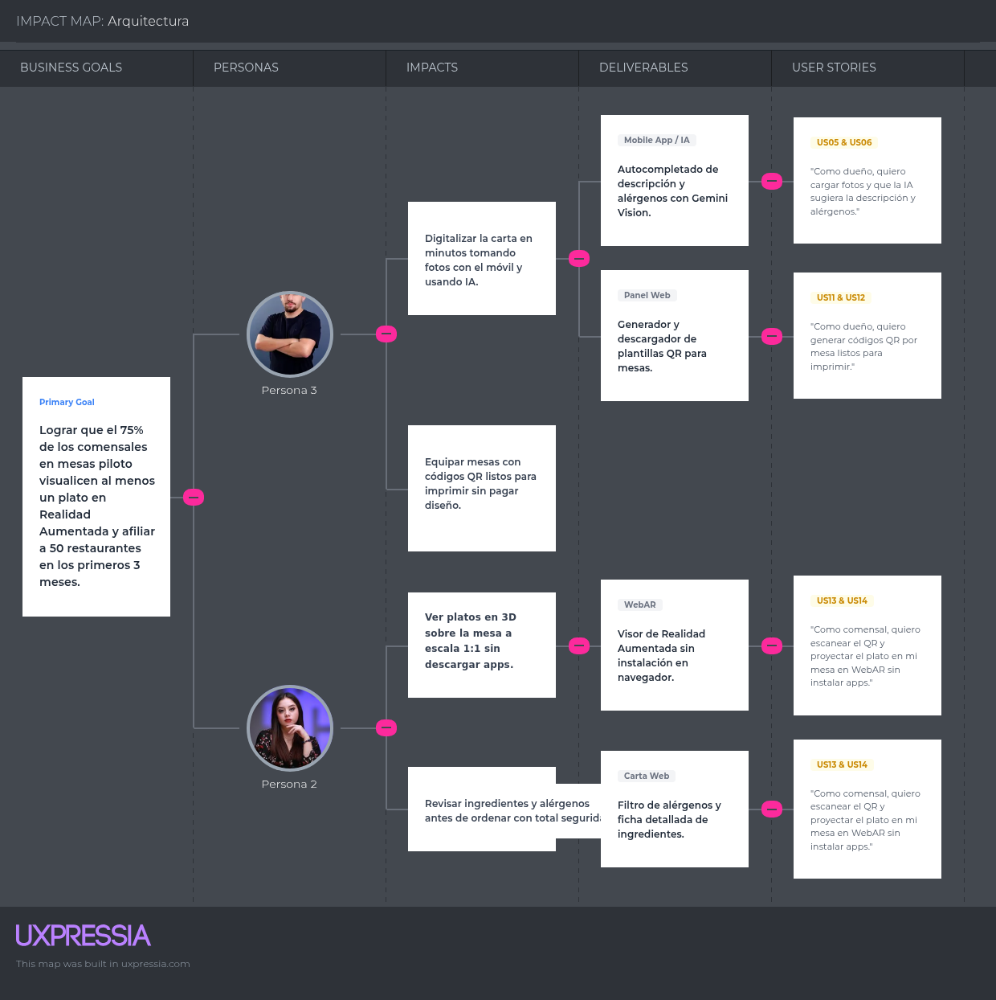

  

<h3 align="center">
Universidad Peruana de Ciencias Aplicadas
</h3>

<h3 align="center">
Ingeniería de Software
  
1ASI0728 Arquitecturas de Software Emergentes
202620
  
NRC: 9046
  
Docente: Rojas Malasquez, Royer Edelwer
  
<strong>Informe de Trabajo Final</strong>  
  
Producto: Platter
  
  
<strong>Integrantes</strong>  
  
Alvarado De La Cruz , Juan Carlos (U202216150) 
  
Duran Diaz, Antonio Rodrigo (U202215721)
  
Nakasone Gomes, Marco Antonio (U202210790)
  
Teves Samaniego, Joan Fernando (U202117303)
  
 

**Septiembre - 2026**

</h3>

# Contenido

## Tabla de contenidos

- [Registro de versiones del informe](#registro-de-versiones-del-informe)

- [Project Report Collaboration Insights](#project-report-collaboration-insights)

- [Contenido](#contenido)

- [Student Outcome](#student-outcome-1)

- [Capítulo I: Introducción](#capitulo-i-introduccion)

# Student Outcome

# Capítulo I: Introducción

## 1.1. Startup Profile

### 1.1.1. Descripción de la Startup

### 1.1.2. Perfiles de integrantes del equipo

## 1.2. Solution Profile

### 1.2.1 Antecedentes y problemática

### 1.2.2 Lean UX Process.

#### 1.2.2.1. Lean UX Problem Statements.

#### 1.2.2.2. Lean UX Assumptions.

#### 1.2.2.3. Lean UX Hypothesis Statements.

#### 1.2.2.4. Lean UX Canvas.

## 1.3. Segmentos objetivo.

# Capítulo II: Requirements Elicitation & Analysis

## 2.1. Competidores.

### 2.1.1. Análisis competitivo.

### 2.1.2. Estrategias y tácticas frente a competidores.

## 2.2. Entrevistas.

### 2.2.1. Diseño de entrevistas.

### 2.2.2. Registro de entrevistas.

### 2.2.3. Análisis de entrevistas.

## 2.3. Needfinding.

### 2.3.1. User Personas.

### 2.3.2. User Task Matrix.

### 2.3.3. Empathy Mapping.

### 2.3.4. As-is Scenario Mapping.

## 2.4. Ubiquitous Language.

# Capítulo III: Requirements Specification

Esta sección permite especificar los requisitos de los productos digitales que conforman la plataforma **Platter**, a partir del análisis riguroso de la información obtenida en los capítulos precedentes (Problem Statement, Lean UX Canvas y Needfinding de los segmentos objetivo). En este capítulo se detallan: el To-Be Scenario Mapping que proyecta la experiencia ideal de interacción para cada segmento; el catálogo consolidado de Epics y User Stories con criterios de aceptación estructurados en formato formal Gherkin; el Impact Mapping que alinea estratégicamente las capacidades de software con las metas de negocio de la startup; y el Product Backlog priorizado estrictamente en función del valor generado para el negocio y el usuario final.

## 3.1. To-Be Scenario Mapping.

El To-Be Scenario Mapping describe la secuencia de interacción ideal que experimentan los usuarios objetivo al utilizar la solución tecnológica propuesta, proyectando las fases del recorrido y detallando las dimensiones de comportamiento (*Doing*), cognición (*Thinking*) y emoción (*Feeling*) para cada segmento.

### Segmento 1 - Carlos Mendoza

| Phases | Captura del plato | Análisis y autocompletado con IA | Asignación 3D y generación QR | Monitoreo en salón |
| :--- | :--- | :--- | :--- | :--- |
| **Doing** | Ingresa a la app móvil de Platter y toma una fotografía directa del plato preparado en cocina. | Carga la foto y revisa la descripción, ingredientes, alérgenos y calorías sugeridas por la IA. Ajusta detalles y confirma. | Vincula un modelo 3D a escala real desde el catálogo y genera los códigos QR de las mesas listos para imprimir. | Coloca los códigos QR en las mesas e ingresa al panel administrativo para observar las visualizaciones AR en tiempo real. |
| **Thinking** | "No necesito un fotógrafo profesional, una foto clara con mi celular es suficiente". "El proceso es rápido y sencillo". | "La IA redactó una descripción atractiva y detectó los alérgenos al instante". "Ahorro horas de redacción manual". | "El modelo 3D coincide con las dimensiones de nuestro plato real". "Tengo los QR listos sin pagar diseño extra". | "Mis clientes exploran la carta antes de pedir". "Puedo saber qué platos llaman más la atención en tiempo real". |
| **Feeling** | Tranquilidad y confianza. | Asombro y alivio. | Seguridad y profesionalismo. | Satisfacción y control. |

### Segmento 2 - Valeria Ramos

| Phases | Llegada y escaneo de QR | Exploración de la carta | Proyección en Realidad Aumentada | Decisión y pedido |
| :--- | :--- | :--- | :--- | :--- |
| **Doing** | Se sienta en la mesa, abre la cámara de su smartphone y escanea el código QR ubicado en el soporte físico. | Navega por las categorías de la carta digital en su navegador móvil y revisa los platos con fotos y descripciones claras. | Selecciona "Ver en mi mesa", enfoca la superficie del mantel y visualiza el plato en 3D a tamaño real interactuando con su entorno. | Verifica que no contenga alérgenos que le afecten, confirma su elección y realiza su pedido al mozo con total certeza. |
| **Thinking** | "Qué práctico que no tenga que descargar ninguna aplicación pesada solo para almorzar". | "La carta carga rápido y muestra ingredientes detallados". "Puedo ver qué opciones se adaptan a mi dieta". | "¡Se ve a tamaño real sobre mi mesa!". "Ahora sé con certeza qué tan generosa es la porción antes de pedir". | "Tengo total confianza en lo que voy a comer y el plato superó mis dudas sobre su tamaño". |
| **Feeling** | Comodidad y tranquilidad. | Curiosidad e interés. | Asombro y seguridad. | Satisfacción y valoración. |

---

## 3.2. User Stories.

Para formalizar los requisitos funcionales y técnicos de los productos digitales de Platter (Landing Page estática, Aplicación Web/Móvil Administrativa, Visor WebAR para Comensales y Servicios Backend RESTful), el equipo definió un catálogo consolidado de **22 User Stories** articuladas en **7 Epics**. 

Las historias cumplen con las siguientes normas metodológicas:
* **Formato estándar de usuario:** Redactadas desde la perspectiva de los roles involucrados: *Visitante* (para el sitio estático/Landing Page), *Dueño de restaurante / Administrador*, *Comensal* y *Developer* (para las historias técnicas de arquitectura e integración).
* **Criterios de Aceptación Gherkin (`Given - When - Then`):** Redactados en tiempo presente, tercera persona, sin referencias acopladas a detalles visuales de la interfaz de usuario (evitando mencionar colores, botones específicos o coordenadas) y plenamente comprobables mediante pruebas funcionales y de integración.
* **Trazabilidad:** Cada historia está asociada a su Epic correspondiente.

| Epic / User Story ID | Título | Descripción | Criterios de Aceptación | Relacionado con (Epic ID) |
| :--- | :--- | :--- | :--- | :--- |
| **EP01** | Landing Page & Adquisición de Clientes | Como visitante interesado en soluciones gastronómicas, deseo explorar un sitio web informativo para conocer la propuesta de valor, los beneficios económicos y los planes de Platter. | - El sitio web estático presenta información clara y responsiva dirigida a restaurantes y comensales. - Incluye secciones de beneficios, retorno de inversión (ROI), demostración interactiva, planes comerciales y formulario de contacto. | - |
| **EP02** | Catálogo Gastronómico & Análisis con IA | Como dueño de restaurante, deseo registrar mis platos mediante fotografías y procesamiento con Inteligencia Artificial para automatizar la creación de fichas técnicas de mi carta sin esfuerzo manual. | - Permite cargar fotografías de platos desde el dispositivo móvil. - Genera descripción gastronómica, ingredientes, alérgenos y estimación calórica con IA. - Permite asociar modelos 3D a escala real y habilitar o deshabilitar platos en tiempo real. | - |
| **EP03** | Generación & Administración de Códigos QR | Como dueño de restaurante, deseo generar y descargar códigos QR asociados a las mesas de mi salón para que mis clientes accedan directamente a la carta en Realidad Aumentada. | - Genera identificadores únicos por mesa y por restaurante. - Proporciona plantillas descargables de alta resolución listas para imprimir y exhibir en mesas físicas. | - |
| **EP04** | Experiencia WebAR para Comensales | Como comensal en el restaurante, deseo visualizar los platos en Realidad Aumentada sobre mi mesa a tamaño real directamente desde el navegador web para tomar una decisión informada de compra sin instalar aplicaciones. | - Permite abrir la carta mediante escaneo de código QR sin autenticación. - Renderiza modelos 3D fotorrealistas a escala 1:1 mediante estándares WebXR / Quick Look. - Permite rotar y comparar el tamaño del plato respecto a la vajilla física. | - |
| **EP05** | Información Nutricional & Alérgenos | Como comensal con restricciones alimentarias, deseo consultar el detalle de ingredientes, calorías y alérgenos de cada plato para consumir alimentos seguros según mi perfil de salud. | - Presenta lista clara de alérgenos certificados por la ficha del plato. - Permite filtrar la carta descartando platos con alérgenos no tolerados por el comensal. - Muestra advertencias de ingredientes sensibles de manera visible y accesible. | - |
| **EP06** | Panel Administrativo & Suscripciones MYPE | Como dueño de restaurante, deseo consultar métricas de interacción con mi carta y gestionar mi plan de suscripción mensual para optimizar la rentabilidad de mi establecimiento. | - Proporciona analítica de platos más visualizados en AR y mesas con mayor interacción. - Permite seleccionar y gestionar planes de suscripción mensual mediante pasarela de pagos. | - |
| **EP07** | Arquitectura Backend & Asset Pipeline (Technical Epics) | Como Developer, deseo disponer de servicios RESTful desacoplados y pipelines de procesamiento para asegurar alta disponibilidad, inferencia de IA y entrega eficiente de modelos 3D ligeros. | - Expone endpoints modulares en Spring Boot bajo arquitectura limpia. - Gestiona compresión y despacho en caché de modelos GLB/USDZ con tiempos de respuesta reducidos. | - |
| **US01** | Visualización de Propuesta de Valor y Demostrador WebAR | Como visitante del sitio web estático, deseo experimentar una demostración interactiva de Realidad Aumentada desde mi dispositivo para comprobar la efectividad de la carta 3D antes de registrar mi negocio. | **Scenario 1: Demostración exitosa desde móvil** **Given** que el visitante navega en la sección principal de la Landing Page desde un dispositivo móvil compatible con WebAR, **When** selecciona la opción de prueba interactiva de un plato de muestra, **Then** el navegador activa la vista de Realidad Aumentada y proyecta el plato gastronómico tridimensional a escala real sobre su entorno.  **Scenario 2: Demostración desde navegador de escritorio** **Given** que el visitante ingresa a la Landing Page desde una computadora de escritorio, **When** consulta el área de demostración interactiva, **Then** el sistema presenta un visor 3D interactivo navegable con cursor y un código QR en pantalla para escanearlo y probar la experiencia en el smartphone. | EP01 |
| **US02** | Sección de Beneficios, Métricas de Retorno (ROI) y Casos de Uso | Como visitante del segmento dueño de restaurante, deseo revisar estadísticas del impacto de la Realidad Aumentada en ventas y testimonios de restaurantes piloto para fundamentar mi decisión de afiliación. | **Scenario 1: Consulta de indicadores de rentabilidad** **Given** que el visitante navega en la sección de beneficios de la Landing Page, **When** explora los datos comparativos de conversión y reducción de tiempos de gestión, **Then** visualiza métricas documentadas sobre incremento de ticket promedio (2x a 3x en conversión AR) y reducción de tiempos de actualización de carta.  **Scenario 2: Navegación de casos de uso** **Given** que el visitante revisa los ejemplos por tipo de cocina (criolla, marina, especialidades), **When** selecciona un caso de uso específico, **Then** se despliegan detalles de cómo la solución resuelve la exhibición de porciones para dicho giro gastronómico. | EP01 |
| **US03** | Consulta de Planes de Suscripción y Calculadora MYPE | Como visitante del segmento dueño de restaurante, deseo consultar los planes tarifarios y calcular el costo según el número de mesas de mi local para evaluar la asequibilidad de la inversión. | **Scenario 1: Visualización transparente de planes** **Given** que el visitante accede a la sección de precios de la Landing Page, **When** revisa las alternativas de suscripción mensual, **Then** se detallan los límites de platos, soporte de IA, generación de códigos QR y acceso a la biblioteca de modelos 3D sin cobros ocultos por plato.  **Scenario 2: Cálculo estimado de inversión** **Given** que el visitante ingresa el número de platos y mesas de su establecimiento en la calculadora de la página, **When** solicita el cálculo estimado, **Then** el sistema recomienda el plan óptimo y resalta el ahorro frente al modelado fotogramétrico tradicional. | EP01 |
| **US04** | Formulario de Solicitud de Piloto Gratuito | Como visitante del segmento dueño de restaurante, deseo enviar mis datos de contacto y nombre de mi local comercial para solicitar una prueba piloto gratuita de 14 días con mi carta. | **Scenario 1: Envío exitoso de solicitud** **Given** que el visitante completa el formulario con nombre del restaurante, correo corporativo, teléfono y número de mesas válidos, **When** envía la solicitud de afiliación, **Then** el sistema registra los datos en la base de prospectos y muestra un mensaje de confirmación notificando que recibirá su acceso en menos de 24 horas.  **Scenario 2: Validación de datos incompletos** **Given** que el visitante omite ingresar un correo o teléfono con formato válido, **When** intenta remitir el formulario, **Then** el sistema no procesa el envío y destaca los campos requeridos con mensajes de subsanación claros. | EP01 |
| **US05** | Carga Fotográfica de Plato para Análisis Automatizado | Como dueño de restaurante, deseo cargar una fotografía de un plato recién preparado desde la cámara o galería de mi móvil para iniciar el proceso de digitalización con Inteligencia Artificial. | **Scenario 1: Carga de fotografía válida** **Given** que el administrador tiene una sesión activa en la aplicación y selecciona la opción de registrar plato, **When** captura o adjunta una fotografía en formato JPEG o PNG con peso menor a 10 MB, **Then** la imagen se procesa satisfactoriamente y se almacena en el repositorio de activos digitales para su análisis posterior.  **Scenario 2: Formato o tamaño no soportado** **Given** que el usuario intenta subir un archivo con extensión no admitida o peso superior a 10 MB, **When** ejecuta la acción de carga, **Then** el sistema rechaza el archivo y emite una notificación indicando los límites permitidos de formato y peso. | EP02 |
| **US06** | Sugerencia Inteligente de Descripción y Categoría con IA | Como dueño de restaurante, deseo que la plataforma analice la imagen del plato mediante Inteligencia Artificial multimodal para obtener una descripción comercial atractiva y su categoría sugerida en segundos. | **Scenario 1: Inferencia exitosa de descripción** **Given** que una fotografía gastronómica válida ha sido cargada al sistema, **When** se invoca el motor de análisis multimodal de Gemini Vision, **Then** el sistema retorna una propuesta de nombre comercial, categoría sugerida y descripción sensorial de entre 40 y 70 palabras adaptada a la gastronomía local.  **Scenario 2: Fotografía difusa o no gastronómica** **Given** que el usuario subió una imagen con baja iluminación o sin elementos gastronómicos discernibles, **When** el motor de IA procesa la imagen y obtiene un nivel de confianza menor al umbral mínimo, **Then** el sistema solicita amablemente al usuario una nueva toma más clara o la opción de completar los datos de forma manual. | EP02 |
| **US07** | Detección Automática de Ingredientes Clave y Alérgenos | Como dueño de restaurante, deseo que el sistema identifique los ingredientes principales y marque alérgenos normados a partir de la foto del plato para cumplir con las regulaciones de seguridad alimentaria. | **Scenario 1: Detección y clasificación de alérgenos comunes** **Given** que la imagen del plato contiene elementos como mariscos, maní, lácteos, huevo o trigo, **When** finaliza el análisis de ingredientes con IA, **Then** el sistema preselecciona las etiquetas de alérgenos correspondientes en la ficha del plato y lista los ingredientes principales reconocidos.  **Scenario 2: Sin alérgenos evidentes** **Given** que el plato corresponde a una preparación libre de alérgenos principales, **When** concluye el análisis, **Then** el sistema presenta la lista de ingredientes limpia y deja las casillas de alérgenos desmarcadas para validación del administrador. | EP02 |
| **US08** | Estimación Calórica y Ficha Nutricional Automatizada | Como dueño de restaurante, deseo contar con una estimación aproximada del rango calórico y macronutrientes del plato para ofrecer información nutricional transparente a mis comensales. | **Scenario 1: Cálculo estimado de calorías** **Given** que se han identificado los ingredientes y la porción típica del plato analizado, **When** el sistema calcula los parámetros nutricionales sugeridos, **Then** se despliega un rango calórico estimado (ej. 450 - 550 kcal) y advertencias informativas de que se trata de una estimación nutricional orientativa.  **Scenario 2: Ajuste de porción** **Given** que el plato tiene una presentación personal o familiar grande, **When** el usuario modifica la escala de porción en la ficha, **Then** el sistema recalcula proporcionalmente el rango calórico sugerido. | EP02 |
| **US09** | Validación y Ajuste Manual de Ficha Gastronómica | Como dueño de restaurante, deseo revisar, editar y confirmar los textos, ingredientes y alérgenos sugeridos por la IA antes de que el plato sea visible en la carta digital. | **Scenario 1: Aprobación con modificaciones** **Given** que la IA sugirió la ficha técnica del plato, **When** el administrador corrige un ingrediente particular y pulsa confirmar publicación, **Then** los datos editados reemplazan la sugerencia automática y el plato queda registrado oficialmente en el catálogo del restaurante.  **Scenario 2: Cancelación de registro** **Given** que el usuario decide no continuar con el alta del plato analizado, **When** cancela la operación antes de guardar, **Then** el borrador temporal se descarta y el catálogo se mantiene sin alteraciones. | EP02 |
| **US10** | Asignación de Modelo 3D a Escala Real desde Biblioteca | Como dueño de restaurante, deseo vincular un modelo 3D fotorrealista a escala 1:1 desde la biblioteca gastronómica predeterminada de Platter para que el plato disponga de visualización en Realidad Aumentada sin costo adicional de modelado. | **Scenario 1: Asociación automática por categoría** **Given** que el plato registrado pertenece a una categoría con modelos estándar disponibles (ej. cebiche, lomo saltado, hamburguesa artesanal), **When** el sistema clasifica el plato, **Then** vincula por defecto el modelo 3D optimizado (GLB/USDZ) configurado con dimensiones físicas exactas en metros.  **Scenario 2: Selección manual alternativa** **Given** que el usuario desea asignar una representación 3D diferente a la sugerida, **When** navega por la galería de modelos gastronómicos y escoge un activo alternativo, **Then** la asociación se actualiza y la vista previa 3D refleja el nuevo modelo elegido. | EP02 |
| **US11** | Generación de Códigos QR con Identificador de Mesa | Como dueño de restaurante, deseo generar códigos QR individuales asociados a cada una de las mesas de mi restaurante para que los comensales accedan de manera contextualizada a la carta digital. | **Scenario 1: Generación masiva por rango de mesas** **Given** que el administrador ingresa la cantidad de mesas de su salón (ej. Mesas 1 a 20), **When** solicita la generación de códigos QR, **Then** el sistema genera identificadores criptográficos únicos vinculados al restaurante y al número de mesa correspondiente, dejándolos listos para consulta y descarga.  **Scenario 2: Incorporación de una nueva mesa** **Given** que el local amplía su capacidad con una mesa adicional, **When** el administrador añade la mesa identificada como "Terraza 01", **Then** se genera de forma instantánea el QR respectivo sin alterar los códigos de las mesas previamente existentes. | EP03 |
| **US12** | Descarga de Plantilla de QR en Alta Calidad para Impresión | Como dueño de restaurante, deseo descargar los códigos QR en un formato gráfico listo para imprenta con el logotipo y nombre de mi negocio para colocarlos en soportes físicos de mesa. | **Scenario 1: Descarga en PDF vectorizado / PNG HD** **Given** que los códigos QR de las mesas han sido generados, **When** el usuario selecciona descargar la plantilla de mesas seleccionadas en formato imprimible, **Then** el sistema descarga un archivo estructurado en alta resolución apto para impresión con instrucciones de escaneo para el comensal.  **Scenario 2: Personalización con marca del restaurante** **Given** que el restaurante tiene configurado su nombre comercial y logotipo en su perfil, **When** se genera la plantilla descargable, **Then** el arte gráfico incorpora dichos distintivos de marca de forma armonizada sobre el código QR. | EP03 |
| **US13** | Acceso Inmediato a Carta Digital sin Registro ni App | Como comensal en la mesa del restaurante, deseo acceder a la carta digital interactiva inmediatamente al escanear el código QR con mi teléfono móvil sin tener que crear cuentas ni instalar aplicaciones. | **Scenario 1: Escaneo y carga exitosa en navegador** **Given** que el comensal escanea el código QR de su mesa mediante la aplicación de cámara de su smartphone (iOS o Android), **When** se abre la URL en el navegador móvil predeterminado, **Then** la carta del restaurante carga en menos de 2 segundos, mostrando el número de mesa identificada y las categorías del menú sin solicitar autenticación previa.  **Scenario 2: Acceso a mesa no configurada o inactiva** **Given** que un comensal escanea un código QR deshabilitado o con identificador inválido, **When** el navegador intenta resolver la dirección web, **Then** el sistema muestra una pantalla amigable indicando que la mesa no está activa y ofreciendo visualizar el menú general del restaurante. | EP04 |
| **US14** | Proyección del Plato en Realidad Aumentada (WebAR) a Escala 1:1 | Como comensal, deseo proyectar el modelo 3D del plato sobre la superficie de mi mesa con dimensiones reales a escala 1:1 para evaluar su presentación y tamaño antes de solicitarlo. | **Scenario 1: Activación de Realidad Aumentada en Android (WebXR / Scene Viewer)** **Given** que el comensal navega en la carta desde un dispositivo Android compatible con ARCore, **When** selecciona "Ver en Realidad Aumentada" en la ficha de un plato, **Then** el navegador ejecuta el visor nativo sin aplicaciones intermedias, detecta la superficie horizontal de la mesa y ubica el modelo 3D fotorrealista a escala 1:1.  **Scenario 2: Activación de Realidad Aumentada en iOS (AR Quick Look)** **Given** que el comensal utiliza un dispositivo iPhone o iPad compatible con ARKit, **When** activa la visualización en AR, **Then** iOS despliega el visor AR Quick Look en formato USDZ permitiendo interactuar con el modelo y rotarlo 360 grados sobre el mantel.  **Scenario 3: Dispositivo móvil sin compatibilidad AR** **Given** que el smartphone del comensal no posee soporte de hardware para Realidad Aumentada, **When** intenta ingresar a la experiencia AR, **Then** el sistema activa automáticamente un visor 3D interactivo en pantalla donde puede rotar y hacer zoom sobre el plato en 360°. | EP04 |
| **US15** | Filtrado de Platos por Alérgenos y Preferencias Dietarias | Como comensal con requerimientos dietarios o alergias alimentarias, deseo filtrar los platos de la carta excluyendo alérgenos específicos para encontrar opciones seguras para mi consumo. | **Scenario 1: Aplicación de filtros de seguridad alimentaria** **Given** que el comensal ingresa a la carta digital de su mesa, **When** marca los filtros de exclusión (ej. "Sin Gluten" y "Sin Mariscos"), **Then** la lista de platos se actualiza dinámicamente mostrando únicamente las preparaciones certificadas libres de dichos alérgenos.  **Scenario 2: Búsqueda sin resultados disponibles** **Given** que la combinación de filtros seleccionada por el comensal no coincide con ningún plato del menú, **When** se aplican las restricciones, **Then** el sistema informa que no hay platos disponibles bajo ese criterio estricto y sugiere consultar al personal del restaurante sobre adaptaciones de cocina. | EP05 |
| **US16** | Comparación Visual de Dimensiones del Plato en Mesa | Como comensal, deseo mover, rotar e inspeccionar la proyección 3D del plato junto a cubiertos o vasos reales sobre mi mesa para constatar su volumen y porción real. | **Scenario 1: Manipulación de gestos táctiles en AR** **Given** que el modelo 3D se encuentra proyectado en la mesa en modo Realidad Aumentada, **When** el comensal realiza gestos táctiles de rotación con sus dedos sobre la pantalla, **Then** el modelo gira sobre su eje vertical manteniendo estrictamente su escala métrica calibrada en relación con el entorno real.  **Scenario 2: Bloqueo de escalado para fidelidad de porción** **Given** que el comensal intenta agrandar el plato con gesto de pellizco en modo AR, **When** interactúa con el modelo, **Then** el sistema restringe el cambio de tamaño libre y emite un mensaje indicando que el plato se mantiene en escala física 1:1 para garantizar la fidelidad de la porción servida. | EP04 |
| **US17** | Consulta de Ingredientes y Advertencias de Contaminación Cruzada | Como comensal alérgico, deseo acceder a la ficha informativa detallada del plato para revisar posibles trazas de ingredientes y notas de advertencia de cocina. | **Scenario 1: Despliegue de ficha de ingredientes** **Given** que el comensal visualiza la ficha de un plato en la carta digital, **When** expande la sección de información de alérgenos e ingredientes, **Then** se despliegan las etiquetas destacadas con iconos representativos de cada alérgeno y la advertencia sobre buenas prácticas de manipulación del restaurante.  **Scenario 2: Certificación de plato vegetariano/vegano** **Given** que un plato cuenta con certificación vegana en su registro, **When** el comensal inspecciona la ficha, **Then** se muestra el distintivo correspondiente y el desglose de sustitutos de origen vegetal utilizados. | EP05 |
| **US18** | Actualización de Disponibilidad de Platos en Tiempo Real | Como dueño de restaurante, deseo marcar platos como "Agotado" con un solo toque desde mi panel para que los comensales no intenten ordenar preparaciones que ya no están disponibles en cocina. | **Scenario 1: Desactivación inmediata por quiebre de stock** **Given** que el administrador identifica que se agotaron los insumos de un plato en el turno, **When** desmarca la disponibilidad del plato en su panel administrativo, **Then** de forma inmediata y reactiva la carta digital y el visor AR ocultan el botón de pedido o marcan el plato como "Agotado por hoy" para todos los comensales conectados.  **Scenario 2: Reactivación de plato disponible** **Given** que cocina prepara una nueva tanda del plato previamente agotado, **When** el administrador activa nuevamente la casilla de disponibilidad, **Then** el plato vuelve a mostrarse activo en las cartas digitales de todas las mesas al instante. | EP02 |
| **US19** | Panel de Analítica de Interacciones AR y Platos Populares | Como dueño de restaurante, deseo visualizar métricas de escaneos de QR y visualizaciones AR por plato para identificar qué preparaciones despiertan mayor interés entre mis comensales. | **Scenario 1: Consulta de métricas semanales** **Given** que el administrador ingresa al módulo de reportes de su cuenta, **When** selecciona el periodo de los últimos 7 días, **Then** el sistema presenta un ranking gráfico con los platos más explorados en AR, el promedio de permanencia en la carta y la mesa con mayor actividad.  **Scenario 2: Descarga de reporte consolidado** **Given** que el restaurante requiere cruzar datos con su sistema de ventas de caja, **When** solicita la exportación de interacciones, **Then** el sistema genera y descarga un resumen en formato CSV con las marcas de tiempo y tipos de interacción por plato. | EP06 |
| **US20** | Gestión de Suscripción Mensual y Métodos de Pago | Como dueño de restaurante, deseo gestionar mi plan de suscripción mensual y registrar mi tarjeta de crédito/débito para mantener activo el servicio de Platter sin interrupciones. | **Scenario 1: Renovación automática de membresía** **Given** que el restaurante se encuentra suscrito a un plan mensual vigente con método de pago registrado, **When** llega la fecha de corte mensual, **Then** la pasarela procesa el cargo del abono recurrente, emite el comprobante de pago digital correspondiente y mantiene la cuenta en estado activo.  **Scenario 2: Notificación por cobro declinado** **Given** que la tarjeta del cliente no cuenta con fondos suficientes en la fecha de corte, **When** la pasarela reporta el fallo de cobro, **Then** el sistema envía un correo de alerta y otorga un periodo de gracia de 72 horas manteniendo el servicio activo mientras el usuario actualiza sus datos de facturación. | EP06 |
| **US21** | Inferencia Multimodal RESTful con Gemini Vision (Technical Story) | Como Developer, deseo disponer de un servicio RESTful en Spring Boot que reciba la imagen binaria del plato y se comunique con la API de Google Gemini para retornar la metadata estructurada en JSON. | **Scenario 1: Inferencia procesada exitosamente** **Given** que el cliente envía una petición `POST` al endpoint `/api/v1/dishes/analyze` con un archivo de imagen válido en multipart/form-data y token JWT autorizado, **When** el servicio procesa la solicitud con la API externa de IA en menos de 3.5 segundos, **Then** la API responde con código HTTP `200 OK` y un cuerpo JSON con los campos `suggestedName`, `description`, `category`, `ingredients` (array), `allergens` (array) y `estimatedCalories` (rango min-max).  **Scenario 2: Excedido tiempo de respuesta o fallo de API de IA** **Given** que la API externa experimenta latencia o falta de disponibilidad temporal, **When** la petición excede el tiempo límite de timeout configurado (5000 ms), **Then** el microservicio aplica el patrón Circuit Breaker, responde con código HTTP `503 Service Unavailable` y devuelve una estructura de error estandarizada indicando la opción de reintento. | EP07 |
| **US22** | Despacho y Caché de Activos 3D Optimizados (Technical Story) | Como Developer, deseo implementar un endpoint optimizado para servir modelos 3D (GLB/USDZ) con compresión Draco y cabeceras de caché HTTP agresivas para garantizar cargas WebAR en menos de 1.5 segundos en redes móviles. | **Scenario 1: Petición de activo con compresión y caché activa** **Given** que el visor WebAR solicita un activo 3D mediante petición `GET` a `/api/v1/assets/models/{modelId}.glb`, **When** el servidor resuelve el archivo optimizado desde el almacenamiento de objetos, **Then** responde con código HTTP `200 OK`, cabecera `Content-Type: model/gltf-binary`, cabecera `Cache-Control: public, max-age=31536000, immutable` y tamaño comprimido inferior a 3.0 MB.  **Scenario 2: Validación de caché no modificada (ETag / If-None-Match)** **Given** que el navegador del comensal ya posee una copia local del modelo y envía una cabecera `If-None-Match` con el ETag correspondiente, **When** el servidor comprueba que el activo no ha variado, **Then** responde inmediatamente con código HTTP `304 Not Modified` sin reenviar el cuerpo binario, minimizando el consumo de datos móviles del comensal. | EP07 |

---

## 3.3. Impact Mapping.

A continuación, se presenta el Impact Mapping de Platter, una representación estratégica elaborada en la herramienta **UXPressia** que alinea los objetivos de negocio (Business Goals) con los usuarios clave (Personas), los cambios de comportamiento que esperamos provocar (Impacts) y las características del producto que construiremos (Deliverables), vinculándolos directamente con nuestras User Stories.

*(Nota: En la herramienta UXPressia se ha construido el diagrama completo en donde se observa:*

* **Business Goal:** Lograr que el 75% de los comensales en mesas piloto visualicen al menos un plato en Realidad Aumentada y afiliar a 50 restaurantes en los primeros 3 meses.
* **Personas:** Dueño / Administrador de Restaurante, Comensal en Mesa.
* **Impacts:** "Digitalizar la carta en minutos usando fotos y autocompletado con IA", "Equipar mesas con códigos QR listos para imprimir", "Ver platos en 3D sobre la mesa a escala 1:1 sin descargar apps", "Revisar ingredientes y alérgenos antes de ordenar".
* **Deliverables:** Autocompletado con Gemini Vision, Generador de códigos QR para mesas, Visor WebAR sin instalación, Filtro de alérgenos y ficha de ingredientes).

---

## 3.4. Product Backlog.

El **Product Backlog** de Platter consolida y prioriza todas las User Stories del sistema utilizando la técnica ágil de estimación relativa en **Story Points** fundamentada en la secuencia modificada de Fibonacci (**1, 2, 3, 5, 8**). 

El orden del backlog está estrictamente determinado por el **Valor de Negocio**: la Landing Page (adquisición de prospectos tempranos) y el núcleo funcional mínimo viable (MVP compuesto por la captura con IA y el visor WebAR sin fricción) se posicionan en los primeros lugares del backlog para permitir validaciones de mercado tempranas desde el Sprint 1. Las tareas de configuración de pagos o analítica avanzada se reservan para etapas posteriores una vez validada la propuesta central.

| # Orden | User Story Id | Título | Descripción | Story Points (1 / 2 / 3 / 5 / 8) |
| :---: | :---: | :--- | :--- | :---: |
| **1** | **US01** | Visualización de Propuesta de Valor y Demostrador WebAR | Como visitante del sitio web estático, deseo experimentar una demostración interactiva de Realidad Aumentada desde mi dispositivo para comprobar la efectividad de la carta 3D antes de registrar mi negocio. | **5** |
| **2** | **US04** | Formulario de Solicitud de Piloto Gratuito | Como visitante del segmento dueño de restaurante, deseo enviar mis datos de contacto y nombre de mi local comercial para solicitar una prueba piloto gratuita de 14 días con mi carta. | **2** |
| **3** | **US02** | Sección de Beneficios, Métricas de Retorno (ROI) y Casos de Uso | Como visitante del segmento dueño de restaurante, deseo revisar estadísticas del impacto de la Realidad Aumentada en ventas y testimonios de restaurantes piloto para fundamentar mi decisión de afiliación. | **2** |
| **4** | **US03** | Consulta de Planes de Suscripción y Calculadora MYPE | Como visitante del segmento dueño de restaurante, deseo consultar los planes tarifarios y calcular el costo según el número de mesas de mi local para evaluar la asequibilidad de la inversión. | **3** |
| **5** | **US13** | Acceso Inmediato a Carta Digital sin Registro ni App | Como comensal en la mesa del restaurante, deseo acceder a la carta digital interactiva inmediatamente al escanear el código QR con mi teléfono móvil sin tener que crear cuentas ni instalar aplicaciones. | **3** |
| **6** | **US14** | Proyección del Plato en Realidad Aumentada (WebAR) a Escala 1:1 | Como comensal, deseo proyectar el modelo 3D del plato sobre la superficie de mi mesa con dimensiones reales a escala 1:1 para evaluar su presentación y tamaño antes de solicitarlo. | **8** |
| **7** | **US05** | Carga Fotográfica de Plato para Análisis Automatizado | Como dueño de restaurante, deseo cargar una fotografía de un plato recién preparado desde la cámara o galería de mi móvil para iniciar el proceso de digitalización con Inteligencia Artificial. | **3** |
| **8** | **US06** | Sugerencia Inteligente de Descripción y Categoría con IA | Como dueño de restaurante, deseo que la plataforma analice la imagen del plato mediante Inteligencia Artificial multimodal para obtener una descripción comercial atractiva y su categoría sugerida en segundos. | **5** |
| **9** | **US07** | Detección Automática de Ingredientes Clave y Alérgenos | Como dueño de restaurante, deseo que el sistema identifique los ingredientes principales y marque alérgenos normados a partir de la foto del plato para cumplir con las regulaciones de seguridad alimentaria. | **5** |
| **10** | **US10** | Asignación de Modelo 3D a Escala Real desde Biblioteca | Como dueño de restaurante, deseo vincular un modelo 3D fotorrealista a escala 1:1 desde la biblioteca gastronómica predeterminada de Platter para que el plato disponga de visualización en Realidad Aumentada sin costo adicional de modelado. | **3** |
| **11** | **US11** | Generación de Códigos QR con Identificador de Mesa | Como dueño de restaurante, deseo generar códigos QR individuales asociados a cada una de las mesas de mi restaurante para que los comensales accedan de manera contextualizada a la carta digital. | **3** |
| **12** | **US12** | Descarga de Plantilla de QR en Alta Calidad para Impresión | Como dueño de restaurante, deseo descargar los códigos QR en un formato gráfico listo para imprenta con el logotipo y nombre de mi negocio para colocarlos en soportes físicos de mesa. | **2** |
| **13** | **US09** | Validación y Ajuste Manual de Ficha Gastronómica | Como dueño de restaurante, deseo revisar, editar y confirmar los textos, ingredientes y alérgenos sugeridos por la IA antes de que el plato sea visible en la carta digital. | **3** |
| **14** | **US16** | Comparación Visual de Dimensiones del Plato en Mesa | Como comensal, deseo mover, rotar e inspeccionar la proyección 3D del plato junto a cubiertos o vasos reales sobre mi mesa para constatar su volumen y porción real. | **3** |
| **15** | **US15** | Filtrado de Platos por Alérgenos y Preferencias Dietarias | Como comensal con requerimientos dietarios o alergias alimentarias, deseo filtrar los platos de la carta excluyendo alérgenos específicos para encontrar opciones seguras para mi consumo. | **3** |
| **16** | **US17** | Consulta de Ingredientes y Advertencias de Contaminación Cruzada | Como comensal alérgico, deseo acceder a la ficha informativa detallada del plato para revisar posibles trazas de ingredientes y notas de advertencia de cocina. | **2** |
| **17** | **US08** | Estimación Calórica y Ficha Nutricional Automatizada | Como dueño de restaurante, deseo contar con una estimación aproximada del rango calórico y macronutrientes del plato para ofrecer información nutricional transparente a mis comensales. | **3** |
| **18** | **US18** | Actualización de Disponibilidad de Platos en Tiempo Real | Como dueño de restaurante, deseo marcar platos como "Agotado" con un solo toque desde mi panel para que los comensales no intenten ordenar preparaciones que ya no están disponibles en cocina. | **2** |
| **19** | **US21** | Inferencia Multimodal RESTful con Gemini Vision (Technical Story) | Como Developer, deseo disponer de un servicio RESTful en Spring Boot que reciba la imagen binaria del plato y se comunique con la API de Google Gemini para retornar la metadata estructurada en JSON. | **8** |
| **20** | **US22** | Despacho y Caché de Activos 3D Optimizados (Technical Story) | Como Developer, deseo implementar un endpoint optimizado para servir modelos 3D (GLB/USDZ) con compresión Draco y cabeceras de caché HTTP agresivas para garantizar cargas WebAR en menos de 1.5 segundos en redes móviles. | **5** |
| **21** | **US19** | Panel de Analítica de Interacciones AR y Platos Populares | Como dueño de restaurante, deseo visualizar métricas de escaneos de QR y visualizaciones AR por plato para identificar qué preparaciones despiertan mayor interés entre mis comensales. | **5** |
| **22** | **US20** | Gestión de Suscripción Mensual y Métodos de Pago | Como dueño de restaurante, deseo gestionar mi plan de suscripción mensual y registrar mi tarjeta de crédito/débito para mantener activo el servicio de Platter sin interrupciones. | **5** |

El backlog completo ha sido registrado y organizado en la herramienta de gestión ágil Jira Software del equipo:
* **Enlace público al Product Backlog en Jira:** [https://marcoanakasone-1789856155139.atlassian.net/jira/software/projects/SCRUM/boards/1/backlog](https://marcoanakasone-1789856155139.atlassian.net/jira/software/projects/SCRUM/boards/1/backlog)

# Capítulo IV: Strategic-Level Software Design

## 4.1. Strategic-Level Attribute-Driven Design.

### 4.1.1. Design Purpose

### 4.1.2. Attribute-Driven Design Inputs.

#### 4.1.2.1. Primary Functionality (Primary User Stories).

#### 4.1.2.2. Quality Attributes Scenarios.

#### 4.1.2.3. Constraints.

### 4.1.3. Architectural Drivers Backlog.

### 4.1.4. Architectural Design Decisions.

### 4.1.5. Quality Attribute Scenario Refinements.

## 4.2. Strategic-Level Domain-Driven Design.

### 4.2.1. EventStorming.

### 4.2.2. Candidate Context Discovery.

### 4.2.3. Domain Message Flows Modeling.

### 4.2.4. Bounded Context Canvases.

### 4.2.5. Context Mapping.

## 4.3. Software Architecture.

### 4.3.1. Software Architecture System Landscape Diagram.

### 4.3.2. Software Architecture Context Level Diagrams.

### 4.3.3. Software Architecture Container Level Diagrams.

### 4.3.4. Software Architecture Deployment Diagrams.

# Conclusiones

## Conclusiones y recomendaciones.

# Video About-the-Team.

# Bibliografía

# Anexos
