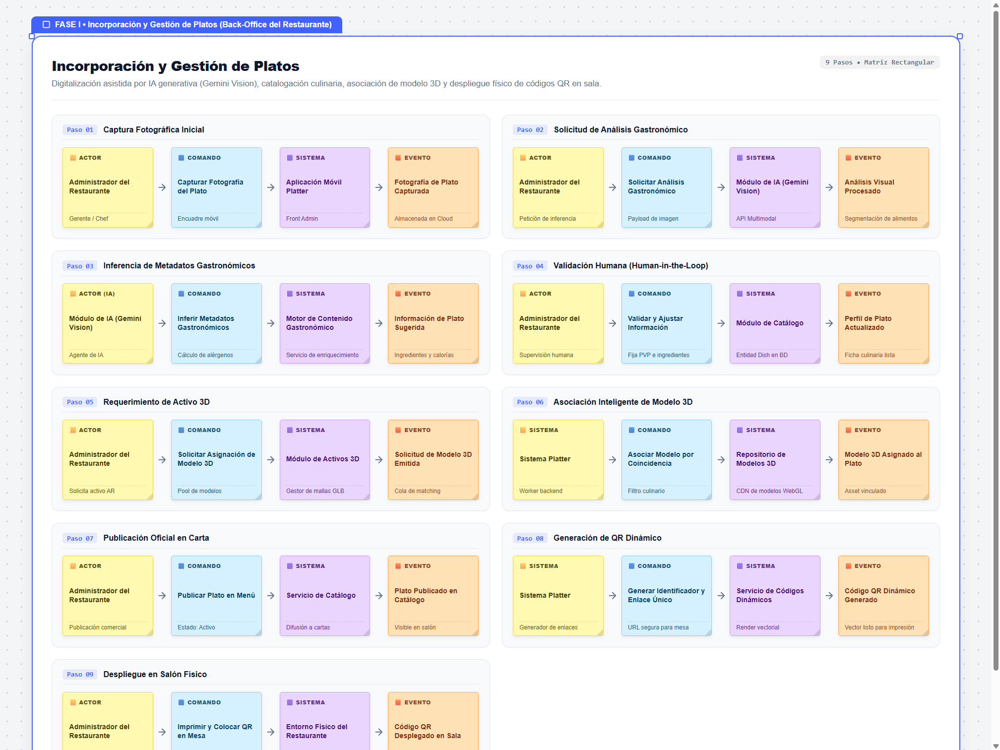
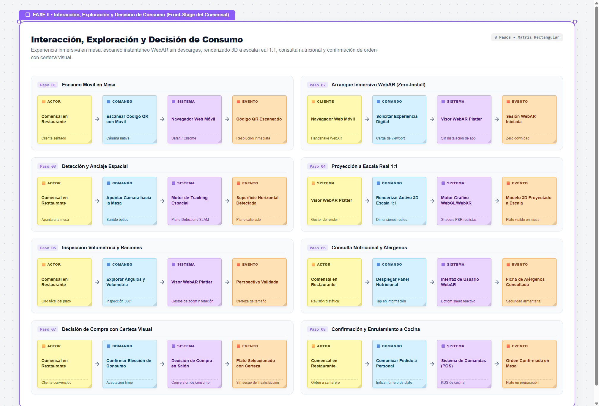
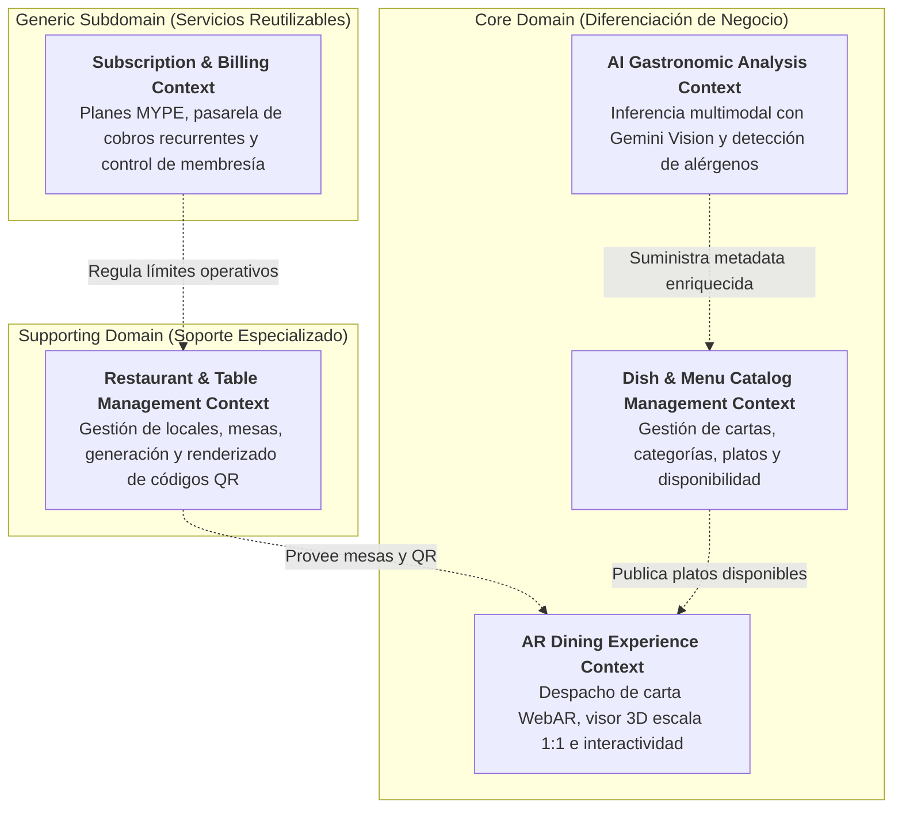
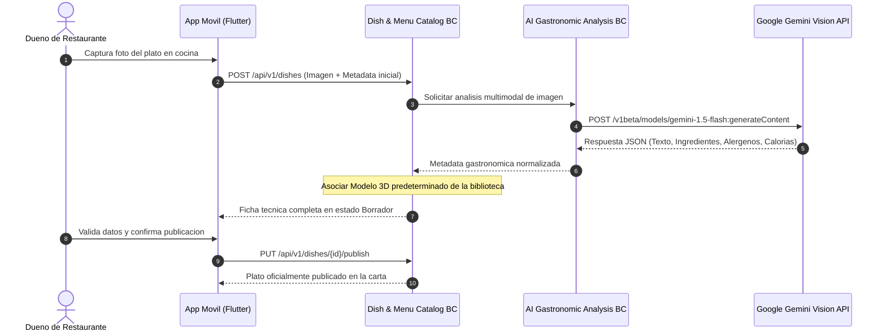
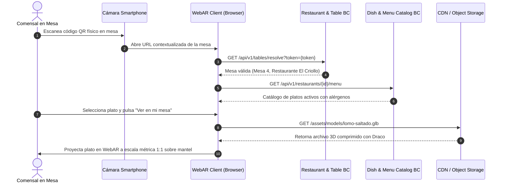
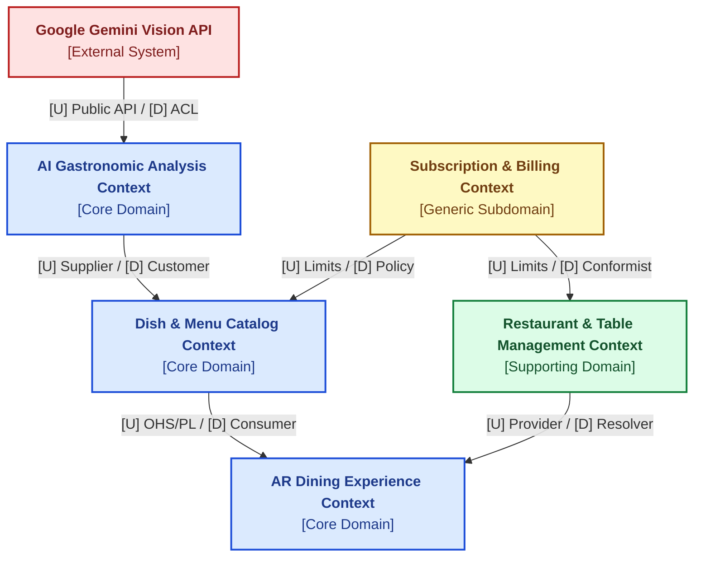
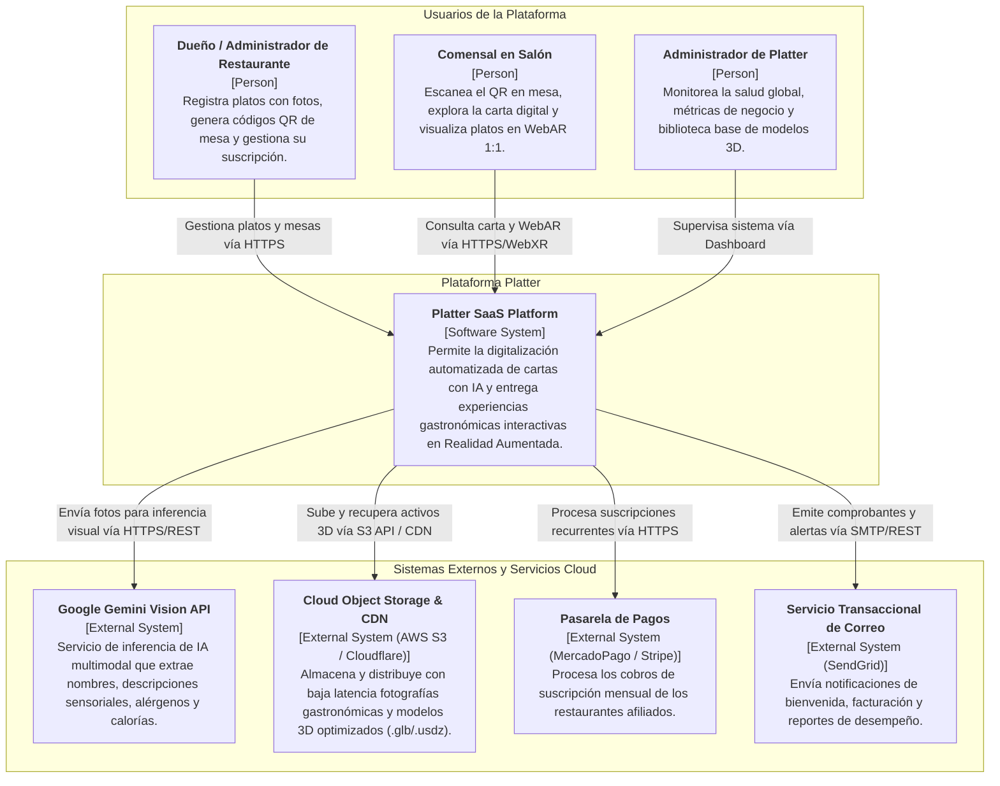
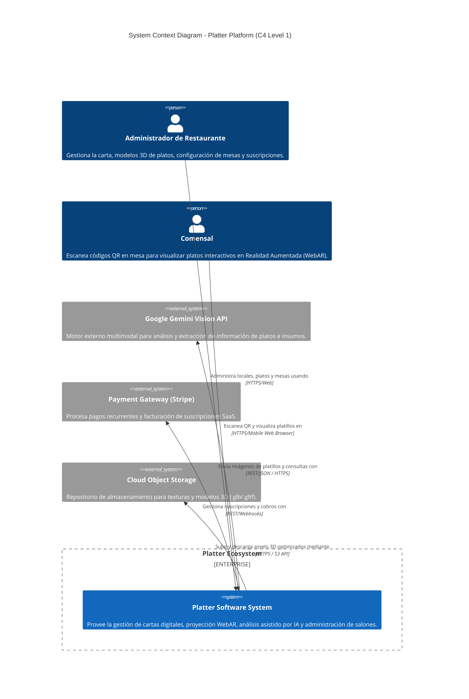
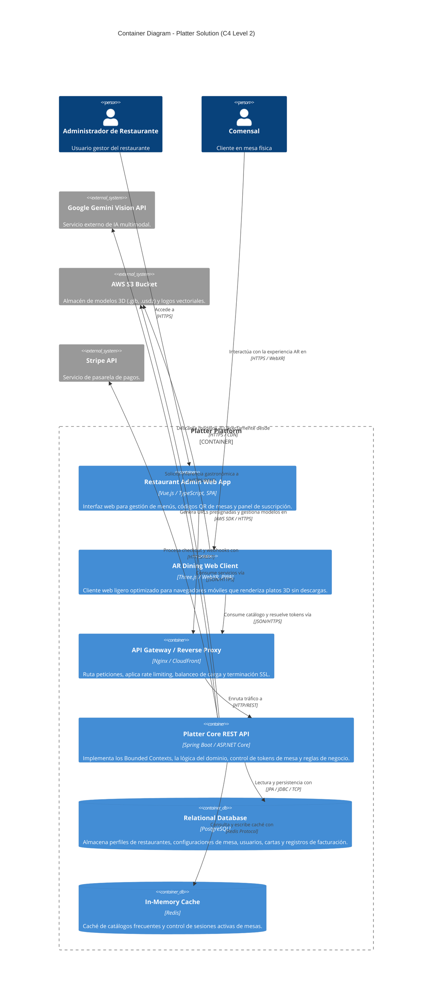
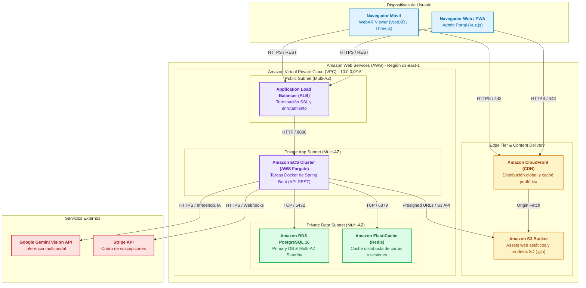

  

<h3 align="center">
Universidad Peruana de Ciencias Aplicadas
</h3>

<h3 align="center">
Ingeniería de Software
  
1ASI0728 Arquitecturas de Software Emergentes
202620
  
NRC: 9046
  
Docente: Rojas Malasquez, Royer Edelwer
  
<strong>Informe de Trabajo Final</strong>  
  
Producto: Platter
  
  
<strong>Integrantes</strong>  
  
Alvarado De La Cruz , Juan Carlos (U202216150) 
  
Duran Diaz, Antonio Rodrigo (U202215721)
  
Nakasone Gomes, Marco Antonio (U202210790)
  
Teves Samaniego, Joan Fernando (U202117303)
  
 

**Septiembre - 2026**

</h3>

# Contenido

## Tabla de contenidos

- [Registro de versiones del informe](#registro-de-versiones-del-informe)

- [Project Report Collaboration Insights](#project-report-collaboration-insights)

- [Contenido](#contenido)

- [Student Outcome](#student-outcome-1)

- [Capítulo I: Introducción](#capitulo-i-introduccion)

# Student Outcome

El curso contribuye al cumplimiento del Student Outcome ABET:

**ABET – EAC - Student Outcome 3**

**Criterio:** *Capacidad de comunicarse efectivamente con un rango de audiencias.*

En el siguiente cuadro se describe las acciones realizadas y enunciados de conclusiones por parte del grupo, que permiten sustentar el haber alcanzado el logro del ABET – EAC - Student Outcome 3.

| Criterio específico | Acciones realizadas | Conclusiones |
| :--- | :--- | :--- |
| **Comunica oralmente sus ideas y/o resultados con objetividad a público de diferentes especialidades y niveles jerárquicos, en el marco del desarrollo de un proyecto en ingeniería.** | **Alvarado De La Cruz, Juan Carlos** *TB1* Expuse ante el equipo y en el video de sustentación los fundamentos de la descomposición estratégica bajo Domain-Driven Design (DDD), justificando la delimitación de Bounded Contexts y la implementación de una Capa Anticorrupción (ACL) para la integración con Google Gemini. Adapté el lenguaje técnico para comunicar claramente cómo la arquitectura soporta los requerimientos de negocio de restaurantes e inversionistas.  **Duran Diaz, Antonio Rodrigo** *TB1* Participé activamente en las sesiones de discusión grupal y en la grabación del video de presentación de la entrega, explicando con objetividad los escenarios de atributos de calidad priorizados en Attribute-Driven Design (ADD) y cómo la infraestructura en la nube de AWS responde a las demandas de alta concurrencia en horas pico.  **Nakasone Gomes, Marco Antonio** *TB1* Presenté oralmente en las reuniones de sincronización y en la exposición grabada los resultados del análisis de problemáticas del sector gastronómico y los supuestos de Lean UX, transmitiendo con claridad a perfiles tanto técnicos como de negocio el valor de la proyección en Realidad Aumentada sin fricción para el comensal.  **Teves Samaniego, Joan Fernando** *TB1* Expuse en el video grupal y en las reuniones técnicas los diagramas de interacción y flujo de mensajes mediante Domain Storytelling, describiendo detalladamente la secuencia técnica entre los clientes móviles, las APIs REST y los servicios en la nube de forma estructurada, fluida y comprensible para el equipo evaluador. | Durante el desarrollo del hito TB1, el equipo demostró capacidad para transmitir conceptos técnicos complejos de ingeniería de software a diversas audiencias. Se articularon con precisión técnica y pertinencia de negocio las decisiones de diseño estratégico, modelado de dominio y esquemas de infraestructura en la nube. A través de reuniones de retrospectiva internas y la sustentación en video, cada integrante adaptó su registro comunicativo para justificar de forma objetiva la viabilidad técnica y operativa de la solución ante evaluadores académicos y potenciales interesados del sector gastronómico. |
| **Comunica en forma escrita ideas y/o resultados con objetividad a público de diferentes especialidades y niveles jerárquicos, en el marco del desarrollo de un proyecto en ingeniería.** | **Alvarado De La Cruz, Juan Carlos** *TB1* Redacté y consolidé los capítulos de diseño estratégico en Markdown, elaborando la especificación formal del Context Mapping y los diagramas C4 (Contexto, Contenedores y Despliegue). Cuidé la consistencia del lenguaje ubicuo del proyecto, documentando los contratos de integración y las decisiones arquitectónicas conforme al estándar de ingeniería solicitado.  **Duran Diaz, Antonio Rodrigo** *TB1* Elaboré las especificaciones técnicas de los escenarios de calidad (Quality Attribute Scenarios) y el Backlog de Drivers Arquitectónicos, documentando de forma estructurada los requisitos de rendimiento, disponibilidad y escalabilidad, así como las tácticas arquitectónicas seleccionadas para mitigarlos.  **Nakasone Gomes, Marco Antonio** *TB1* Redacté la caracterización de la startup, la problemática del sector gastronómico, las declaraciones de problema de Lean UX, supuestos e hipótesis. Documenté los hallazgos en tablas y formatos estandarizados dentro del informe, facilitando la comprensión de los dolores del cliente tanto para perfiles de negocio como de desarrollo.  **Teves Samaniego, Joan Fernando** *TB1* Documenté la especificación formal de requerimientos mediante To-Be Scenario Mapping, User Stories bajo el formato Gherkin y los diagramas de secuencia de Domain Storytelling en Mermaid. Garanticé que la documentación escrita fuera rigurosa, no ambigua y completamente trazable con los objetivos del sistema. | La redacción colaborativa del informe técnico en GitHub bajo estándares de Markdown y conventional commits permitió consolidar un cuerpo documental riguroso, coherente y profesional. Se logró comunicar con claridad el análisis del problema, los modelos formales de dominio y las decisiones de arquitectura de software, empleando notaciones estándar (C4 Model, diagramas UML/secuencia y plantillas Lean UX). El producto escrito evidencia objetividad técnica y una estructura que satisface las exigencias metodológicas del curso y de la práctica profesional de la ingeniería de software. |

# Capítulo I: Introducción

## 1.1. Startup Profile

### 1.1.1. Descripción de la Startup

Platter es una startup dedicada al desarrollo de soluciones tecnológicas para el sector gastronómico, enfocada en cerrar la brecha entre lo que un comensal observa en la carta de un restaurante y lo que finalmente recibe en su mesa. La propuesta de valor de la startup se centra en permitir que los clientes de un restaurante visualicen, mediante Realidad Aumentada (AR), una representación tridimensional a escala real del plato que están por ordenar, directamente desde la cámara del navegador de su propio dispositivo móvil, sin necesidad de instalar una aplicación adicional.
 
La solución integra cuatro pilares tecnológicos que sustentan su propuesta de transformación digital para el sector: una aplicación móvil de gestión dirigida al restaurante, un componente de Realidad Extendida (WebAR) dirigido al comensal, un módulo de Inteligencia Artificial que analiza fotografías de los platos para autocompletar información gastronómica relevante (nombre, descripción, ingredientes, alérgenos y calorías estimadas), y una arquitectura de backend/BaaS que centraliza el registro de platos, los modelos tridimensionales asociados y los códigos QR que enlazan ambos mundos.
 
La misión de Platter es reducir la incertidumbre del comensal al momento de decidir su pedido y, con ello, mejorar la satisfacción del cliente y la eficiencia operativa de los restaurantes que adoptan la plataforma. La visión de la startup es convertirse en la herramienta de referencia para la digitalización de cartas gastronómicas en restaurantes pequeños y medianos de Perú y Latinoamérica, ampliando progresivamente sus capacidades hacia otros formatos de experiencia inmersiva para el sector food service.
 
Platter se posiciona como una alternativa accesible frente a soluciones de digitalización de menús que se limitan a listados de texto o fotografías estáticas, diferenciándose mediante la incorporación de Realidad Aumentada activada por un simple escaneo de código QR y la automatización del proceso de carga de información gastronómica mediante Inteligencia Artificial, lo que reduce la carga operativa que históricamente ha desincentivado a los restaurantes pequeños a mantener actualizada su carta digital.
 

### 1.1.2. Perfiles de integrantes del equipo

| Integrante | Descripción de Carrera | Conocimientos y Habilidades a aportar |
| --------------------------------| ----------------------| ------------------------------------ |
|    Alvarado De La Cruz, Juan Carlos | Ingeniería de Software  Universidad Peruana de Ciencias Aplicadas | Soy estudiante de Ingeniería de Software en la Universidad Peruana de Ciencias Aplicadas. Cuento con experiencia en el diseño arquitectónico de software bajo el C4 Model, modelado estratégico con Domain-Driven Design (DDD) y desarrollo backend con Spring Boot y bases de datos relacionales. En este proyecto mi meta es articular e implementar la comunicación desacoplada entre los Bounded Contexts, liderar las buenas prácticas de arquitectura y asegurar que cumplamos los estándares técnicos y plazos del equipo. |
|    Duran Diaz, Antonio Rodrigo | Ingeniería de Software  Universidad Peruana de Ciencias Aplicadas | Soy estudiante de la carrera de Ingeniería de Software en la Universidad Peruana de Ciencias Aplicadas. Me enfoco principalmente en el desarrollo de servicios backend y la gestión de infraestructura en la nube. Cuento con conocimientos en Java, SQL y diseño de APIs RESTful. Mi propósito en el equipo es implementar la lógica de negocio de los servicios centrales, asegurar la correcta persistencia y disponibilidad de los datos, y aportar activamente al cumplimiento de las metas en cada entrega. |
|    Nakasone Gomes, Marco Antonio | Ingeniería de Software  Universidad Peruana de Ciencias Aplicadas | Tengo 22 años y me encuentro cursando el noveno ciclo de la carrera de Ingeniería de Software en la Universidad Peruana de Ciencias Aplicadas. Me caracterizo por mi capacidad para el trabajo colaborativo, la organización y el cumplimiento puntual de tareas. En este proyecto busco aportar en el diseño de interfaces web, la integración de servicios externos y la optimización de flujos de interacción, proponiendo soluciones prácticas que eleven la calidad de la solución. |
|    Teves Samaniego, Joan Fernando | Ingeniería de Software  Universidad Peruana de Ciencias Aplicadas | Soy estudiante de Ingeniería de Software en la Universidad Peruana de Ciencias Aplicadas. Cuento con conocimientos en programación orientada a objetos, despliegue de aplicaciones en contenedores Docker y control de versiones con GitFlow. Mi objetivo en el proyecto es colaborar estrechamente en la construcción de endpoints resilientes, apoyar en la configuración de los entornos de despliegue y asegurar una integración fluida entre los módulos de software y las pruebas. |

## 1.2. Solution Profile

### 1.2.1 Antecedentes y problemática

El sector gastronómico peruano constituye uno de los ejes económicos más relevantes del país, tanto por su aporte a la generación de empleo como por su peso simbólico dentro de la identidad nacional. Este sector está compuesto mayoritariamente por micro y pequeños negocios: cerca del 99.9% de las empresas formales del rubro de restaurantes y afines en el Perú son micro y pequeñas empresas (Mype) (Produce, citado por Andina, 2020). Esta atomización del mercado implica que la mayoría de restaurantes no cuenta con presupuestos ni equipos de tecnología propios para digitalizar su operación, lo que limita su capacidad de adoptar herramientas modernas de interacción con el cliente.
 
El proceso de decisión de compra de un comensal se apoya casi exclusivamente en la carta del restaurante, ya sea física o digital, que en la gran mayoría de los casos se limita a texto descriptivo y, en el mejor de los casos, a una fotografía estática del plato. Esta representación bidimensional no logra comunicar con precisión el tamaño real de la porción, la disposición de los ingredientes ni la presentación final del plato, generando una brecha entre la expectativa que se forma el comensal y la realidad que recibe en su mesa. A nivel de comercio electrónico, esta misma brecha entre expectativa y producto recibido explica en gran medida las tasas de devolución de 20% a 30% que enfrentan categorías como indumentaria y mobiliario, donde el cliente no puede experimentar el producto antes de comprarlo (Ecosire, 2024).
 
La Realidad Aumentada ha demostrado ser una tecnología efectiva para cerrar esta brecha en otros sectores del retail: estudios reportados por Shopify indican que los compradores que utilizan visualización de productos en AR convierten entre 2 y 3 veces más que quienes no la utilizan, mientras que las tasas de devolución de productos con experiencias de visualización en AR disminuyen entre 25% y 40% (Ecosire, 2024; ARInsider, 2020). Sin embargo, esta tecnología ha sido adoptada principalmente por categorías como moda, mobiliario y belleza, y su aplicación específica al sector de servicios de alimentos —donde el "producto" es perecible, se prepara bajo pedido y no puede probarse físicamente antes de decidir— permanece prácticamente inexplorada en el mercado local.
 
Adicionalmente, el sector restaurantero peruano atraviesa un contexto de contracción reciente: se reporta que existen alrededor de 50,000 restaurantes menos en el país en comparación con el año 2019 (Gestión, 2024), lo que incrementa la presión competitiva sobre los negocios que permanecen activos y refuerza la necesidad de herramientas que les permitan diferenciarse y mejorar la experiencia que ofrecen a sus clientes sin incurrir en inversiones tecnológicas complejas o costosas.
 

### Problemática
 

Para comprender la necesidad del proyecto, se aplicó la técnica de las 5W's + 2H's:
 
### 5W's
 
### What (¿Cuál es el problema?):
 
Los comensales que visitan un restaurante o revisan su carta digital no cuentan con una forma confiable de anticipar cómo lucirá realmente el plato que están por ordenar, lo que genera indecisión al momento de elegir, expectativas no cumplidas al recibir el pedido y, en algunos casos, insatisfacción o devolución del plato.
 
Por su parte, los dueños y administradores de restaurantes no cuentan con herramientas accesibles para digitalizar su carta de forma atractiva y diferenciada, ni con procesos ágiles para mantener actualizada la información gastronómica (ingredientes, alérgenos, información nutricional) de cada plato, ya que su actualización manual demanda tiempo del que usualmente no disponen.
 
### When (¿Cuándo ocurre el problema?):
 
El problema del comensal ocurre en el momento exacto de decisión de compra, cuando revisa la carta física o digital del restaurante y debe elegir un plato basándose únicamente en una descripción textual o, en el mejor de los casos, en una fotografía que no refleja el tamaño real ni la disposición final del plato servido.
 
El problema del restaurante ocurre de forma recurrente cada vez que incorpora un plato nuevo a su carta o modifica uno existente, momento en el cual debe redactar manualmente la descripción, identificar ingredientes y alérgenos, y —si desea ofrecer una experiencia visual más rica— gestionar por separado la fotografía y cualquier material adicional, sin contar con herramientas que integren estos procesos.
 
### Where (¿Dónde ocurre el problema?):
 
En el punto de venta del restaurante, ya sea en el salón al momento de revisar la carta física, o en canales digitales (redes sociales, aplicaciones de delivery, página web) cuando el comensal explora el menú antes de decidir su pedido.
 
En el back-office del restaurante, donde el personal administrativo o los propios dueños gestionan manualmente la actualización de la carta, típicamente mediante documentos de texto, hojas de cálculo o publicaciones sueltas en redes sociales, sin un sistema centralizado que integre contenido visual enriquecido.
 
### Who (¿A quién o quiénes afecta el problema?):
 
- A los comensales, quienes enfrentan incertidumbre al momento de decidir su pedido y riesgo de recibir un plato que no coincide con lo que imaginaban, afectando su satisfacción con la experiencia del restaurante.
- A los dueños y administradores de restaurantes, especialmente de micro y pequeños negocios, quienes no cuentan con tiempo, presupuesto ni conocimiento técnico para digitalizar su carta con contenido visual enriquecido y mantenerla actualizada de forma ágil.
- De forma indirecta, al personal de sala (meseros), quienes deben invertir tiempo adicional explicando verbalmente el contenido y la presentación de los platos ante la falta de una referencia visual clara para el cliente.
### Why (¿Por qué sucede el problema?):
 
Porque la mayoría de restaurantes, especialmente los de menor tamaño, gestionan su carta de forma manual y con herramientas genéricas (documentos de texto, redes sociales, fotografías sueltas) que no están diseñadas para comunicar de forma inmersiva el contenido de un plato.
 
Al no existir una plataforma accesible que combine generación automática de contenido gastronómico con visualización en Realidad Aumentada, los restaurantes pequeños quedan al margen de una tecnología que en otros sectores del retail ya ha demostrado mejorar la conversión y reducir la insatisfacción del cliente.
 
### 2H's
 
### How (¿Cómo aparece el problema?):
 
Los restaurantes suelen publicar sus platos con descripciones breves y, en el mejor de los casos, una fotografía tomada sin estándares de calidad, careciendo de un proceso que les permita generar de forma rápida información gastronómica completa (ingredientes, alérgenos, calorías) y una representación tridimensional del plato para brindar mayor confianza al comensal.
 
Por su parte, los comensales dependen de su propia interpretación de un texto o una imagen plana para imaginar cómo lucirá el plato, lo que genera una desconexión entre expectativa y realidad que solo se resuelve —para bien o para mal— una vez que el plato llega a la mesa.
 
### How Much (¿Cuánto afecta el problema?):
 
El impacto es relevante tanto para el negocio como para la experiencia del cliente:
 
- Para los restaurantes, un comensal insatisfecho con la presentación o el tamaño del plato recibido representa un riesgo directo de reseñas negativas, menor probabilidad de recompra y pérdida de recomendaciones boca a boca, en un sector donde la reputación digital incide directamente en la afluencia de nuevos clientes.
- Para el sector en su conjunto, la falta de diferenciación digital entre restaurantes pequeños limita su capacidad de competir frente a cadenas más grandes que sí cuentan con presupuesto para marketing visual y experiencias digitales more elaboradas, en un contexto donde el número de restaurantes activos en el país ya se ha reducido significativamente en los últimos años (Gestión, 2024).

### 1.2.2 Lean UX Process.

#### 1.2.2.1. Lean UX Problem Statements.

El estado actual de la digitalización de cartas gastronómicas en restaurantes pequeños y medianos se ha centrado principalmente en descripciones textuales y fotografías estáticas, gestionadas de forma manual y desconectada entre el contenido informativo del plato y su representación visual. Esto genera indecisión y expectativas no cumplidas en los comensales, además de una carga operativa elevada para los restaurantes al momento de mantener su carta actualizada y atractiva.
 
Lo que los productos y servicios existentes no abordan es la necesidad de una solución accesible que permita a los restaurantes generar de forma ágil contenido gastronómico completo a partir de una simple fotografía, y que además ofrezca al comensal una experiencia de visualización inmersiva del plato a escala real, sin fricción de instalación y accesible desde cualquier smartphone mediante el escaneo de un código QR.
 
Nuestro producto, Platter, abordará esta brecha mediante una plataforma que combina una aplicación móvil de gestión para el restaurante, un módulo de Inteligencia Artificial que analiza la fotografía del plato para autocompletar nombre, descripción, ingredientes, alérgenos y calorías estimadas, un visor de Realidad Aumentada (WebAR) accesible mediante código QR que proyecta el plato en 3D a escala real sobre la mesa del comensal, y un backend que centraliza el registro de platos, modelos tridimensionales y códigos QR asociados.
 
Nuestro enfoque inicial será restaurantes pequeños y medianos en Lima, Perú, que buscan diferenciarse mediante una experiencia digital innovadora sin incurrir en costos elevados de desarrollo tecnológico propio, junto con sus comensales como usuarios finales de la experiencia de Realidad Aumentada.
 
Sabremos que tenemos éxito cuando veamos que al menos el 70% de los comensales que utilicen el visor WebAR reporten mayor confianza en su decisión de compra, y que los restaurantes que adopten la plataforma reduzcan en al menos 30% el tiempo que dedican a registrar y actualizar la información de cada plato en su carta.
 

#### 1.2.2.2. Lean UX Assumptions.

**Business Assumptions:**
 
1. Nuestros clientes (restaurantes) necesitan una forma más eficiente y atractiva de comunicar el contenido de sus platos a los comensales, sin depender de procesos manuales de redacción y fotografía.
2. Pensamos que estas necesidades pueden resolverse con una plataforma que combine una aplicación móvil de gestión, análisis de fotografías con Inteligencia Artificial y un visor de Realidad Aumentada accesible mediante código QR.
3. Nuestros clientes iniciales serán restaurantes pequeños y medianos en Lima, Perú, que buscan diferenciarse de su competencia mediante innovación en la experiencia del comensal.
4. El valor principal para los restaurantes será reducir el tiempo de gestión de su carta y diferenciarse visualmente frente a la competencia; para los comensales, será tomar decisiones de compra con mayor confianza y menor incertidumbre.
5. Captaremos clientes mediante demostraciones directas a dueños de restaurantes, alianzas con asociaciones gastronómicas y estrategias de marketing digital dirigidas al sector food service.
6. Generaremos ingresos con un modelo de suscripción mensual por restaurante, escalado según el número de platos registrados en la plataforma.
7. La competencia serán plataformas genéricas de menú digital y códigos QR estáticos, pero nos destacaremos por la incorporación de Realidad Aumentada y automatización mediante Inteligencia Artificial.
8. El mayor riesgo es la resistencia al cambio por parte de restaurantes con poca familiaridad tecnológica, que mitigaremos con un proceso de carga de platos simple, asistido por IA, y con soporte de onboarding personalizado.
9. Reconocemos que si los restaurantes no perciben un retorno claro sobre la inversión en la suscripción, el proyecto podría fracasar, por lo que validaremos su aceptación desde etapas tempranas mediante pilotos gratuitos.
**User Assumptions:**
 
1. Nuestros usuarios serán dueños y administradores de restaurantes, además de los comensales que visitan dichos restaurantes.
2. Nuestro producto encajará en el proceso diario de actualización de carta del restaurante y en el momento de decisión de compra del comensal previo a realizar su pedido.
3. Nuestro producto resolverá la incertidumbre del comensal sobre la presentación real de un plato y la carga operativa del restaurante al generar contenido gastronómico y visual para su carta.
4. Nuestro producto se usará de forma constante por parte del restaurante al incorporar nuevos platos a su carta, y de forma puntual por parte del comensal cada vez que visite el restaurante y escanee un código QR.
5. Las características más importantes serán la rapidez del análisis por Inteligencia Artificial, la fidelidad de la visualización en Realidad Aumentada y la facilidad para generar y compartir el código QR.
6. Nuestro producto deberá verse simple, confiable y no requerir instalación alguna para el comensal, y ser intuitivo para restaurantes con poca experiencia tecnológica previa.
**Business Outcome Assumptions:**
 
- Incrementar la diferenciación competitiva de los restaurantes que adoptan la plataforma frente a negocios que mantienen cartas tradicionales sin contenido visual enriquecido.
- Reducir el tiempo operativo que los restaurantes destinan a la redacción y actualización de la información de cada plato en su carta.
- Mejorar la satisfacción y confianza del comensal en su decisión de compra, reduciendo la brecha entre expectativa y producto recibido.
- Incrementar la recurrencia de visitas y la probabilidad de recomendación de los restaurantes que ofrecen la experiencia de Realidad Aumentada.
**User Outcome Assumptions:**
 
- Los restaurantes podrán registrar nuevos platos en su carta de forma más rápida, gracias al autocompletado de información mediante Inteligencia Artificial.
- Los comensales podrán visualizar el plato que están por ordenar en tamaño real sobre su propia mesa, reduciendo la incertidumbre al momento de decidir su pedido.
- La integración de información gastronómica automatizada (ingredientes, alérgenos, calorías) permitirá a los comensales con restricciones alimentarias tomar decisiones más informadas y seguras.
**Features:**
 
- Implementar un módulo de análisis de fotografías con Inteligencia Artificial (Gemini Vision) que autocomplete nombre, descripción, ingredientes, alérgenos y calorías estimadas del plato.
- Desarrollar un visor de Realidad Aumentada (WebAR) accesible mediante código QR, que proyecte el modelo 3D del plato a escala real sobre una superficie horizontal, sin necesidad de instalar una aplicación.
- Crear una aplicación móvil de gestión para el restaurante que permita registrar platos, asociar modelos 3D y generar códigos QR dinámicos.
- Incorporar un mecanismo de asignación automática de modelos 3D de muestra cuando el restaurante no cuente con un modelo propio del plato.

#### 1.2.2.3. Lean UX Hypothesis Statements.

Para la elaboración de los Hypothesis Statements, se empleó la plantilla recomendada por Lean UX:
 
We believe that [business outcome] will be achieved if [user] attains [benefit] with [feature].
 
#### Hipótesis 1
 
**Creemos que** la reducción del tiempo de gestión de la carta digital **se logrará si** los dueños y administradores de restaurantes **obtienen** información gastronómica completa de cada plato de forma automática **con** una funcionalidad de análisis de fotografías mediante Inteligencia Artificial.
 
#### Hipótesis 2
 
**Creemos que** el incremento en la confianza de los comensales al momento de decidir su pedido **se logrará si** los comensales **obtienen** una visualización realista del plato a escala real sobre su mesa **con** un visor de Realidad Aumentada (WebAR) accesible mediante código QR, sin necesidad de instalar una aplicación.
 
#### Hipótesis 3
 
**Creemos que** la diferenciación competitiva de los restaurantes que adoptan la plataforma **se logrará si** los dueños de restaurantes **obtienen** una carta digital enriquecida con Realidad Aumentada **con** un generador de códigos QR dinámico asociado a cada plato registrado.
 
#### Hipótesis 4
 
**Creemos que** la reducción de la insatisfacción por expectativas no cumplidas **se logrará si** los comensales **obtienen** información clara y anticipada sobre alérgenos e ingredientes del plato **con** una funcionalidad de detección automática de alérgenos basada en el análisis de la fotografía del plato.
 
#### Hipótesis 5
 
**Creemos que** el aumento en la adopción de la plataforma por restaurantes sin modelos 3D propios **se logrará si** los dueños de restaurantes **obtienen** una representación tridimensional del plato sin necesidad de contratar servicios de modelado 3D **con** una funcionalidad de asignación automática de modelos 3D de muestra basada en el análisis de la fotografía.
 
#### Hipótesis 6
 
**Creemos que** la mejora en la eficiencia del proceso de atención en sala **se logrará si** el personal de sala (meseros) **obtiene** una herramienta visual de apoyo para resolver dudas del comensal sobre el contenido y presentación del plato **con** la posibilidad de abrir el visor de Realidad Aumentada directamente desde la aplicación móvil de gestión durante la toma del pedido.

#### 1.2.2.4. Lean UX Canvas.

| **Business Problem** | **Solutions** | **Business Outcomes** |
|---|---|---|
| Los comensales no cuentan con una forma confiable de anticipar cómo lucirá el plato que están por ordenar, lo que genera indecisión y expectativas no cumplidas.   Los restaurantes, especialmente los pequeños y medianos, no cuentan con herramientas accesibles para generar contenido gastronómico completo ni para ofrecer una experiencia visual diferenciada en su carta, debido a procesos manuales que consumen tiempo y conocimiento técnico del que usualmente no disponen. | - Implementación de un módulo de análisis de fotografías con Inteligencia Artificial que autocomplete información gastronómica del plato. - Desarrollo de un visor de Realidad Aumentada (WebAR) accesible por código QR, sin instalación, con proyección del modelo 3D a escala real. - Aplicación móvil de gestión para que el restaurante registre platos, asocie modelos 3D y genere códigos QR dinámicos. | - Incremento en la confianza de los comensales al decidir su pedido. - Reducción del tiempo operativo de los restaurantes para actualizar su carta. - Mayor diferenciación competitiva frente a restaurantes con cartas tradicionales. - Incremento en la recurrencia y recomendación de los restaurantes que adoptan la plataforma. |
 
| **Users and Customer** | | **User Outcomes & Benefits** |
|---|---|---|
| Dueños y administradores de restaurantes: registran platos en la aplicación móvil, cargan una fotografía y aprovechan el autocompletado con Inteligencia Artificial para generar descripción, ingredientes, alérgenos y calorías, además de generar el código QR asociado.   Comensales: escanean el código QR ubicado en la carta física o digital del restaurante y visualizan el plato en Realidad Aumentada, a escala real, sobre su propia mesa, directamente desde el navegador de su dispositivo móvil. | | - Los restaurantes podrán reducir el tiempo dedicado a la gestión de su carta gracias a la automatización con Inteligencia Artificial. - Los comensales podrán tomar decisiones de compra más informadas y con mayor confianza al visualizar el plato antes de ordenarlo. - Ambas partes mejorarán su experiencia de interacción, fortaleciendo la satisfacción del comensal y la reputación del restaurante. |
 
| **Hypotheses** | **What's the most important thing we need to learn first?** | **What's the least amount of work we need to do to learn the next most important thing?** |
|---|---|---|
| - Los restaurantes reducirán significativamente el tiempo dedicado a la gestión de su carta gracias al autocompletado de información mediante Inteligencia Artificial, lo que aumentará la probabilidad de adopción y uso continuo de la plataforma. - Los comensales incrementarán su confianza en la decisión de compra al visualizar el plato en Realidad Aumentada antes de ordenarlo, lo que se traducirá en mayor satisfacción y menor tasa de reclamos por expectativas no cumplidas. - Una plataforma que integre generación automática de contenido gastronómico, Realidad Aumentada y generación de códigos QR aportará valor tanto a restaurantes como a comensales, fortaleciendo la relación entre ambos y diferenciando a los restaurantes que la adopten. | Lo más importante que se necesita aprender primero es si los comensales realmente valoran la visualización del plato en Realidad Aumentada al punto de que influya en su decisión de compra o en su percepción de confianza hacia el restaurante. Validar esta percepción es crítico porque si los comensales no encuentran valor en la experiencia AR, el resto de funcionalidades (gestión con IA, generación de QR, panel administrativo) pierde relevancia como propuesta diferenciadora. | - Desarrollar un prototipo funcional del visor WebAR con un número reducido de platos de muestra y probarlo con comensales reales escaneando un código QR en un restaurante piloto. - Crear un flujo mínimo de registro de plato con análisis de Inteligencia Artificial y medir si los dueños de restaurante perciben ahorro de tiempo frente a su proceso actual. - Realizar una prueba comparativa simple entre una carta tradicional y una carta con Realidad Aumentada, midiendo percepción de confianza del comensal. - MVP enfocado en el visor WebAR y el registro básico de platos para validar adopción temprana antes de desarrollar funcionalidades adicionales. |

## 1.3. Segmentos objetivo.

### Segmento 1: Dueños y administradores de restaurantes
 
- **Descripción:** Este segmento está conformado por propietarios y administradores de restaurantes pequeños y medianos, principalmente del rubro de comida criolla, pollerías, cevicherías y restaurantes de especialidades, que gestionan directamente el contenido de su carta gastronómica. Utilizan la aplicación móvil de Platter para registrar platos, cargar fotografías, revisar y ajustar la información sugerida por la Inteligencia Artificial, asociar modelos 3D y generar los códigos QR que se incorporan a su carta física o digital.
- **Sexo:** Masculino y femenino
- **Edades:** Adultos jóvenes (25-40 años) y adultos de mediana edad (41-55 años)
- **Nivel socioeconómico:** Principalmente clases B y C (media-alta y media)
- **Necesidades:** Diferenciarse de la competencia mediante una experiencia de carta más atractiva, reducir el tiempo dedicado a la redacción manual de la información de cada plato, y mejorar la satisfacción de sus comensales sin incurrir en inversiones tecnológicas complejas. Cerca del 99.9% de las empresas formales del sector Restaurantes y afines en el Perú son micro y pequeñas empresas (Produce, citado por Andina, 2020), lo que confirma que este segmento opera mayoritariamente con recursos y presupuestos tecnológicos limitados.
### Segmento 2: Comensales de restaurante
 
- **Descripción:** Este segmento está conformado por clientes que visitan un restaurante de forma presencial y utilizan su propio smartphone para escanear el código QR disponible en la carta, accediendo así al visor de Realidad Aumentada de Platter sin necesidad de instalar ninguna aplicación. Buscan tomar una decisión de compra más informada, visualizando el plato en 3D y a escala real antes de confirmar su pedido, y revisando la información de ingredientes y alérgenos autogenerada por la plataforma.
- **Sexo:** Masculino y femenino
- **Edades:** Jóvenes (18-30 años) y adultos jóvenes (31-45 años), segmento con alta familiaridad en el uso de smartphones y disposición a interactuar con experiencias digitales nuevas durante su consumo diario
- **Nivel socioeconómico:** Principalmente clases B y C (media-alta y media), consumidores habituales de restaurantes de comida casual y de especialidades en zonas urbanas
- **Necesidades:** Reducir la incertidumbre al momento de elegir un plato, contar con información confiable sobre ingredientes y alérgenos para quienes tienen restricciones alimentarias, y disfrutar de una experiencia de consumo más informada e interactiva. La adopción de Realidad Aumentada en procesos de decisión de compra ha demostrado mejorar la conversión entre 2 y 3 veces frente a la ausencia de visualización en AR en otros sectores del retail (Ecosire, 2024), lo que sustenta el valor potencial de esta experiencia también en el sector gastronómico.

# Capítulo II: Requirements Elicitation & Analysis

## 2.1. Competidores.

<table border="1px">
    <thead>
        <th colspan="11">Competitive Analysis Landscape</th>
    </thead>
    <tbody>
        <tr>
            <td rowspan="2" colspan="2">¿Por qué llevar a
                cabo este análisis?</td>
        </tr>
        <tr>
            <td colspan="9">El objetivo de este análisis es comprender el funcionamiento, el enfoque de mercado y las características de los productos ofrecidos por competidores en el sector de digitalización de menús de restaurante y visualización de productos mediante Realidad Aumentada. Esto permitirá planificar estrategias que resalten las fortalezas de Platter y aprovechen las debilidades de las soluciones actuales en el mercado.</td>
        </tr>
        <tr>
            <tr>
                <td colspan="3"></td>
                <td colspan="2"> Platter</td>
                <td colspan="2"> ARmenu</td>
                <td colspan="2"> Menu3</td>
                <td colspan="2"> Onirix</td>
            </tr>
        </tr>
        <tr>
            <td rowspan="2" colspan="1">Perfil</td>
            <td colspan="2">Overview</td>
            <td colspan="2">Plataforma que digitaliza la carta de restaurantes combinando Inteligencia Artificial (Gemini Vision) y Realidad Aumentada. El restaurante registra un plato mediante una aplicación móvil, sube una fotografía y la IA autocompleta nombre, descripción, ingredientes, alérgenos y calorías; el modelo 3D se asigna automáticamente desde una biblioteca de muestra si el restaurante no cuenta con uno propio. El comensal accede al plato en Realidad Aumentada escaneando un código QR desde la cámara de su celular, sin instalar ninguna aplicación.</td>
            <td colspan="2">Plataforma británica que convierte fotografías de platos en modelos 3D fotorrealistas mediante fotogrametría (Apple Object Capture). El restaurante envía de 20 a 30 fotografías por plato y recibe, en 48 horas, un modelo 3D alojado en un CDN junto con un código QR imprimible que activa la visualización en WebAR desde el navegador del comensal, sin instalar aplicación.</td>
            <td colspan="2">Aplicación pionera de AR para menús, nacida como proyecto estudiantil en la Universidad de Illinois (EE. UU.). El comensal descarga una aplicación nativa (iOS/Android) y apunta la cámara hacia un marcador físico colocado en la mesa para visualizar el menú en 3D. Los modelos son generados por el propio equipo de Menu3 a partir de fotografías enviadas por el restaurante.</td>
            <td colspan="2">Plataforma española de WebAR de propósito general, con casos de uso en retail y restauración. Su caso más visible es la cadena La Tagliatella, que utiliza códigos QR individuales por plato para que el comensal visualice cada producto en Realidad Aumentada desde el navegador, sin instalar aplicación. Los modelos 3D son generados por el equipo de Onirix a solicitud del cliente.</td>
        </tr>
        <tr>
            <td colspan="2">Ventaja competitiva   ¿Qué valor ofrece a los clientes?</td>
            <td colspan="2">Combina automatización con IA para reducir el tiempo y costo de registrar un plato (no requiere sesión fotográfica profesional ni fotogrametría), con una experiencia de Realidad Aumentada 100% libre de instalación para el comensal. Su valor adicional está en la generación automática de información de alérgenos y calorías, inexistente en los competidores analizados, y en un enfoque de mercado desatendido: restaurantes pequeños y medianos de Perú y Latinoamérica.</td>
            <td colspan="2">Su ventaja está en el fotorrealismo del modelo 3D obtenido por fotogrametría y en un tiempo de entrega rápido y predecible (48 horas). Aporta valor a restaurantes de gama media-alta que buscan una representación visual de máxima fidelidad de sus platos insignia.</td>
            <td colspan="2">Su ventaja fue ser de los primeros en demostrar que la Realidad Aumentada puede reducir la brecha entre expectativa y realidad en un plato. Aporta valor al dar una vista 3D rotable del menú completo dentro de una sola aplicación.</td>
            <td colspan="2">Su ventaja está en ser una plataforma de WebAR robusta y ya validada con cadenas de restauración de tamaño medio/grande, ofreciendo una implementación de Realidad Aumentada confiable sin necesidad de instalar aplicación.</td>
        </tr>
        <tr>
            <td rowspan="2" colspan="1">Perfil de Marketing</td>
            <td colspan="2">Mercado Objetivo</td>
            <td colspan="2">Dueños y administradores de restaurantes pequeños y medianos (pollerías, cevicherías, restaurantes de comida criolla y de especialidades) en Lima, Perú, en su fase inicial, con proyección de expansión a otras ciudades y países de Latinoamérica.</td>
            <td colspan="2">Restaurantes de gama media-alta en el Reino Unido, con especial tracción en cocinas premium o poco familiares para el comensal local (india, pakistaní, japonesa, alta cocina).</td>
            <td colspan="2">Restaurantes ubicados en un campus universitario en Champaign-Urbana, Illinois (EE. UU.), como mercado piloto; sin evidencia de expansión comercial posterior.</td>
            <td colspan="2">Cadenas de restauración medianas y grandes en España y Europa, dentro de una oferta más amplia de WebAR para retail.</td>
        </tr>
        <tr>
            <td colspan="2">Estrategia de Marketing</td>
            <td colspan="2">Demostraciones directas a dueños de restaurantes, alianzas con asociaciones gastronómicas peruanas, pilotos gratuitos con restaurantes seleccionados para generar casos de éxito medibles, y marketing digital dirigido al sector food service en redes sociales.</td>
            <td colspan="2">Venta directa basada en casos de éxito con métricas de conversión (2.4x de aumento en pedidos de platos destacados con AR) dirigida a restaurantes de gama alta dispuestos a pagar por plato.</td>
            <td colspan="2">Alianzas directas con restaurantes locales del campus (ej. restaurante Maize), cobertura de prensa universitaria y local, y participación en programas de aceleración universitaria (iVenture Accelerator).</td>
            <td colspan="2">Venta B2B a cadenas de restauración mediante casos de éxito documentados (La Tagliatella) y posicionamiento como proveedor tecnológico de WebAR para múltiples verticales de retail, no exclusivo de gastronomía.</td>
        </tr>
        <tr>
            <td rowspan="3" colspan="1">Perfil de Producto</td>
            <td colspan="2">Producto & Servicio</td>
            <td colspan="2">Aplicación móvil de gestión para el restaurante (registro de platos, autocompletado con IA, asociación de modelo 3D, generación de QR), visor WebAR (model-viewer sobre WebXR/AR Quick Look) y backend con base de datos para centralizar platos, modelos 3D y códigos QR.</td>
            <td colspan="2">Generación de modelos 3D fotorrealistas por fotogrametría, hosting del modelo en CDN, entrega de código QR imprimible y visor WebAR (AR Quick Look / Scene Viewer).</td>
            <td colspan="2">Aplicación móvil nativa con catálogo de platos en 3D/foto, activación de AR mediante marcador físico en mesa, y generación de modelos 3D a pedido del restaurante por el equipo de Menu3.</td>
            <td colspan="2">Plataforma WebAR de propósito general con generación de modelos 3D a pedido, códigos QR individuales por producto y panel de gestión de contenido.</td>
        </tr>
        <tr>
            <td colspan="2">Precio & Costos</td>
            <td colspan="2">Modelo de suscripción mensual por restaurante, escalable según el número de platos registrados, con un plan piloto inicial gratuito o de bajo costo para restaurantes pequeños, evitando el cobro por plato individual.</td>
            <td colspan="2">Desde £49 por plato, cobrado de forma individual por cada modelo 3D generado mediante fotogrametría.</td>
            <td colspan="2">Gratuito para el restaurante durante la fase piloto; sin modelo de precios comercial público conocido, limitado a un mercado universitario.</td>
            <td colspan="2">Precio no público; orientado a contratos B2B con cadenas medianas/grandes, lo que sugiere un costo de implementación superior al accesible para un restaurante independiente pequeño.</td>
        </tr>
        <tr>
            <td colspan="2">Canales de distribución (Web y/o Móvil)</td>
            <td colspan="2">Aplicación móvil (gestión del restaurante) y aplicación web/WebAR (experiencia del comensal, sin instalación)</td>
            <td colspan="2">Código QR impreso + aplicación web/WebAR (sin instalación para el comensal)</td>
            <td colspan="2">Aplicación móvil nativa (obligatoria para el comensal)</td>
            <td colspan="2">Código QR + aplicación web/WebAR (sin instalación para el comensal)</td>
        </tr>
        <tr>
            <td rowspan="5">Análisis SWOT</td>
            <td colspan="10">Realizado para Platter y para cada uno de los competidores identificados. Las fortalezas de Platter apoyan las oportunidades identificadas y sustentan su posible ventaja competitiva frente a los tres competidores analizados.</td>
        </tr>
        <tr>
            <td colspan="2">Fortalezas</td>
            <td colspan="2">Automatización con IA que reduce el costo y tiempo de registrar un plato; experiencia 100% sin instalación para el comensal; generación automática de alérgenos y calorías, inexistente en los competidores; enfoque en un mercado (Perú/Latinoamérica) sin competidores directos identificados; plataforma integrada de extremo a extremo (app + IA + AR + QR) que no depende de un equipo externo para cada actualización de carta.</td>
            <td colspan="2">Alto fotorrealismo del modelo 3D vía fotogrametría; tiempo de entrega predecible (48 horas); WebAR sin instalación ya validado comercialmente.</td>
            <td colspan="2">Pionero histórico en el espacio de AR para menús; validado con 24 restaurantes en un piloto real; catálogo completo de menú navegable en 3D dentro de una sola app.</td>
            <td colspan="2">Plataforma WebAR robusta y ya probada con clientes de cadena de restauración de tamaño medio/grande; experiencia sin instalación.</td>
        </tr>
        <tr>
            <td colspan="2">Debilidades</td>
            <td colspan="2">Marca nueva sin trayectoria ni casos de éxito documentados; la fidelidad del modelo 3D de muestra puede no coincidir exactamente con el plato real cuando el restaurante no sube un modelo propio; depende de la disponibilidad y estabilidad de una API externa de IA (Gemini) y de la compatibilidad AR del dispositivo del comensal.</td>
            <td colspan="2">Requiere que el restaurante realice una sesión fotográfica de 20 a 30 fotos por plato, lo que representa una carga operativa considerable; costo por plato (£49) poco accesible para restaurantes pequeños o medianos; no automatiza la generación de descripción, ingredientes, alérgenos ni calorías.</td>
            <td colspan="2">Exige la descarga de una aplicación nativa, generando fricción de adopción en el comensal; depende de un marcador físico en la mesa; quedó limitado a un piloto universitario sin evidencia de expansión comercial.</td>
            <td colspan="2">No está especializada exclusivamente en el rubro gastronómico, sino que atiende múltiples verticales de retail; no automatiza la generación de contenido gastronómico con IA; orientada a cadenas medianas/grandes, no a restaurantes independientes pequeños.</td>
        </tr>
        <tr>
            <td colspan="2">Oportunidades</td>
            <td colspan="2">Sector gastronómico peruano en recuperación que busca diferenciarse frente a la competencia; ausencia de competidores directos con enfoque en el mercado local; creciente familiaridad de los comensales con el escaneo de códigos QR desde la pandemia.</td>
            <td colspan="2">Expansión hacia mercados fuera del Reino Unido; crecimiento del segmento de restaurantes de alta cocina interesados en diferenciación digital.</td>
            <td colspan="2">Adoptar un modelo de WebAR sin aplicación para reducir la fricción que limitó su adopción; expandirse más allá del mercado universitario.</td>
            <td colspan="2">Ampliar su oferta con una vertical especializada en gastronomía; incorporar automatización de contenido con IA para atender también a restaurantes independientes.</td>
        </tr>
        <tr>
            <td colspan="2">Amenazas</td>
            <td colspan="2">Posible ingreso de competidores internacionales (ARmenu, Onirix) al mercado latinoamericano; resistencia al cambio tecnológico por parte de restaurantes tradicionales; cambios en el costo o disponibilidad de la API de Gemini Vision.</td>
            <td colspan="2">Aparición de soluciones basadas en IA (como Platter) que reduzcan drásticamente el costo y el tiempo de generación de modelos 3D frente a su proceso de fotogrametría manual.</td>
            <td colspan="2">Competidores con WebAR sin fricción (ARmenu, Onirix, Platter) capturan la preferencia del comensal final, que evita instalar aplicaciones para un solo restaurante.</td>
            <td colspan="2">Competidores especializados y más accesibles para el segmento de restaurantes pequeños y medianos (como Platter) le disputan ese nicho de mercado desatendido.</td>
        </tr>
    </tbody>
</table>

### 2.1.2 Estrategias y tácticas frente a competidores.

#### Estrategia de diferenciación por automatización con Inteligencia Artificial

Platter se diferenciará al ser, entre los competidores analizados, la única plataforma que automatiza tanto la generación de contenido gastronómico (descripción, ingredientes, alérgenos, calorías) como la asignación de un modelo 3D, sin exigir al restaurante una sesión fotográfica especializada como ARmenu ni depender de un equipo externo para modelar cada plato como Menu3 y Onirix.

**Tácticas:**
- Optimizar el flujo de análisis de fotografías con Gemini Vision para que el restaurante obtenga la ficha completa del plato en segundos, reduciendo la carga operativa que hoy enfrenta con procesos manuales o con competidores que exigen múltiples fotografías.
- Mantener y ampliar la biblioteca de modelos 3D de muestra emparejados automáticamente por categoría, para que ningún restaurante quede sin representación visual de un plato por no contar con un modelo 3D propio.
- Comunicar activamente la funcionalidad de detección de alérgenos y calorías como un diferenciador de seguridad alimentaria frente a competidores que no la ofrecen.

#### Estrategia de eliminación de fricción para el comensal

A diferencia de Menu3, que exige la descarga de una aplicación nativa y el uso de un marcador físico, Platter adoptará el mismo estándar sin fricción que ARmenu y Onirix: visualización en Realidad Aumentada activada directamente desde la cámara o el navegador del comensal mediante escaneo de un código QR.

**Tácticas:**
- Garantizar que el visor WebAR funcione de forma consistente tanto en Android (WebXR/Scene Viewer) como en iOS (AR Quick Look) desde un mismo código QR, sin pasos adicionales para el comensal.
- Evitar cualquier requerimiento de registro, descarga o cuenta de usuario para acceder a la experiencia AR desde el lado del comensal.

#### Estrategia de liderazgo en costos y accesibilidad para MYPE

Platter implementará un modelo de suscripción mensual accesible para restaurantes pequeños y medianos, evitando el cobro por plato individual de ARmenu (desde £49 por plato) y posicionándose como una alternativa viable para el segmento MYPE que domina el sector gastronómico peruano.

**Tácticas:**
- Ofrecer un plan piloto gratuito o de bajo costo a los primeros restaurantes adoptantes, a cambio de retroalimentación y casos de éxito documentados.
- Diseñar planes de suscripción escalables según el número de platos registrados, evitando cargos adicionales por generación de modelos 3D cuando se utiliza la biblioteca de muestra.

#### Estrategia de enfoque en el mercado peruano y latinoamericano

Ninguno de los competidores identificados (ARmenu en Reino Unido, Menu3 como piloto universitario en EE. UU., Onirix orientado a cadenas europeas) tiene presencia o enfoque específico en Perú o Latinoamérica. Platter aprovechará esta ausencia de competencia directa para posicionarse como la plataforma de referencia local antes de que un competidor internacional expanda su operación a la región.

**Tácticas:**
- Establecer alianzas con asociaciones gastronómicas peruanas para acelerar la adopción entre restaurantes pequeños y medianos.
- Priorizar el idioma, la moneda y los medios de pago locales, y adaptar la comunicación comercial a la identidad gastronómica peruana.
- Construir casos de éxito locales medibles (reducción de tiempo de gestión de carta, mejora en confianza de compra del comensal) para usarlos como evidencia frente a restaurantes indecisos.
## 2.2. Entrevistas.

### 2.2.1. Diseño de entrevistas.

El diseño de las entrevistas semiestructuradas tiene como propósito validar en el terreno empírico los puntos de dolor, las expectativas operativas y la disposición hacia la adopción tecnológica de la plataforma Platter en sus dos segmentos clave: administradores gastronómicos y comensales.

#### Segmento 1: Dueños y administradores de restaurantes

1. ¿Cuál es el proceso operativo que sigue actualmente en su restaurante para dar de alta un plato nuevo o actualizar precios, descripciones e ingredientes en su carta?
2. ¿Cuánto tiempo y recursos humanos demanda redactar manualmente la información detallada de cada plato (ingredientes, alérgenos y aporte calórico)?
3. ¿Con qué frecuencia el personal de salón debe resolver dudas o atender reclamos debido a que la porción o presentación servida difiere de lo que el comensal imaginó?
4. ¿Qué impacto económico o de reputación ha experimentado su establecimiento a causa de platos devueltos o insatisfacción por expectativas visuales no cumplidas?
5. ¿Cuáles han sido las principales barreras (costo, complejidad técnica, tiempo) que le han impedido incorporar fotografías profesionales continuas o modelos 3D en su carta?
6. Si una herramienta asistida por Inteligencia Artificial completara automáticamente el nombre, descripción, ingredientes, alérgenos y calorías a partir de una foto del plato, ¿cómo transformaría su dinámica operativa?
7. ¿Qué tan factible considera implementar códigos QR en mesa que permitan al comensal proyectar el plato en 3D sobre su mesa a escala real mediante Realidad Aumentada?
8. Ante la falta de modelos 3D propios de cada plato, ¿qué tan receptivo sería a utilizar modelos tridimensionales estándar de muestra asignados automáticamente por el sistema según la categoría gastronómica?

#### Segmento 2: Comensales de restaurante

1. Al acudir a un restaurante y revisar la carta física o digital, ¿en qué elementos visuales o textuales se basa para tomar su decisión de compra?
2. ¿Ha tenido experiencias donde el plato recibido fue notablemente distinto en volumen, estética o cantidad de ingredientes a lo que anticipó en la carta? ¿Cómo afectó esto su percepción del lugar?
3. ¿Qué relevancia tiene para usted conocer de forma clara e inmediata la presencia de alérgenos o restricciones nutricionales antes de ordenar?
4. ¿Cuánto tiempo suele demorar en elegir un plato debido a la incertidumbre sobre cómo lucirá en realidad?
5. ¿Qué fricciones encuentra habitualmente al interactuar con cartas mediante códigos QR (p. ej., descargas obligatorias de apps, lectura de PDFs pesados, interfaces lentas)?
6. ¿Qué valor representaría para usted proyectar el plato en 3D y a escala real sobre su propia mesa usando únicamente la cámara del celular y sin instalar ninguna aplicación?
7. ¿Tener una previsualización interactiva en Realidad Aumentada y el detalle de alérgenos incrementaría su confianza para solicitar platos nuevos o de mayor valor?
8. ¿Considera que la presencia de tecnología de Realidad Aumentada en mesa aumentaría su probabilidad de volver a visitar o recomendar el restaurante?

### 2.2.2. Registro de entrevistas.

* **Entrevista 1:**
  * Nombres: Carlos Mendoza Vidal
  * Segmento: Dueños y Administradores de Restaurantes (Propietario de restaurante criollo tradicional)
  * Edad: 42 años
  * Fecha: 12 de septiembre de 2026
  * Duración: 28 minutos

* **Entrevista 2:**
  * Nombres: Valeria Ramos Benavides
  * Segmento: Comensales de Restaurante
  * Edad: 26 años
  * Fecha: 14 de septiembre de 2026
  * Duración: 22 minutos
  

### 2.2.3. Análisis de entrevistas.

El análisis cualitativo estructurado de las respuestas obtenidas permitió sintetizar los siguientes hallazgos:

* **Patrones de comportamiento identificados:**
  * Los administradores gastronómicos recurren a soluciones ofimáticas básicas (Word, Excel) e intermediarios de diseño gráfico informal para actualizar cartas impresas o archivos PDF, con ciclos de actualización lentos y desconectados del inventario real.
  * Los comensales presentan una conducta de verificación cruzada: ante descripciones escuetas, buscan fotos en redes sociales del restaurante o interrogan al personal de sala para contrastar porciones y apariencia.
  * Existe un hábito consolidado en el escaneo de códigos QR, pero condicionado estrictamente a que no demande instalar software adicional ni consuma tiempos prolongados de carga.

* **Puntos de dolor críticos (Pains):**
  * *Administradores:* Sobrecarga de tiempo administrativo al redactar fichas técnicas de platos, desconocimiento de cómo declarar alérgenos formalmente y frustración por el costo inaccesible de servicios de modelado 3D o fotografía publicitaria periódica.
  * *Comensales:* Incertidumbre volumétrica y estética (brecha entre expectativa y realidad), sensación de lentitud al ordenar por falta de referencias visuales confiables y riesgo latente de salud para personas con alergias alimentarias.

* **Recepción y disposición hacia la tecnología propuesta:**
  * El procesamiento multimodal con Inteligencia Artificial (Gemini Vision) fue recibido por los administradores como un catalizador de eficiencia, reduciendo drásticamente la barrera de entrada al ingreso de platos.
  * La adopción de WebAR fue ampliamente validada por los comensales, destacando que proyectar el plato a escala real sobre la mesa disipa la desconfianza de compra y aporta un componente lúdico e innovador sin fricción de descarga.

* **Conclusión y validación de hipótesis:**
  Los resultados validan plenamente las hipótesis del Lean UX Canvas. La reducción de la brecha de expectativa visual mediante WebAR responde directamente al núcleo del problema del comensal, mientras que la automatización del catálogo asistida por IA elimina la fricción operativa del restaurante, confirmando la viabilidad y pertinencia del modelo arquitectónico de Platter.

---

## 2.3. Needfinding.

### 2.3.1. User Personas.

Los User Personas representan arquetipos construidos a partir de los patrones conductuales, motivaciones y limitaciones identificados durante la investigación cualitativa. El primer arquetipo consolida la perspectiva del gestor de una micro o pequeña empresa gastronómica que busca modernizar su servicio y reducir fricciones operativas sin elevar sus costos fijos. El segundo arquetipo refleja al comensal urbano habitual que valora la transparencia en el servicio, busca optimizar su tiempo de decisión y prioriza experiencias inmersivas respaldadas por información nutricional confiable.

UserPersona 1 

UserPersona 2 

### 2.3.2. User Task Matrix.

| Tareas | Segmento 1: Dueños y Administradores | Segmento 2: Comensales | Frecuencia | Importancia |
| :--- | :--- | :--- | :--- | :--- |
| Registrar nuevo plato cargando una fotografía | Alta | No aplica | Semanal / Quincenal | Alta |
| Autocompletar y verificar datos gastronómicos (alérgenos, calorías) con IA | Alta | No aplica | Semanal / Quincenal | Alta |
| Asignar o vincular modelo 3D al plato del catálogo | Media | No aplica | Ocasional | Media |
| Generar e imprimir código QR dinámico para mesas | Media | No aplica | Ocasional | Alta |
| Monitorear métricas de visualización y platos más consultados | Media | No aplica | Mensual | Media |
| Escanear código QR desde la mesa del restaurante | No aplica | Alta | Por visita | Alta |
| Proyectar y visualizar plato en WebAR a escala real sobre la mesa | No aplica | Alta | Por visita | Alta |
| Consultar detalle de ingredientes, alérgenos y aporte calórico | No aplica | Alta | Por visita | Alta |
| Solicitar aclaraciones verbales al mesero sobre el plato | Baja | Media | Por visita | Baja |
| Tomar la decisión y ordenar el pedido final en mesa | No aplica | Alta | Por visita | Alta |

#### Análisis de Tareas

* **Tareas con mayor frecuencia e importancia:**
  En el Segmento 1, las tareas más críticas y recurrentes son el registro fotográfico del plato y la verificación asistida por IA de la información gastronómica, ya que alimentan la base de datos de la carta. En el Segmento 2, las tareas dominantes son el escaneo del código QR dinámico, la proyección tridimensional en WebAR a escala real y la consulta inmediata de alérgenos, determinantes en el momento de la compra.

* **Principales diferencias:**
  El Segmento 1 realiza tareas asincrónicas de back-office, centradas en la gobernanza del catálogo, configuración visual y control de contenido. Por el contrario, el Segmento 2 ejecuta tareas sincrónicas en el front-stage (salón del restaurante), con un ciclo de interacción efímero de alta demanda de inmediatez y rendimiento visual.

* **Principales similitudes:**
  Ambos segmentos convergen en la necesidad de coherencia y exactitud del contenido gastronómico. El código QR dinámico actúa como el punto de integración operacional mutuo: el administrador lo genera y distribuye, mientras que el comensal lo consume como punto de partida de su interacción.

* **Enfoque de los segmentos:**
  El Segmento 1 está enfocado en la productividad, el ahorro de tiempo en gestión de contenidos y la diferenciación competitiva frente a otras opciones gastronómicas. El Segmento 2 está enfocado en la certidumbre visual, la seguridad alimentaria (control riguroso de alérgenos) y una experiencia de usuario rápida y sin barreras técnicas.

### 2.3.3. Empathy Mapping.

El Mapa de Empatía sintetiza el entorno sensorial y emocional de ambos actores clave, identificando lo que dicen, hacen, piensan y sienten en su contexto operativo o de consumo regular, permitiendo una comprensión holística de sus dolores y aspiraciones.

#### Mapa de Empatía - Segmento 1: Dueños y Administradores de Restaurantes

#### Mapa de Empatía - Segmento 2: Comensales de Restaurante

### 2.3.4. As-is Scenario Mapping.

El mapeo de escenarios actuales ("As-is") documenta el flujo cronológico de interacciones, fricciones y estados emocionales por los que atraviesan los usuarios en el sistema actual sin la intervención de Platter.

Para el administrador, el flujo inicia con la concepción manual de cartas impresas o archivos PDF, atravesando por la dificultad de calcular información nutricional y la frustración por costos elevados de diseño publicitario, culminando en cartas estáticas difíciles de mantener al día.

Para el comensal, el escenario actual abarca desde la llegada a la mesa, la lectura de cartas basadas en descripciones ambiguas o fotografías planas desactualizadas, la constante consulta verbal al personal de salón y la decepción final cuando el plato recibido no cumple las expectativas visuales ni de porción deseadas.

#### As-is Scenario Mapping - Segmento 1: Dueños y Administradores de Restaurantes

#### As-is Scenario Mapping - Segmento 2: Comensales de Restaurante

## 2.4. Big Picture EventStorming.

## 2.5. Ubiquitous Language.

| Term (English) | Término (Español) | Definition (Definición en español) |
| :--- | :--- | :--- |
| **Dish Profile** | Perfil del Plato | Entidad fundamental del dominio que encapsula la información descriptiva, comercial, nutricional y los activos 3D de un ítem del menú. |
| **Computer Vision Extraction** | Extracción por Visión Computacional | Proceso automatizado en el cual un modelo multimodal de IA analiza la imagen de un plato para inferir ingredientes, alérgenos y aporte calórico. |
| **Allergen Tagging** | Etiquetado de Alérgenos | Clasificación explícita y normalizada de sustancias potencialmente reactivas (gluten, mariscos, frutos secos) detectadas o asociadas al plato. |
| **WebAR Viewer** | Visor WebAR | Interfaz web que procesa y renderiza elementos en Realidad Aumentada desde el navegador móvil del comensal sin instalación de aplicaciones nativas. |
| **Dynamic QR Code** | Código QR Dinámico | Código bidimensional que redirecciona a un URI configurable, permitiendo actualizar la referencia del plato o carta sin alterar el código físico impreso. |
| **Real-scale 3D Projection** | Proyección 3D a Escala Real | Renderizado volumétrico tridimensional anclado en el espacio físico que replica con exactitud las proporciones y dimensiones métricas del plato servido. |
| **Surface Tracking** | Detección de Superficie | Técnica de visión espacial del dispositivo móvil encargada de identificar planos horizontales (mesas) para situar y estabilizar el modelo tridimensional. |
| **Sample 3D Model** | Modelo 3D de Muestra | Representación tridimensional genérica provista por el sistema asignada automáticamente a un plato cuando el restaurante no posee un activo 3D propio. |
| **Menu Catalog** | Catálogo de Carta | Agregado que agrupa, categoriza y gobierna la totalidad de perfiles de platos pertenecientes a una sede o restaurante en particular. |
| **Restaurant Manager** | Administrador del Restaurante | Rol de usuario que gestiona el ciclo de vida de los platos, administra el catálogo y supervisa la configuración visual y operativa de su carta. |
| **Diner** | Comensal | Actor final que escanea el identificador en mesa para interactuar con la carta digitalizada y examinar los platos en Realidad Aumentada. |
| **Nutritional Estimation** | Estimación Nutricional | Cálculo aproximado del valor calórico y macronutrientes inferido a partir de la identificación volumétrica y visual de los ingredientes por IA. |
| **Visual Expectation Gap** | Brecha de Expectativa Visual | Discrepancia entre la representación mental que el comensal elabora a partir del texto o foto plana y el plato físico servido en su mesa. |
| **Dish Onboarding** | Alta de Plato | Flujo operativo mediante el cual el administrador carga la imagen inicial, valida las sugerencias de la IA y publica el ítem en la carta visible. |
| **Bounded Context** | Contexto Delimitado | Frontera arquitectónica explícita en DDD dentro de la cual un submodelo de dominio particular (p. ej., Gestión de Menú, Experiencia WebAR) tiene significado unívoco. |

# Capítulo III: Requirements Specification

Esta sección permite especificar los requisitos de los productos digitales que conforman la plataforma **Platter**, a partir del análisis riguroso de la información obtenida en los capítulos precedentes (Problem Statement, Lean UX Canvas y Needfinding de los segmentos objetivo). En este capítulo se detallan: el To-Be Scenario Mapping que proyecta la experiencia ideal de interacción para cada segmento; el catálogo consolidado de Epics y User Stories con criterios de aceptación estructurados en formato formal Gherkin; el Impact Mapping que alinea estratégicamente las capacidades de software con las metas de negocio de la startup; y el Product Backlog priorizado estrictamente en función del valor generado para el negocio y el usuario final.

## 3.1. To-Be Scenario Mapping.

El To-Be Scenario Mapping describe la secuencia de interacción ideal que experimentan los usuarios objetivo al utilizar la solución tecnológica propuesta, proyectando las fases del recorrido y detallando las dimensiones de comportamiento (*Doing*), cognición (*Thinking*) y emoción (*Feeling*) para cada segmento.

### Segmento 1 - Carlos Mendoza

| Phases | Captura del plato | Análisis y autocompletado con IA | Asignación 3D y generación QR | Monitoreo en salón |
| :--- | :--- | :--- | :--- | :--- |
| **Doing** | Ingresa a la app móvil de Platter y toma una fotografía directa del plato preparado en cocina. | Carga la foto y revisa la descripción, ingredientes, alérgenos y calorías sugeridas por la IA. Ajusta detalles y confirma. | Vincula un modelo 3D a escala real desde el catálogo y genera los códigos QR de las mesas listos para imprimir. | Coloca los códigos QR en las mesas e ingresa al panel administrativo para observar las visualizaciones AR en tiempo real. |
| **Thinking** | "No necesito un fotógrafo profesional, una foto clara con mi celular es suficiente". "El proceso es rápido y sencillo". | "La IA redactó una descripción atractiva y detectó los alérgenos al instante". "Ahorro horas de redacción manual". | "El modelo 3D coincide con las dimensiones de nuestro plato real". "Tengo los QR listos sin pagar diseño extra". | "Mis clientes exploran la carta antes de pedir". "Puedo saber qué platos llaman más la atención en tiempo real". |
| **Feeling** | Tranquilidad y confianza. | Asombro y alivio. | Seguridad y profesionalismo. | Satisfacción y control. |

### Segmento 2 - Valeria Ramos

| Phases | Llegada y escaneo de QR | Exploración de la carta | Proyección en Realidad Aumentada | Decisión y pedido |
| :--- | :--- | :--- | :--- | :--- |
| **Doing** | Se sienta en la mesa, abre la cámara de su smartphone y escanea el código QR ubicado en el soporte físico. | Navega por las categorías de la carta digital en su navegador móvil y revisa los platos con fotos y descripciones claras. | Selecciona "Ver en mi mesa", enfoca la superficie del mantel y visualiza el plato en 3D a tamaño real interactuando con su entorno. | Verifica que no contenga alérgenos que le afecten, confirma su elección y realiza su pedido al mozo con total certeza. |
| **Thinking** | "Qué práctico que no tenga que descargar ninguna aplicación pesada solo para almorzar". | "La carta carga rápido y muestra ingredientes detallados". "Puedo ver qué opciones se adaptan a mi dieta". | "¡Se ve a tamaño real sobre mi mesa!". "Ahora sé con certeza qué tan generosa es la porción antes de pedir". | "Tengo total confianza en lo que voy a comer y el plato superó mis dudas sobre su tamaño". |
| **Feeling** | Comodidad y tranquilidad. | Curiosidad e interés. | Asombro y seguridad. | Satisfacción y valoración. |

---

## 3.2. User Stories.

Para formalizar los requisitos funcionales y técnicos de los productos digitales de Platter (Landing Page estática, Aplicación Web/Móvil Administrativa, Visor WebAR para Comensales y Servicios Backend RESTful), el equipo definió un catálogo consolidado de **22 User Stories** articuladas en **7 Epics**. 

Las historias cumplen con las siguientes normas metodológicas:
* **Formato estándar de usuario:** Redactadas desde la perspectiva de los roles involucrados: *Visitante* (para el sitio estático/Landing Page), *Dueño de restaurante / Administrador*, *Comensal* y *Developer* (para las historias técnicas de arquitectura e integración).
* **Criterios de Aceptación Gherkin (`Given - When - Then`):** Redactados en tiempo presente, tercera persona, sin referencias acopladas a detalles visuales de la interfaz de usuario (evitando mencionar colores, botones específicos o coordenadas) y plenamente comprobables mediante pruebas funcionales y de integración.
* **Trazabilidad:** Cada historia está asociada a su Epic correspondiente.

| Epic / User Story ID | Título | Descripción | Criterios de Aceptación | Relacionado con (Epic ID) |
| :--- | :--- | :--- | :--- | :--- |
| **EP01** | Landing Page & Adquisición de Clientes | Como visitante interesado en soluciones gastronómicas, deseo explorar un sitio web informativo para conocer la propuesta de valor, los beneficios económicos y los planes de Platter. | - El sitio web estático presenta información clara y responsiva dirigida a restaurantes y comensales. - Incluye secciones de beneficios, retorno de inversión (ROI), demostración interactiva, planes comerciales y formulario de contacto. | - |
| **EP02** | Catálogo Gastronómico & Análisis con IA | Como dueño de restaurante, deseo registrar mis platos mediante fotografías y procesamiento con Inteligencia Artificial para automatizar la creación de fichas técnicas de mi carta sin esfuerzo manual. | - Permite cargar fotografías de platos desde el dispositivo móvil. - Genera descripción gastronómica, ingredientes, alérgenos y estimación calórica con IA. - Permite asociar modelos 3D a escala real y habilitar o deshabilitar platos en tiempo real. | - |
| **EP03** | Generación & Administración de Códigos QR | Como dueño de restaurante, deseo generar y descargar códigos QR asociados a las mesas de mi salón para que mis clientes accedan directamente a la carta en Realidad Aumentada. | - Genera identificadores únicos por mesa y por restaurante. - Proporciona plantillas descargables de alta resolución listas para imprimir y exhibir en mesas físicas. | - |
| **EP04** | Experiencia WebAR para Comensales | Como comensal en el restaurante, deseo visualizar los platos en Realidad Aumentada sobre mi mesa a tamaño real directamente desde el navegador web para tomar una decisión informada de compra sin instalar aplicaciones. | - Permite abrir la carta mediante escaneo de código QR sin autenticación. - Renderiza modelos 3D fotorrealistas a escala 1:1 mediante estándares WebXR / Quick Look. - Permite rotar y comparar el tamaño del plato respecto a la vajilla física. | - |
| **EP05** | Información Nutricional & Alérgenos | Como comensal con restricciones alimentarias, deseo consultar el detalle de ingredientes, calorías y alérgenos de cada plato para consumir alimentos seguros según mi perfil de salud. | - Presenta lista clara de alérgenos certificados por la ficha del plato. - Permite filtrar la carta descartando platos con alérgenos no tolerados por el comensal. - Muestra advertencias de ingredientes sensibles de manera visible y accesible. | - |
| **EP06** | Panel Administrativo & Suscripciones MYPE | Como dueño de restaurante, deseo consultar métricas de interacción con mi carta y gestionar mi plan de suscripción mensual para optimizar la rentabilidad de mi establecimiento. | - Proporciona analítica de platos más visualizados en AR y mesas con mayor interacción. - Permite seleccionar y gestionar planes de suscripción mensual mediante pasarela de pagos. | - |
| **EP07** | Arquitectura Backend & Asset Pipeline (Technical Epics) | Como Developer, deseo disponer de servicios RESTful desacoplados y pipelines de procesamiento para asegurar alta disponibilidad, inferencia de IA y entrega eficiente de modelos 3D ligeros. | - Expone endpoints modulares en Spring Boot bajo arquitectura limpia. - Gestiona compresión y despacho en caché de modelos GLB/USDZ con tiempos de respuesta reducidos. | - |
| **US01** | Visualización de Propuesta de Valor y Demostrador WebAR | Como visitante del sitio web estático, deseo experimentar una demostración interactiva de Realidad Aumentada desde mi dispositivo para comprobar la efectividad de la carta 3D antes de registrar mi negocio. | **Scenario 1: Demostración exitosa desde móvil** **Given** que el visitante navega en la sección principal de la Landing Page desde un dispositivo móvil compatible con WebAR, **When** selecciona la opción de prueba interactiva de un plato de muestra, **Then** el navegador activa la vista de Realidad Aumentada y proyecta el plato gastronómico tridimensional a escala real sobre su entorno.  **Scenario 2: Demostración desde navegador de escritorio** **Given** que el visitante ingresa a la Landing Page desde una computadora de escritorio, **When** consulta el área de demostración interactiva, **Then** el sistema presenta un visor 3D interactivo navegable con cursor y un código QR en pantalla para escanearlo y probar la experiencia en el smartphone. | EP01 |
| **US02** | Sección de Beneficios, Métricas de Retorno (ROI) y Casos de Uso | Como visitante del segmento dueño de restaurante, deseo revisar estadísticas del impacto de la Realidad Aumentada en ventas y testimonios de restaurantes piloto para fundamentar mi decisión de afiliación. | **Scenario 1: Consulta de indicadores de rentabilidad** **Given** que el visitante navega en la sección de beneficios de la Landing Page, **When** explora los datos comparativos de conversión y reducción de tiempos de gestión, **Then** visualiza métricas documentadas sobre incremento de ticket promedio (2x a 3x en conversión AR) y reducción de tiempos de actualización de carta.  **Scenario 2: Navegación de casos de uso** **Given** que el visitante revisa los ejemplos por tipo de cocina (criolla, marina, especialidades), **When** selecciona un caso de uso específico, **Then** se despliegan detalles de cómo la solución resuelve la exhibición de porciones para dicho giro gastronómico. | EP01 |
| **US03** | Consulta de Planes de Suscripción y Calculadora MYPE | Como visitante del segmento dueño de restaurante, deseo consultar los planes tarifarios y calcular el costo según el número de mesas de mi local para evaluar la asequibilidad de la inversión. | **Scenario 1: Visualización transparente de planes** **Given** que el visitante accede a la sección de precios de la Landing Page, **When** revisa las alternativas de suscripción mensual, **Then** se detallan los límites de platos, soporte de IA, generación de códigos QR y acceso a la biblioteca de modelos 3D sin cobros ocultos por plato.  **Scenario 2: Cálculo estimado de inversión** **Given** que el visitante ingresa el número de platos y mesas de su establecimiento en la calculadora de la página, **When** solicita el cálculo estimado, **Then** el sistema recomienda el plan óptimo y resalta el ahorro frente al modelado fotogramétrico tradicional. | EP01 |
| **US04** | Formulario de Solicitud de Piloto Gratuito | Como visitante del segmento dueño de restaurante, deseo enviar mis datos de contacto y nombre de mi local comercial para solicitar una prueba piloto gratuita de 14 días con mi carta. | **Scenario 1: Envío exitoso de solicitud** **Given** que el visitante completa el formulario con nombre del restaurante, correo corporativo, teléfono y número de mesas válidos, **When** envía la solicitud de afiliación, **Then** el sistema registra los datos en la base de prospectos y muestra un mensaje de confirmación notificando que recibirá su acceso en menos de 24 horas.  **Scenario 2: Validación de datos incompletos** **Given** que el visitante omite ingresar un correo o teléfono con formato válido, **When** intenta remitir el formulario, **Then** el sistema no procesa el envío y destaca los campos requeridos con mensajes de subsanación claros. | EP01 |
| **US05** | Carga Fotográfica de Plato para Análisis Automatizado | Como dueño de restaurante, deseo cargar una fotografía de un plato recién preparado desde la cámara o galería de mi móvil para iniciar el proceso de digitalización con Inteligencia Artificial. | **Scenario 1: Carga de fotografía válida** **Given** que el administrador tiene una sesión activa en la aplicación y selecciona la opción de registrar plato, **When** captura o adjunta una fotografía en formato JPEG o PNG con peso menor a 10 MB, **Then** la imagen se procesa satisfactoriamente y se almacena en el repositorio de activos digitales para su análisis posterior.  **Scenario 2: Formato o tamaño no soportado** **Given** que el usuario intenta subir un archivo con extensión no admitida o peso superior a 10 MB, **When** ejecuta la acción de carga, **Then** el sistema rechaza el archivo y emite una notificación indicando los límites permitidos de formato y peso. | EP02 |
| **US06** | Sugerencia Inteligente de Descripción y Categoría con IA | Como dueño de restaurante, deseo que la plataforma analice la imagen del plato mediante Inteligencia Artificial multimodal para obtener una descripción comercial atractiva y su categoría sugerida en segundos. | **Scenario 1: Inferencia exitosa de descripción** **Given** que una fotografía gastronómica válida ha sido cargada al sistema, **When** se invoca el motor de análisis multimodal de Gemini Vision, **Then** el sistema retorna una propuesta de nombre comercial, categoría sugerida y descripción sensorial de entre 40 y 70 palabras adaptada a la gastronomía local.  **Scenario 2: Fotografía difusa o no gastronómica** **Given** que el usuario subió una imagen con baja iluminación o sin elementos gastronómicos discernibles, **When** el motor de IA procesa la imagen y obtiene un nivel de confianza menor al umbral mínimo, **Then** el sistema solicita amablemente al usuario una nueva toma más clara o la opción de completar los datos de forma manual. | EP02 |
| **US07** | Detección Automática de Ingredientes Clave y Alérgenos | Como dueño de restaurante, deseo que el sistema identifique los ingredientes principales y marque alérgenos normados a partir de la foto del plato para cumplir con las regulaciones de seguridad alimentaria. | **Scenario 1: Detección y clasificación de alérgenos comunes** **Given** que la imagen del plato contiene elementos como mariscos, maní, lácteos, huevo o trigo, **When** finaliza el análisis de ingredientes con IA, **Then** el sistema preselecciona las etiquetas de alérgenos correspondientes en la ficha del plato y lista los ingredientes principales reconocidos.  **Scenario 2: Sin alérgenos evidentes** **Given** que el plato corresponde a una preparación libre de alérgenos principales, **When** concluye el análisis, **Then** el sistema presenta la lista de ingredientes limpia y deja las casillas de alérgenos desmarcadas para validación del administrador. | EP02 |
| **US08** | Estimación Calórica y Ficha Nutricional Automatizada | Como dueño de restaurante, deseo contar con una estimación aproximada del rango calórico y macronutrientes del plato para ofrecer información nutricional transparente a mis comensales. | **Scenario 1: Cálculo estimado de calorías** **Given** que se han identificado los ingredientes y la porción típica del plato analizado, **When** el sistema calcula los parámetros nutricionales sugeridos, **Then** se despliega un rango calórico estimado (ej. 450 - 550 kcal) y advertencias informativas de que se trata de una estimación nutricional orientativa.  **Scenario 2: Ajuste de porción** **Given** que el plato tiene una presentación personal o familiar grande, **When** el usuario modifica la escala de porción en la ficha, **Then** el sistema recalcula proporcionalmente el rango calórico sugerido. | EP02 |
| **US09** | Validación y Ajuste Manual de Ficha Gastronómica | Como dueño de restaurante, deseo revisar, editar y confirmar los textos, ingredientes y alérgenos sugeridos por la IA antes de que el plato sea visible en la carta digital. | **Scenario 1: Aprobación con modificaciones** **Given** que la IA sugirió la ficha técnica del plato, **When** el administrador corrige un ingrediente particular y pulsa confirmar publicación, **Then** los datos editados reemplazan la sugerencia automática y el plato queda registrado oficialmente en el catálogo del restaurante.  **Scenario 2: Cancelación de registro** **Given** que el usuario decide no continuar con el alta del plato analizado, **When** cancela la operación antes de guardar, **Then** el borrador temporal se descarta y el catálogo se mantiene sin alteraciones. | EP02 |
| **US10** | Asignación de Modelo 3D a Escala Real desde Biblioteca | Como dueño de restaurante, deseo vincular un modelo 3D fotorrealista a escala 1:1 desde la biblioteca gastronómica predeterminada de Platter para que el plato disponga de visualización en Realidad Aumentada sin costo adicional de modelado. | **Scenario 1: Asociación automática por categoría** **Given** que el plato registrado pertenece a una categoría con modelos estándar disponibles (ej. cebiche, lomo saltado, hamburguesa artesanal), **When** el sistema clasifica el plato, **Then** vincula por defecto el modelo 3D optimizado (GLB/USDZ) configurado con dimensiones físicas exactas en metros.  **Scenario 2: Selección manual alternativa** **Given** que el usuario desea asignar una representación 3D diferente a la sugerida, **When** navega por la galería de modelos gastronómicos y escoge un activo alternativo, **Then** la asociación se actualiza y la vista previa 3D refleja el nuevo modelo elegido. | EP02 |
| **US11** | Generación de Códigos QR con Identificador de Mesa | Como dueño de restaurante, deseo generar códigos QR individuales asociados a cada una de las mesas de mi restaurante para que los comensales accedan de manera contextualizada a la carta digital. | **Scenario 1: Generación masiva por rango de mesas** **Given** que el administrador ingresa la cantidad de mesas de su salón (ej. Mesas 1 a 20), **When** solicita la generación de códigos QR, **Then** el sistema genera identificadores criptográficos únicos vinculados al restaurante y al número de mesa correspondiente, dejándolos listos para consulta y descarga.  **Scenario 2: Incorporación de una nueva mesa** **Given** que el local amplía su capacidad con una mesa adicional, **When** el administrador añade la mesa identificada como "Terraza 01", **Then** se genera de forma instantánea el QR respectivo sin alterar los códigos de las mesas previamente existentes. | EP03 |
| **US12** | Descarga de Plantilla de QR en Alta Calidad para Impresión | Como dueño de restaurante, deseo descargar los códigos QR en un formato gráfico listo para imprenta con el logotipo y nombre de mi negocio para colocarlos en soportes físicos de mesa. | **Scenario 1: Descarga en PDF vectorizado / PNG HD** **Given** que los códigos QR de las mesas han sido generados, **When** el usuario selecciona descargar la plantilla de mesas seleccionadas en formato imprimible, **Then** el sistema descarga un archivo estructurado en alta resolución apto para impresión con instrucciones de escaneo para el comensal.  **Scenario 2: Personalización con marca del restaurante** **Given** que el restaurante tiene configurado su nombre comercial y logotipo en su perfil, **When** se genera la plantilla descargable, **Then** el arte gráfico incorpora dichos distintivos de marca de forma armonizada sobre el código QR. | EP03 |
| **US13** | Acceso Inmediato a Carta Digital sin Registro ni App | Como comensal en la mesa del restaurante, deseo acceder a la carta digital interactiva inmediatamente al escanear el código QR con mi teléfono móvil sin tener que crear cuentas ni instalar aplicaciones. | **Scenario 1: Escaneo y carga exitosa en navegador** **Given** que el comensal escanea el código QR de su mesa mediante la aplicación de cámara de su smartphone (iOS o Android), **When** se abre la URL en el navegador móvil predeterminado, **Then** la carta del restaurante carga en menos de 2 segundos, mostrando el número de mesa identificada y las categorías del menú sin solicitar autenticación previa.  **Scenario 2: Acceso a mesa no configurada o inactiva** **Given** que un comensal escanea un código QR deshabilitado o con identificador inválido, **When** el navegador intenta resolver la dirección web, **Then** el sistema muestra una pantalla amigable indicando que la mesa no está activa y ofreciendo visualizar el menú general del restaurante. | EP04 |
| **US14** | Proyección del Plato en Realidad Aumentada (WebAR) a Escala 1:1 | Como comensal, deseo proyectar el modelo 3D del plato sobre la superficie de mi mesa con dimensiones reales a escala 1:1 para evaluar su presentación y tamaño antes de solicitarlo. | **Scenario 1: Activación de Realidad Aumentada en Android (WebXR / Scene Viewer)** **Given** que el comensal navega en la carta desde un dispositivo Android compatible con ARCore, **When** selecciona "Ver en Realidad Aumentada" en la ficha de un plato, **Then** el navegador ejecuta el visor nativo sin aplicaciones intermedias, detecta la superficie horizontal de la mesa y ubica el modelo 3D fotorrealista a escala 1:1.  **Scenario 2: Activación de Realidad Aumentada en iOS (AR Quick Look)** **Given** que el comensal utiliza un dispositivo iPhone o iPad compatible con ARKit, **When** activa la visualización en AR, **Then** iOS despliega el visor AR Quick Look en formato USDZ permitiendo interactuar con el modelo y rotarlo 360 grados sobre el mantel.  **Scenario 3: Dispositivo móvil sin compatibilidad AR** **Given** que el smartphone del comensal no posee soporte de hardware para Realidad Aumentada, **When** intenta ingresar a la experiencia AR, **Then** el sistema activa automáticamente un visor 3D interactivo en pantalla donde puede rotar y hacer zoom sobre el plato en 360°. | EP04 |
| **US15** | Filtrado de Platos por Alérgenos y Preferencias Dietarias | Como comensal con requerimientos dietarios o alergias alimentarias, deseo filtrar los platos de la carta excluyendo alérgenos específicos para encontrar opciones seguras para mi consumo. | **Scenario 1: Aplicación de filtros de seguridad alimentaria** **Given** que el comensal ingresa a la carta digital de su mesa, **When** marca los filtros de exclusión (ej. "Sin Gluten" y "Sin Mariscos"), **Then** la lista de platos se actualiza dinámicamente mostrando únicamente las preparaciones certificadas libres de dichos alérgenos.  **Scenario 2: Búsqueda sin resultados disponibles** **Given** que la combinación de filtros seleccionada por el comensal no coincide con ningún plato del menú, **When** se aplican las restricciones, **Then** el sistema informa que no hay platos disponibles bajo ese criterio estricto y sugiere consultar al personal del restaurante sobre adaptaciones de cocina. | EP05 |
| **US16** | Comparación Visual de Dimensiones del Plato en Mesa | Como comensal, deseo mover, rotar e inspeccionar la proyección 3D del plato junto a cubiertos o vasos reales sobre mi mesa para constatar su volumen y porción real. | **Scenario 1: Manipulación de gestos táctiles en AR** **Given** que el modelo 3D se encuentra proyectado en la mesa en modo Realidad Aumentada, **When** el comensal realiza gestos táctiles de rotación con sus dedos sobre la pantalla, **Then** el modelo gira sobre su eje vertical manteniendo estrictamente su escala métrica calibrada en relación con el entorno real.  **Scenario 2: Bloqueo de escalado para fidelidad de porción** **Given** que el comensal intenta agrandar el plato con gesto de pellizco en modo AR, **When** interactúa con el modelo, **Then** el sistema restringe el cambio de tamaño libre y emite un mensaje indicando que el plato se mantiene en escala física 1:1 para garantizar la fidelidad de la porción servida. | EP04 |
| **US17** | Consulta de Ingredientes y Advertencias de Contaminación Cruzada | Como comensal alérgico, deseo acceder a la ficha informativa detallada del plato para revisar posibles trazas de ingredientes y notas de advertencia de cocina. | **Scenario 1: Despliegue de ficha de ingredientes** **Given** que el comensal visualiza la ficha de un plato en la carta digital, **When** expande la sección de información de alérgenos e ingredientes, **Then** se despliegan las etiquetas destacadas con iconos representativos de cada alérgeno y la advertencia sobre buenas prácticas de manipulación del restaurante.  **Scenario 2: Certificación de plato vegetariano/vegano** **Given** que un plato cuenta con certificación vegana en su registro, **When** el comensal inspecciona la ficha, **Then** se muestra el distintivo correspondiente y el desglose de sustitutos de origen vegetal utilizados. | EP05 |
| **US18** | Actualización de Disponibilidad de Platos en Tiempo Real | Como dueño de restaurante, deseo marcar platos como "Agotado" con un solo toque desde mi panel para que los comensales no intenten ordenar preparaciones que ya no están disponibles en cocina. | **Scenario 1: Desactivación inmediata por quiebre de stock** **Given** que el administrador identifica que se agotaron los insumos de un plato en el turno, **When** desmarca la disponibilidad del plato en su panel administrativo, **Then** de forma inmediata y reactiva la carta digital y el visor AR ocultan el botón de pedido o marcan el plato como "Agotado por hoy" para todos los comensales conectados.  **Scenario 2: Reactivación de plato disponible** **Given** que cocina prepara una nueva tanda del plato previamente agotado, **When** el administrador activa nuevamente la casilla de disponibilidad, **Then** el plato vuelve a mostrarse activo en las cartas digitales de todas las mesas al instante. | EP02 |
| **US19** | Panel de Analítica de Interacciones AR y Platos Populares | Como dueño de restaurante, deseo visualizar métricas de escaneos de QR y visualizaciones AR por plato para identificar qué preparaciones despiertan mayor interés entre mis comensales. | **Scenario 1: Consulta de métricas semanales** **Given** que el administrador ingresa al módulo de reportes de su cuenta, **When** selecciona el periodo de los últimos 7 días, **Then** el sistema presenta un ranking gráfico con los platos más explorados en AR, el promedio de permanencia en la carta y la mesa con mayor actividad.  **Scenario 2: Descarga de reporte consolidado** **Given** que el restaurante requiere cruzar datos con su sistema de ventas de caja, **When** solicita la exportación de interacciones, **Then** el sistema genera y descarga un resumen en formato CSV con las marcas de tiempo y tipos de interacción por plato. | EP06 |
| **US20** | Gestión de Suscripción Mensual y Métodos de Pago | Como dueño de restaurante, deseo gestionar mi plan de suscripción mensual y registrar mi tarjeta de crédito/débito para mantener activo el servicio de Platter sin interrupciones. | **Scenario 1: Renovación automática de membresía** **Given** que el restaurante se encuentra suscrito a un plan mensual vigente con método de pago registrado, **When** llega la fecha de corte mensual, **Then** la pasarela procesa el cargo del abono recurrente, emite el comprobante de pago digital correspondiente y mantiene la cuenta en estado activo.  **Scenario 2: Notificación por cobro declinado** **Given** que la tarjeta del cliente no cuenta con fondos suficientes en la fecha de corte, **When** la pasarela reporta el fallo de cobro, **Then** el sistema envía un correo de alerta y otorga un periodo de gracia de 72 horas manteniendo el servicio activo mientras el usuario actualiza sus datos de facturación. | EP06 |
| **US21** | Inferencia Multimodal RESTful con Gemini Vision (Technical Story) | Como Developer, deseo disponer de un servicio RESTful en Spring Boot que reciba la imagen binaria del plato y se comunique con la API de Google Gemini para retornar la metadata estructurada en JSON. | **Scenario 1: Inferencia procesada exitosamente** **Given** que el cliente envía una petición `POST` al endpoint `/api/v1/dishes/analyze` con un archivo de imagen válido en multipart/form-data y token JWT autorizado, **When** el servicio procesa la solicitud con la API externa de IA en menos de 3.5 segundos, **Then** la API responde con código HTTP `200 OK` y un cuerpo JSON con los campos `suggestedName`, `description`, `category`, `ingredients` (array), `allergens` (array) y `estimatedCalories` (rango min-max).  **Scenario 2: Excedido tiempo de respuesta o fallo de API de IA** **Given** que la API externa experimenta latencia o falta de disponibilidad temporal, **When** la petición excede el tiempo límite de timeout configurado (5000 ms), **Then** el microservicio aplica el patrón Circuit Breaker, responde con código HTTP `503 Service Unavailable` y devuelve una estructura de error estandarizada indicando la opción de reintento. | EP07 |
| **US22** | Despacho y Caché de Activos 3D Optimizados (Technical Story) | Como Developer, deseo implementar un endpoint optimizado para servir modelos 3D (GLB/USDZ) con compresión Draco y cabeceras de caché HTTP agresivas para garantizar cargas WebAR en menos de 1.5 segundos en redes móviles. | **Scenario 1: Petición de activo con compresión y caché activa** **Given** que el visor WebAR solicita un activo 3D mediante petición `GET` a `/api/v1/assets/models/{modelId}.glb`, **When** el servidor resuelve el archivo optimizado desde el almacenamiento de objetos, **Then** responde con código HTTP `200 OK`, cabecera `Content-Type: model/gltf-binary`, cabecera `Cache-Control: public, max-age=31536000, immutable` y tamaño comprimido inferior a 3.0 MB.  **Scenario 2: Validación de caché no modificada (ETag / If-None-Match)** **Given** que el navegador del comensal ya posee una copia local del modelo y envía una cabecera `If-None-Match` con el ETag correspondiente, **When** el servidor comprueba que el activo no ha variado, **Then** responde inmediatamente con código HTTP `304 Not Modified` sin reenviar el cuerpo binario, minimizando el consumo de datos móviles del comensal. | EP07 |

---

## 3.3. Impact Mapping.

A continuación, se presenta el Impact Mapping de Platter, una representación estratégica elaborada en la herramienta **UXPressia** que alinea los objetivos de negocio (Business Goals) con los usuarios clave (Personas), los cambios de comportamiento que esperamos provocar (Impacts) y las características del producto que construiremos (Deliverables), vinculándolos directamente con nuestras User Stories.

*(Nota: En la herramienta UXPressia se ha construido el diagrama completo en donde se observa:*

* **Business Goal:** Lograr que el 75% de los comensales en mesas piloto visualicen al menos un plato en Realidad Aumentada y afiliar a 50 restaurantes en los primeros 3 meses.
* **Personas:** Dueño / Administrador de Restaurante, Comensal en Mesa.
* **Impacts:** "Digitalizar la carta en minutos usando fotos y autocompletado con IA", "Equipar mesas con códigos QR listos para imprimir", "Ver platos en 3D sobre la mesa a escala 1:1 sin descargar apps", "Revisar ingredientes y alérgenos antes de ordenar".
* **Deliverables:** Autocompletado con Gemini Vision, Generador de códigos QR para mesas, Visor WebAR sin instalación, Filtro de alérgenos y ficha de ingredientes).

---

## 3.4. Product Backlog.

El **Product Backlog** de Platter consolida y prioriza todas las User Stories del sistema utilizando la técnica ágil de estimación relativa en **Story Points** fundamentada en la secuencia modificada de Fibonacci (**1, 2, 3, 5, 8**). 

El orden del backlog está estrictamente determinado por el **Valor de Negocio**: la Landing Page (adquisición de prospectos tempranos) y el núcleo funcional mínimo viable (MVP compuesto por la captura con IA y el visor WebAR sin fricción) se posicionan en los primeros lugares del backlog para permitir validaciones de mercado tempranas desde el Sprint 1. Las tareas de configuración de pagos o analítica avanzada se reservan para etapas posteriores una vez validada la propuesta central.

| # Orden | User Story Id | Título | Descripción | Story Points (1 / 2 / 3 / 5 / 8) |
| :---: | :---: | :--- | :--- | :---: |
| **1** | **US01** | Visualización de Propuesta de Valor y Demostrador WebAR | Como visitante del sitio web estático, deseo experimentar una demostración interactiva de Realidad Aumentada desde mi dispositivo para comprobar la efectividad de la carta 3D antes de registrar mi negocio. | **5** |
| **2** | **US04** | Formulario de Solicitud de Piloto Gratuito | Como visitante del segmento dueño de restaurante, deseo enviar mis datos de contacto y nombre de mi local comercial para solicitar una prueba piloto gratuita de 14 días con mi carta. | **2** |
| **3** | **US02** | Sección de Beneficios, Métricas de Retorno (ROI) y Casos de Uso | Como visitante del segmento dueño de restaurante, deseo revisar estadísticas del impacto de la Realidad Aumentada en ventas y testimonios de restaurantes piloto para fundamentar mi decisión de afiliación. | **2** |
| **4** | **US03** | Consulta de Planes de Suscripción y Calculadora MYPE | Como visitante del segmento dueño de restaurante, deseo consultar los planes tarifarios y calcular el costo según el número de mesas de mi local para evaluar la asequibilidad de la inversión. | **3** |
| **5** | **US13** | Acceso Inmediato a Carta Digital sin Registro ni App | Como comensal en la mesa del restaurante, deseo acceder a la carta digital interactiva inmediatamente al escanear el código QR con mi teléfono móvil sin tener que crear cuentas ni instalar aplicaciones. | **3** |
| **6** | **US14** | Proyección del Plato en Realidad Aumentada (WebAR) a Escala 1:1 | Como comensal, deseo proyectar el modelo 3D del plato sobre la superficie de mi mesa con dimensiones reales a escala 1:1 para evaluar su presentación y tamaño antes de solicitarlo. | **8** |
| **7** | **US05** | Carga Fotográfica de Plato para Análisis Automatizado | Como dueño de restaurante, deseo cargar una fotografía de un plato recién preparado desde la cámara o galería de mi móvil para iniciar el proceso de digitalización con Inteligencia Artificial. | **3** |
| **8** | **US06** | Sugerencia Inteligente de Descripción y Categoría con IA | Como dueño de restaurante, deseo que la plataforma analice la imagen del plato mediante Inteligencia Artificial multimodal para obtener una descripción comercial atractiva y su categoría sugerida en segundos. | **5** |
| **9** | **US07** | Detección Automática de Ingredientes Clave y Alérgenos | Como dueño de restaurante, deseo que el sistema identifique los ingredientes principales y marque alérgenos normados a partir de la foto del plato para cumplir con las regulaciones de seguridad alimentaria. | **5** |
| **10** | **US10** | Asignación de Modelo 3D a Escala Real desde Biblioteca | Como dueño de restaurante, deseo vincular un modelo 3D fotorrealista a escala 1:1 desde la biblioteca gastronómica predeterminada de Platter para que el plato disponga de visualización en Realidad Aumentada sin costo adicional de modelado. | **3** |
| **11** | **US11** | Generación de Códigos QR con Identificador de Mesa | Como dueño de restaurante, deseo generar códigos QR individuales asociados a cada una de las mesas de mi restaurante para que los comensales accedan de manera contextualizada a la carta digital. | **3** |
| **12** | **US12** | Descarga de Plantilla de QR en Alta Calidad para Impresión | Como dueño de restaurante, deseo descargar los códigos QR en un formato gráfico listo para imprenta con el logotipo y nombre de mi negocio para colocarlos en soportes físicos de mesa. | **2** |
| **13** | **US09** | Validación y Ajuste Manual de Ficha Gastronómica | Como dueño de restaurante, deseo revisar, editar y confirmar los textos, ingredientes y alérgenos sugeridos por la IA antes de que el plato sea visible en la carta digital. | **3** |
| **14** | **US16** | Comparación Visual de Dimensiones del Plato en Mesa | Como comensal, deseo mover, rotar e inspeccionar la proyección 3D del plato junto a cubiertos o vasos reales sobre mi mesa para constatar su volumen y porción real. | **3** |
| **15** | **US15** | Filtrado de Platos por Alérgenos y Preferencias Dietarias | Como comensal con requerimientos dietarios o alergias alimentarias, deseo filtrar los platos de la carta excluyendo alérgenos específicos para encontrar opciones seguras para mi consumo. | **3** |
| **16** | **US17** | Consulta de Ingredientes y Advertencias de Contaminación Cruzada | Como comensal alérgico, deseo acceder a la ficha informativa detallada del plato para revisar posibles trazas de ingredientes y notas de advertencia de cocina. | **2** |
| **17** | **US08** | Estimación Calórica y Ficha Nutricional Automatizada | Como dueño de restaurante, deseo contar con una estimación aproximada del rango calórico y macronutrientes del plato para ofrecer información nutricional transparente a mis comensales. | **3** |
| **18** | **US18** | Actualización de Disponibilidad de Platos en Tiempo Real | Como dueño de restaurante, deseo marcar platos como "Agotado" con un solo toque desde mi panel para que los comensales no intenten ordenar preparaciones que ya no están disponibles en cocina. | **2** |
| **19** | **US21** | Inferencia Multimodal RESTful con Gemini Vision (Technical Story) | Como Developer, deseo disponer de un servicio RESTful en Spring Boot que reciba la imagen binaria del plato y se comunique con la API de Google Gemini para retornar la metadata estructurada en JSON. | **8** |
| **20** | **US22** | Despacho y Caché de Activos 3D Optimizados (Technical Story) | Como Developer, deseo implementar un endpoint optimizado para servir modelos 3D (GLB/USDZ) con compresión Draco y cabeceras de caché HTTP agresivas para garantizar cargas WebAR en menos de 1.5 segundos en redes móviles. | **5** |
| **21** | **US19** | Panel de Analítica de Interacciones AR y Platos Populares | Como dueño de restaurante, deseo visualizar métricas de escaneos de QR y visualizaciones AR por plato para identificar qué preparaciones despiertan mayor interés entre mis comensales. | **5** |
| **22** | **US20** | Gestión de Suscripción Mensual y Métodos de Pago | Como dueño de restaurante, deseo gestionar mi plan de suscripción mensual y registrar mi tarjeta de crédito/débito para mantener activo el servicio de Platter sin interrupciones. | **5** |

El backlog completo ha sido registrado y organizado en la herramienta de gestión ágil Jira Software del equipo:
* **Enlace público al Product Backlog en Jira:** [https://marcoanakasone-1789856155139.atlassian.net/jira/software/projects/SCRUM/boards/1/backlog](https://marcoanakasone-1789856155139.atlassian.net/jira/software/projects/SCRUM/boards/1/backlog)

# Capítulo IV: Strategic-Level Software Design

## 4.1. Strategic-Level Attribute-Driven Design.

### 4.1.1. Design Purpose

El propósito del diseño arquitectónico para **Platter** consiste en establecer la estructura estratégica, táctica y operativa de una plataforma SaaS concebida para revolucionar la digitalización de cartas gastronómicas en el segmento de micro y pequeñas empresas (MYPE) y brindar una experiencia inmersiva sin fricción a los comensales en salón mediante Realidad Aumentada (WebAR) e Inteligencia Artificial multimodal.

La problemática diagnosticada en los capítulos precedentes evidencia que la mayoría de los restaurantes MYPE carecen de recursos técnicos y financieros para implementar cartas interactivas tridimensionales: los métodos actuales basados en cartas físicas o documentos PDF accesibles mediante códigos QR estándar resultan estáticos, tediosos de actualizar y fallan en comunicar la volumetría real, ingredientes críticos y alérgenos de los platos. Por otro lado, las soluciones de Realidad Aumentada pioneras en el mercado internacional demandan procesos de fotogrametría manual con costos prohibitivos (superiores a £49 por plato) y exigen que el comensal descargue aplicaciones móviles nativas pesadas en su teléfono personal, generando una severa fricción que desalienta su uso en mesa.

Frente a esta brecha, el diseño de software de Platter satisface las necesidades de negocio y de los segmentos objetivo a través de los siguientes pilares de arquitectura:
1. **Digitalización Automatizada e Inteligente:** Un pipeline de procesamiento en el backend que consume la API de **Google Gemini Vision** para transformar una simple fotografía tomada con un smartphone en una ficha gastronómica estructurada (nombre comercial, descripción sensorial, desglose de ingredientes, detección de alérgenos normados y cálculo calórico estimado) en un tiempo inferior a 3.5 segundos.
2. **Biblioteca Gastronómica 3D Normalizada:** Un catálogo centralizado de modelos tridimensionales fotorrealistas optimizados en formatos estándar (GLB y USDZ) calibrados a escala métrica 1:1, eliminando la barrera económica del modelado individual para restaurantes pequeños.
3. **Acceso WebAR sin Descargas ni Registro:** Una arquitectura de consumo público sin estado que permite a cualquier comensal escanear un código QR en mesa y proyectar de manera instantánea el plato en Realidad Aumentada mediante estándares web nativos (**WebXR Device API** para Android y **AR Quick Look** para iOS), prescindiendo totalmente de autenticación y de descargas de aplicaciones en tiendas de apps.
4. **Arquitectura Limpia y Modular en Spring Boot:** Un núcleo de servicios RESTful desacoplados, resilientes y de alta disponibilidad construidos sobre Java 21, siguiendo los principios de Domain-Driven Design (DDD) y garantizando escalabilidad elástica ante la concurrencia propia de los horarios pico de salón.

---

### 4.1.2. Attribute-Driven Design Inputs.

El proceso de diseño arquitectónico se fundamenta en la metodología **Attribute-Driven Design (ADD 3.0)** desarrollada por el *Software Engineering Institute (SEI)*. ADD es un enfoque sistemático basado en atributos de calidad que guía la toma de decisiones mediante iteraciones sucesivas, donde las estructuras y patrones arquitectónicos se eligen con el propósito explícito de satisfacer los requerimientos funcionales críticos, los atributos de calidad priorizados y las restricciones de entorno y negocio.

A continuación, se documentan los tres insumos esenciales que alimentan el proceso de diseño arquitectónico de Platter: la Funcionalidad Primaria (Primary Functionality), los Escenarios de Atributos de Calidad (Quality Attribute Scenarios) y las Restricciones del Sistema (Constraints).

#### 4.1.2.1. Primary Functionality (Primary User Stories).

En concordancia con las pautas del método ADD, no todos los requerimientos funcionales poseen la misma relevancia para la arquitectura. En esta sección se seleccionan aquellas Historias de Usuario del Product Backlog que introducen los mayores desafíos estructurales, determinan la asignación de responsabilidades entre capas y contenedores, o imponen integraciones críticas con sistemas externos de procesamiento en la nube e inferencia de Inteligencia Artificial.

| Epic / User Story ID | Título | Descripción | Criterios de Aceptación | Relacionado con (Epic ID) |
| :--- | :--- | :--- | :--- | :--- |
| **US06** | Sugerencia Inteligente de Descripción y Categoría con IA | Como dueño de restaurante, deseo que la plataforma analice la imagen del plato mediante Inteligencia Artificial multimodal para obtener una descripción comercial atractiva y su categoría sugerida en segundos. | **Scenario 1: Inferencia exitosa de descripción** **Given** que una fotografía gastronómica válida ha sido cargada al sistema, **When** se invoca el motor de análisis multimodal de Gemini Vision, **Then** el sistema retorna una propuesta de nombre comercial, categoría sugerida y descripción sensorial de entre 40 y 70 palabras adaptada a la gastronomía local.  **Scenario 2: Fotografía difusa o no gastronómica** **Given** que el usuario subió una imagen con baja iluminación o sin elementos gastronómicos discernibles, **When** el motor de IA procesa la imagen y obtiene un nivel de confianza menor al umbral mínimo, **Then** el sistema solicita amablemente al usuario una nueva toma más clara o la opción de completar los datos de forma manual. | EP02 |
| **US10** | Asignación de Modelo 3D a Escala Real desde Biblioteca | Como dueño de restaurante, deseo vincular un modelo 3D fotorrealista a escala 1:1 desde la biblioteca gastronómica predeterminada de Platter para que el plato disponga de visualización en Realidad Aumentada sin costo adicional de modelado. | **Scenario 1: Asociación automática por categoría** **Given** que el plato registrado pertenece a una categoría con modelos estándar disponibles (ej. cebiche, lomo saltado, hamburguesa artesanal), **When** el sistema clasifica el plato, **Then** vincula por defecto el modelo 3D optimizado (GLB/USDZ) configurado con dimensiones físicas exactas en metros.  **Scenario 2: Selección manual alternativa** **Given** que el usuario desea asignar una representación 3D diferente a la sugerida, **When** navega por la galería de modelos gastronómicos y escoge un activo alternativo, **Then** la asociación se actualiza y la vista previa 3D refleja el nuevo modelo elegido. | EP02 |
| **US11** | Generación de Códigos QR con Identificador de Mesa | Como dueño de restaurante, deseo generar códigos QR individuales asociados a cada una de las mesas de mi restaurante para que los comensales accedan de manera contextualizada a la carta digital. | **Scenario 1: Generación masiva por rango de mesas** **Given** que el administrador ingresa la cantidad de mesas de su salón (ej. Mesas 1 a 20), **When** solicita la generación de códigos QR, **Then** el sistema genera identificadores criptográficos únicos vinculados al restaurante y al número de mesa correspondiente, dejándolos listos para consulta y descarga.  **Scenario 2: Incorporación de una nueva mesa** **Given** que el local amplía su capacidad con una mesa adicional, **When** el administrador añade la mesa identificada como "Terraza 01", **Then** se genera de forma instantánea el QR respectivo sin alterar los códigos de las mesas previamente existentes. | EP03 |
| **US13** | Acceso Inmediato a Carta Digital sin Registro ni App | Como comensal en la mesa del restaurante, deseo acceder a la carta digital interactiva inmediatamente al escanear el código QR con mi teléfono móvil sin tener que crear cuentas ni instalar aplicaciones. | **Scenario 1: Escaneo y carga exitosa en navegador** **Given** que el comensal escanea el código QR de su mesa mediante la aplicación de cámara de su smartphone (iOS o Android), **When** se abre la URL en el navegador móvil predeterminado, **Then** la carta del restaurante carga en menos de 2 segundos, mostrando el número de mesa identificada y las categorías del menú sin solicitar autenticación previa.  **Scenario 2: Acceso a mesa no configurada o inactiva** **Given** que un comensal escanea un código QR deshabilitado o con identificador inválido, **When** el navegador intenta resolver la dirección web, **Then** el sistema muestra una pantalla amigable indicando que la mesa no está activa y ofreciendo visualizar el menú general del restaurante. | EP04 |
| **US14** | Proyección del Plato en Realidad Aumentada (WebAR) a Escala 1:1 | Como comensal, deseo proyectar el modelo 3D del plato sobre la superficie de mi mesa con dimensiones reales a escala 1:1 para evaluar su presentación y tamaño antes de solicitarlo. | **Scenario 1: Activación de Realidad Aumentada en Android (WebXR / Scene Viewer)** **Given** que el comensal navega en la carta desde un dispositivo Android compatible con ARCore, **When** selecciona "Ver en Realidad Aumentada" en la ficha de un plato, **Then** el navegador ejecuta el visor nativo sin aplicaciones intermedias, detecta la superficie horizontal de la mesa y ubica el modelo 3D fotorrealista a escala 1:1.  **Scenario 2: Activación de Realidad Aumentada en iOS (AR Quick Look)** **Given** que el comensal utiliza un dispositivo iPhone o iPad compatible con ARKit, **When** activa la visualización en AR, **Then** iOS despliega el visor AR Quick Look en formato USDZ permitiendo interactuar con el modelo y rotarlo 360 grados sobre el mantel.  **Scenario 3: Dispositivo móvil sin compatibilidad AR** **Given** que el smartphone del comensal no posee soporte de hardware para Realidad Aumentada, **When** intenta ingresar a la experiencia AR, **Then** el sistema activa automáticamente un visor 3D interactivo en pantalla donde puede rotar y hacer zoom sobre el plato en 360°. | EP04 |
| **US21** | Inferencia Multimodal RESTful con Gemini Vision (Technical Story) | Como Developer, deseo disponer de un servicio RESTful en Spring Boot que reciba la imagen binaria del plato y se comunique con la API de Google Gemini para retornar la metadata estructurada en JSON. | **Scenario 1: Inferencia procesada exitosamente** **Given** que el cliente envía una petición `POST` al endpoint `/api/v1/dishes/analyze` con un archivo de imagen válido en multipart/form-data y token JWT autorizado, **When** el servicio procesa la solicitud con la API externa de IA en menos de 3.5 segundos, **Then** la API responde con código HTTP `200 OK` y un cuerpo JSON con los campos `suggestedName`, `description`, `category`, `ingredients` (array), `allergens` (array) y `estimatedCalories` (rango min-max).  **Scenario 2: Excedido tiempo de respuesta o fallo de API de IA** **Given** que la API externa experimenta latencia o falta de disponibilidad temporal, **When** la petición excede el tiempo límite de timeout configurado (5000 ms), **Then** el microservicio aplica el patrón Circuit Breaker, responde con código HTTP `503 Service Unavailable` y devuelve una estructura de error estandarizada indicando la opción de reintento. | EP07 |
| **US22** | Despacho y Caché de Activos 3D Optimizados (Technical Story) | Como Developer, deseo implementar un endpoint optimizado para servir modelos 3D (GLB/USDZ) con compresión Draco y cabeceras de caché HTTP agresivas para garantizar cargas WebAR en menos de 1.5 segundos en redes móviles. | **Scenario 1: Petición de activo con compresión y caché activa** **Given** que el visor WebAR solicita un activo 3D mediante petición `GET` a `/api/v1/assets/models/{modelId}.glb`, **When** el servidor resuelve el archivo optimizado desde el almacenamiento de objetos, **Then** responde con código HTTP `200 OK`, cabecera `Content-Type: model/gltf-binary`, cabecera `Cache-Control: public, max-age=31536000, immutable` y tamaño comprimido inferior a 3.0 MB.  **Scenario 2: Validación de caché no modificada (ETag / If-None-Match)** **Given** que el navegador del comensal ya posee una copia local del modelo y envía una cabecera `If-None-Match` con el ETag correspondiente, **When** el servidor comprueba que el activo no ha variado, **Then** responde inmediatamente con código HTTP `304 Not Modified` sin reenviar el cuerpo binario, minimizando el consumo de datos móviles del comensal. | EP07 |

#### 4.1.2.2. Quality Attributes Scenarios.

Los atributos de calidad representan los requerimientos no funcionales que determinan el éxito operativo, la experiencia del usuario y la robustez del sistema. Para Platter, se han formulado los siguientes escenarios iniciales de calidad que actúan como inputs del proceso de diseño:

1. **Rendimiento y Latencia (Performance):**
   * *Escenario QA-01 (Despacho WebAR):* Cuando un comensal escanea el código QR de una mesa en condiciones normales de red móvil 4G (latencia promedio de 50 ms), el sistema debe descargar el modelo tridimensional comprimido (GLB/USDZ < 3.0 MB) y activar la proyección WebAR sobre la mesa en menos de **1.5 segundos**.
   * *Escenario QA-02 (Inferencia de IA):* Cuando el administrador del restaurante envía una fotografía de un plato desde la app móvil, el servicio de backend debe coordinar la inferencia multimodal con la API de Google Gemini y devolver la ficha técnica estructurada en menos de **3.5 segundos** en el 95% de los casos.
2. **Disponibilidad y Tolerancia a Fallos (Availability & Fault Tolerance):**
   * *Escenario QA-03 (Degradación elegante ante fallos de IA):* Si la API externa de Google Gemini experimenta una caída de servicio o una latencia superior a 5000 ms, el sistema debe abrir el circuito (Circuit Breaker) en menos de 100 ms, responder con código HTTP 503 controlado y permitir que el usuario continúe registrando el plato de manera manual sin bloquear la aplicación móvil ni afectar las operaciones en salón.
   * *Escenario QA-04 (Alta disponibilidad en salón):* El servicio de consulta de cartas por QR y visualización WebAR debe mantener una disponibilidad anual mínima del **99.5%** durante el horario de atención gastronómica (11:00 a 23:00 horas).
3. **Usabilidad y Accesibilidad (Usability):**
   * *Escenario QA-05 (Zero-Friction Access):* Un comensal debe ser capaz de acceder a la carta digital interactiva y activar la visualización 3D en su mesa realizando un máximo de **2 toques** en su pantalla tras el escaneo del código QR físico, sin pantallas intermedias de inicio de sesión, consentimiento de cookies invasivo ni redirección a tiendas de aplicaciones.
4. **Escalabilidad (Scalability):**
   * *Escenario QA-06 (Concurrencia en hora pico):* Durante los horarios pico de almuerzo (13:00 - 15:30) y cena (20:00 - 22:30), el backend debe soportar una carga sostenida de hasta **500 peticiones concurrentes por segundo** de consulta de carta y descarga de metadatos sin que el tiempo de respuesta del servidor exceda los 250 ms.
5. **Seguridad (Security):**
   * *Escenario QA-07 (Control de acceso y protección de activos):* Las operaciones de administración y carga de fotos deben estar estrictamente autenticadas mediante tokens JWT con expiración configurable (1 hora) y algoritmos HMAC-SHA256, mientras que los enlaces de almacenamiento para subida de fotos deben utilizar URLs prefirmadas (Pre-signed URLs) con validez no mayor a 5 minutos.

#### 4.1.2.3. Constraints.

Las restricciones de diseño representan decisiones prefijadas impuestas por el contexto académico, tecnológico y de mercado que acotan el espacio de soluciones posibles:

* **CON-01 (Backend Framework):** El backend de servicios debe desarrollarse utilizando el framework **Spring Boot** sobre la versión **Java 21 LTS**, aplicando patrones de arquitectura limpia y exponiendo interfaces de comunicación estrictamente basadas en **APIs RESTful** con serialización JSON.
* **CON-02 (Estándar WebAR sin Aplicación):** La experiencia de Realidad Aumentada para el comensal debe ejecutarse exclusivamente en el navegador web móvil mediante estándares abiertos (**WebXR Device API / Scene Viewer** para dispositivos Android y **AR Quick Look** sobre Safari para dispositivos iOS), quedando prohibido exigir la instalación de paquetes APK/IPA nativos en el dispositivo del comensal.
* **CON-03 (Aplicación Móvil de Gestión):** La aplicación de gestión operativa para el dueño y administrador de restaurante debe construirse en **Flutter** (Dart), asegurando una experiencia nativa homogénea y acceso directo a la cámara fotográfica del dispositivo tanto en Android (versión 10+) como en iOS (versión 14+).
* **CON-04 (Persistencia y Almacenamiento de Archivos):** La persistencia transaccional de catálogos, restaurantes, mesas y suscripciones debe gestionarse en un motor relacional **PostgreSQL**, mientras que los activos binarios voluminosos (fotografías gastronómicas y modelos 3D en formatos `.glb` y `.usdz`) deben alojarse en un servicio de almacenamiento de objetos en la nube (**Cloud Object Storage**, compatible con Amazon S3 o Google Cloud Storage).
* **CON-05 (Motor de Inferencia de Inteligencia Artificial):** El servicio de análisis gastronómico automatizado debe integrarse con los modelos multimodales **Google Gemini 1.5 Flash / Pro** a través de su API oficial en la nube, optimizando el consumo de cuota y costos por token.
* **CON-06 (Perfil Económico y Técnico MYPE):** La solución está dirigida al mercado gastronómico peruano de micro y pequeñas empresas. Por ende, los costos operativos de infraestructura en la nube deben mantenerse en niveles mínimos (tier gratuito o infraestructura ligera serverless/paas) para viabilizar planes de suscripción mensuales asequibles (entre S/ 49 y S/ 129 al mes).

---

### 4.1.3. Architectural Drivers Backlog.

El **Architectural Drivers Backlog** consolida y prioriza todos los factores determinantes de la arquitectura identificados durante el proceso de diseño con ADD: los Requerimientos Funcionales Primarios (FD), los Atributos de Calidad (QA) y las Restricciones Técnicas (CON). 

El backlog se encuentra ordenado de acuerdo con su nivel de criticidad combinada, posicionando en los primeros lugares aquellos drivers que poseen simultáneamente **Alta Importancia para los Stakeholders (High)** y un **Alto Impacto en la Complejidad Técnica Arquitectónica (High)**.

| Driver ID | Título de Driver | Descripción | Importancia para Stakeholders (High, Medium, Low) | Impacto en Architecture Technical Complexity (High, Medium, Low) |
| :---: | :--- | :--- | :---: | :---: |
| **DRV-01** | Despacho ultrarrápido de modelos 3D WebAR (QA-01) | La descarga y renderizado de modelos 3D en mesa debe realizarse en < 1.5 s sobre redes 4G mediante compresión Draco y caché CDN. | **High** | **High** |
| **DRV-02** | Inferencia resiliente con IA Multimodal (QA-02 / US21) | El análisis de fotos con Gemini Vision debe responder en < 3.5 s e implementar Circuit Breaker ante indisponibilidad externa. | **High** | **High** |
| **DRV-03** | Experiencia WebAR sin instalación (CON-02 / US14) | El comensal debe visualizar platos en escala 1:1 en su mesa directamente desde el navegador (WebXR / Quick Look) sin instalar apps. | **High** | **High** |
| **DRV-04** | Acceso público sin fricción a la carta (QA-05 / US13) | Apertura de carta digital en mesa en < 2 segundos y con máximo 2 toques tras escanear el QR físico, sin requerir login ni registro. | **High** | **Medium** |
| **DRV-05** | Digitalización automatizada de platos (FD-01 / US06) | Generación automática de nombre, descripción sensorial, ingredientes y alérgenos a partir de una foto del plato. | **High** | **High** |
| **DRV-06** | Biblioteca de modelos 3D normalizados 1:1 (FD-02 / US10) | Catálogo precargado de modelos tridimensionales fotorrealistas calibrados a escala física real para evitar costos de modelado a la MYPE. | **High** | **Medium** |
| **DRV-07** | Generación de códigos QR por mesa (FD-03 / US11) | Emisión de identificadores criptográficos únicos y plantillas vectorizadas imprimibles para contextualizar mesas físicas. | **High** | **Medium** |
| **DRV-08** | Filtrado estricto de seguridad alimentaria (FD-04 / US15) | Exclusión inmediata de platos con alérgenos no tolerados según normativas alimentarias y notas de advertencia de cocina. | **High** | **Medium** |
| **DRV-09** | Backend RESTful en Spring Boot Java 21 (CON-01) | Implementación de microservicios o módulos desacoplados bajo arquitectura limpia con Java 21 LTS y contratos RESTful JSON. | **High** | **Medium** |
| **DRV-10** | Alta disponibilidad en salón (QA-04) | Disponibilidad operativa mínima del 99.5% durante el horario de atención gastronómica (11:00 a 23:00 hrs). | **High** | **High** |
| **DRV-11** | Escalabilidad elástica en horas pico (QA-06) | Capacidad para procesar hasta 500 peticiones concurrentes/segundo en horas de almuerzo y cena sin degradar latencia. | **Medium** | **High** |
| **DRV-12** | Seguridad y control de acceso JWT (QA-07) | Autenticación stateless para administradores y aislamiento de datos por restaurante (multi-tenancy a nivel lógico). | **High** | **Medium** |
| **DRV-13** | Almacenamiento híbrido PostgreSQL y Cloud Storage (CON-04) | Datos relacionales en PostgreSQL y archivos binarios pesados (GLB, USDZ, JPG) en Object Storage distribuido. | **Medium** | **Medium** |
| **DRV-14** | Operación económica y asequible para MYPE (CON-06) | Mantenimiento de costos mensuales de infraestructura reducidos para sustentar planes comerciales de bajo costo. | **High** | **Medium** |

---

### 4.1.4. Architectural Design Decisions.

Para dar respuesta a los drivers priorizados, el equipo técnico llevó a cabo un proceso estructurado siguiendo las etapas del **Quality Attribute Workshop (QAW)**. Durante este taller se evaluaron múltiples tácticas y patrones de diseño arquitectónico alternativos, ponderando sus ventajas (*Pros*), desventajas (*Cons*) y compensaciones (*Trade-offs*).

A continuación, se presenta la matriz comparativa **Candidate Pattern Evaluation Matrix** que sintetiza las evaluaciones y fundamenta las decisiones adoptadas:

| Driver ID | Título de Driver | Patrón / Táctica Candidata 1 | Patrón / Táctica Candidata 2 | Patrón / Táctica Candidata 3 | Decisión Arquitectónica Adoptada |
| :---: | :--- | :--- | :--- | :--- | :--- |
| **DRV-01** | Despacho de modelos 3D WebAR | **Despacho directo desde Base de Datos (BLOBs):** • *Pro:* Todo centralizado en una única BD. • *Con:* Degrada catastróficamente la memoria y ancho de banda de la BD relacional con archivos de 2 a 5 MB. | **Almacenamiento de Objetos (S3) con CDN Edge Caching y Compresión Draco:** • *Pro:* Descarga distribuida a nivel geográfico con latencia < 300 ms, cabeceras `Cache-Control: immutable` y reducción del 60% de peso. • *Con:* Requiere configuración de CDN y pipeline de optimización de malla. | **Renderizado remoto en servidor (Pixel Streaming):** • *Pro:* Dispositivos de baja gama no procesan 3D localmente. • *Con:* Costos exorbitantes de servidores GPU en la nube e inviable para comensales en redes móviles peruanas. | **Se adopta el Patrón 2 (Object Storage + CDN + Draco):** Garantiza la latencia < 1.5 s (QA-01), reduce drásticamente el consumo de datos móviles y descarga por completo a la base de datos relacional. |
| **DRV-02** | Inferencia resiliente con IA Multimodal | **Llamada REST Síncrona Bloqueante:** • *Pro:* Implementación trivial y directa. • *Con:* Cualquier lentitud o indisponibilidad de la API de Google bloquea los hilos de Tomcat en Spring Boot y tumba el backend. | **Llamada Síncrona con Circuit Breaker y Timeout (Resilience4j):** • *Pro:* Aísla las fallas externas, corta peticiones si la latencia supera los 5000 ms y activa un fallback a carga manual controlada. • *Con:* Agrega complejidad de configuración de umbrales en el microservicio. | **Arquitectura Asíncrona basada en Eventos (Kafka / RabbitMQ):** • *Pro:* Desacoplamiento total y reintentos automáticos desacoplados. • *Con:* Sobrediseño y complejidad innecesaria para un flujo interactivo donde el dueño espera la respuesta en pantalla. | **Se adopta el Patrón 2 (REST + Circuit Breaker / Fallback):** Protege la disponibilidad del sistema (QA-03) y ofrece una degradación elegante sin sobrecargar la infraestructura con brokers pesados. |
| **DRV-03 / DRV-04** | Experiencia de consumo en mesa | **Aplicación Móvil Nativa obligatoria (Android/iOS):** • *Pro:* Acceso completo a APIs nativas de ARCore y ARKit de alto desempeño. • *Con:* Fricción de instalación inaceptable: el 80% de comensales desiste si tiene que descargar 80 MB para ver una carta. | **WebAR sin instalación (WebXR Device API + Apple AR Quick Look):** • *Pro:* Fricción cero; se activa con 1 toque en el navegador móvil al escanear el QR físico; estándar universal en Android e iOS. • *Con:* Limitaciones de sombreado avanzado frente a motores gráficos nativos. | **Visualización 2D tradicional mediante PDF estático:** • *Pro:* Muy económica y común. • *Con:* No ofrece diferenciación, no muestra el tamaño real del plato (1:1) y perpetúa la incertidumbre del comensal. | **Se adopta el Patrón 2 (WebAR sin instalación):** Cumple con la regla de oro de eliminación de fricción para comensales (QA-05 / CON-02) maximizando la tasa de visualización en mesa. |
| **DRV-09 / DRV-11** | Estilo Arquitectural General | **Monolito Tradicional Acoplado:** • *Pro:* Rápido de arrancar en etapas iniciales. • *Con:* Fuerte acoplamiento entre el módulo de catálogos y el de cobros; escalado rígido que desperdicia recursos en horas valle. | **Monolito Modular con Separación Limpia por Bounded Contexts:** • *Pro:* Despliegue unificado y económico para MYPE (CON-06); límites estrictos de dominio basados en DDD; migración sencilla a microservicios. • *Con:* Requiere rigurosidad en los límites de paquetes e interfaces de dominio. | **Microservicios Distribuidos en Kubernetes:** • *Pro:* Escalado independiente extremo por contenedor. • *Con:* Costo prohibitivo de infraestructura para una fase inicial (CON-06), sobrecarga de red y complejidad operativa desproporcionada. | **Se adopta el Patrón 2 (Monolito Modular / Arquitectura Limpia en Spring Boot):** Equilibrio óptimo entre mantenibilidad estratégica (DDD), bajo costo operativo para MYPE y preparación para desacoplamiento futuro. |

---

### 4.1.5. Quality Attribute Scenario Refinements.

A continuación, se documentan las especificaciones formalmente refinadas según el estándar del SEI para los escenarios de atributos de calidad de mayor prioridad arquitectónica:

**Scenario Refinement for Scenario 1 (Rendimiento en Despacho de Activos 3D WebAR)

| Elemento | Descripción Detallada |
| :--- | :--- |
| **Scenario(s):** | **QA-01 (Despacho de activos 3D WebAR en menos de 1.5 segundos sobre redes móviles)** |
| **Business Goals:** | Incrementar la tasa de conversión en salón logrando que al menos el 75% de comensales proyecten el plato en su mesa sin abandonar la experiencia por tiempos de carga lentos. |
| **Relevant Quality Attributes:** | Latencia, Rendimiento (Performance), Eficiencia de Ancho de Banda. |
| **Stimulus:** | Petición HTTP GET solicitando la descarga del modelo tridimensional (`.glb` o `.usdz`) y su metadata de calibración métrica al momento de presionar "Ver en mi mesa". |
| **Stimulus Source:** | Navegador web móvil del comensal (Chrome en Android o Safari en iOS). |
| **Environment:** | Operación normal en salón de restaurante con red móvil de datos 4G (latencia promedio ~50 ms, ancho de banda ~15-25 Mbps) en horas pico de almuerzo. |
| **Artifact (if Known):** | Componente de entrega de activos (CDN Edge Cache + Cloud Object Storage Bucket) y Visor WebAR (WebXR Device API / model-viewer). |
| **Response:** | El sistema resuelve el archivo binario pre-optimizado con compresión Draco (< 3.0 MB), aplica la caché del navegador (`Cache-Control: public, max-age=31536000, immutable`), inicializa el contexto WebXR y proyecta el plato en Realidad Aumentada a escala 1:1. |
| **Response Measure:** | Tiempo total transcurrido desde el toque del botón hasta la aparición del plato en AR inferior a **1.5 segundos**; tamaño transferido por la red menor a 3.0 MB. |
| **Questions:** | ¿Cómo afecta la calidad de cobertura en interiores de locales rústicos o subterráneos? |
| **Issues:** | Se debe asegurar una vista 3D interactiva orbital en pantalla como fallback si el acelerómetro o la cámara del dispositivo móvil no responden a tiempo. |

---

**Scenario Refinement for Scenario 2 (Disponibilidad y Resiliencia en Inferencia con IA)

| Elemento | Descripción Detallada |
| :--- | :--- |
| **Scenario(s):** | **QA-03 (Degradación elegante y protección por Circuit Breaker ante fallos de la API externa de IA)** |
| **Business Goals:** | Evitar la pérdida de productividad del dueño de restaurante durante el registro de nuevos platos, garantizando la continuidad operativa incluso si los servicios de Google Cloud presentan incidencias. |
| **Relevant Quality Attributes:** | Disponibilidad (Availability), Tolerancia a Fallos (Fault Tolerance), Robustez. |
| **Stimulus:** | Solicitud POST de análisis de fotografía gastronómica enviada desde la app móvil del restaurante. |
| **Stimulus Source:** | Administrador o dueño del restaurante registrando un plato en cocina mediante la app Flutter. |
| **Environment:** | Petición procesada en condiciones donde la API de Google Gemini Vision experimenta alta latencia (> 5000 ms), throttling por cuota o indisponibilidad temporal (HTTP 500 / 503). |
| **Artifact (if Known):** | Microservicio de Backend Spring Boot (`AI Analysis Service`), cliente REST con Resilience4j Circuit Breaker. |
| **Response:** | El Circuit Breaker detecta el fallo o timeout de 5000 ms, interrumpe la espera para evitar el consumo de hilos del servidor, emite una respuesta JSON estructurada informando el estado del servicio externo y habilita inmediatamente el formulario con los campos vacíos para que el usuario ingrese la descripción manualmente. |
| **Response Measure:** | Tiempo de corte y retorno de respuesta al cliente móvil inferior a **100 ms** tras cumplirse el umbral de timeout; 0 hilos de ejecución bloqueados en el pool de Tomcat. |
| **Questions:** | ¿Con qué frecuencia debe verificarse si la API externa se ha recuperado (estado Half-Open)? |
| **Issues:** | Configurar una ventana deslizante de 10 peticiones con un umbral de apertura del circuito al 50% de tasa de fallos y un periodo de espera de 30 segundos en estado Open. |

---

**Scenario Refinement for Scenario 3 (Escalabilidad y Concurrencia en Salón)

| Elemento | Descripción Detallada |
| :--- | :--- |
| **Scenario(s):** | **QA-06 (Concurrencia masiva de consultas de cartas digitales en horarios pico de almuerzo y cena)** |
| **Business Goals:** | Garantizar una experiencia de consulta fluida y simultánea en decenas de restaurantes afiliados sin saturación del backend ni costos exorbitantes de servidor. |
| **Relevant Quality Attributes:** | Escalabilidad (Scalability), Concurrencia, Rendimiento. |
| **Stimulus:** | Oleada repentina de peticiones HTTP GET simultáneas para resolver URLs de códigos QR, cargar categorías de carta y consultar disponibilidad de platos. |
| **Stimulus Source:** | Múltiples comensales (hasta 500 usuarios concurrentes) escaneando códigos QR de mesa en diferentes restaurantes afiliados. |
| **Environment:** | Horario estelar de servicio de restaurante en día festivo o fin de semana (13:30 - 15:00 hrs). |
| **Artifact (if Known):** | API Gateway, Módulo de Catálogo en Spring Boot, Capa de Caché en Memoria (Redis) y Base de Datos PostgreSQL. |
| **Response:** | El sistema atiende el 90% de las consultas de lectura de catálogo y mesas resolviéndolas directamente desde la caché en memoria distribuida (Redis) sin tocar el disco de PostgreSQL, manteniendo conexiones abiertas mediante HTTP Keep-Alive. |
| **Response Measure:** | Latencia de respuesta en el percentil 95 ($P_{95}$) menor a **250 ms**; tasa de errores HTTP 5xx igual a 0.0%; CPU del servidor de aplicaciones por debajo del 70%. |
| **Questions:** | ¿Cuál es la estrategia de invalidación de caché cuando un restaurante agota un plato? |
| **Issues:** | Implementar invalidación reactiva de claves de caché por restaurante/mesa mediante eventos del dominio al momento de actualizar la disponibilidad de un plato. |

---

## 4.2. Strategic-Level Domain-Driven Design.

Para estructurar la complejidad inherente al modelo de negocio de Platter, el equipo adoptó la perspectiva estratégica del diseño guiado por el dominio (**Domain-Driven Design - DDD**). Este enfoque permite descomponer el espacio del problema en modelos conceptuales con límites semánticos estrictos denominados **Bounded Contexts** (Contextos Delimitados), garantizando que cada término del Lenguaje Ubicuo posea un significado unívoco y que los equipos de desarrollo puedan evolucionar componentes de software de manera autónoma y altamente cohesiva.

A continuación, se detalla el proceso sistemático seguido para el modelado estratégico: EventStorming colaborativo, descubrimiento de contextos candidatos, modelado de flujos de mensajes mediante Domain Storytelling, diseño de Bounded Context Canvases y la construcción del mapa de relaciones estratégicas (Context Mapping).

---

### 4.2.1. EventStorming.

El equipo llevó a cabo una sesión de **EventStorming** con una duración de 90 minutos en un tablero virtual interactivo (**Miro**). El objetivo de este taller radicó en plasmar de forma rápida y holística todos los eventos significativos que ocurren en el dominio del negocio gastronómico interactivo de Platter, mapeando la secuencia cronológica de sucesos desde que un restaurante se afilia hasta que un comensal disfruta de la proyección de un plato en su mesa.

Durante la sesión se empleó la notación estandarizada por colores:
* **Domain Events (Post-its Naranjas):** Eventos de negocio en tiempo pasado que representan hechos inmutables ocurridos en el sistema (ej. `DishPhotoUploaded`, `DishAnalyzedByAI`, `QRCodeScanned`).
* **Commands / Triggers (Post-its Azules):** Acciones o decisiones intencionales disparadas por los actores humanos o por el propio sistema (ej. `UploadDishPhoto`, `GenerateTableQR`, `ProjectARModel`).
* **Actors / Users (Post-its Amarillos pequeños):** Los roles que interactúan con el dominio: *Dueño de Restaurante*, *Comensal en Mesa*, *Developer / Sistema*.
* **Aggregates / Entities (Post-its Amarillos grandes):** Conjuntos de entidades de negocio que mantienen consistencia transaccional (ej. `Dish`, `RestaurantTable`, `MenuCatalog`, `ARSession`).
* **Read Models / Views (Post-its Verdes):** Modelos de consulta diseñados para optimizar la visualización de datos en interfaces de usuario (ej. `PublicMenuView`, `AllergenSafetySheet`, `TableInteractionMetrics`).
* **Policies / Business Rules (Post-its Lilas):** Reglas reactivas o condiciones del tipo *"Cuando ocurre X, entonces ejecutar Y"* (ej. *Cuando un plato se marca como agotado, ocultar inmediatamente el botón de proyección AR en todas las mesas*).

A continuación, se representa el flujo conceptual resultante de la sesión de EventStorming en formato secuencial interactivo:

---

### 4.2.2. Candidate Context Discovery.

A partir de los eventos del dominio identificados en el EventStorming, el equipo aplicó técnicas sistemáticas de particionamiento estratégico para descubrir los **Bounded Contexts candidatos**:

1. **Técnica *Start-with-Value*:** Se aislaron las partes que constituyen la propuesta de valor diferencial e insustituible de Platter (el núcleo generador de ventaja competitiva). Esto permitió delinear de inmediato el **AI Gastronomic Analysis Context** (el motor de enriquecimiento automático con Gemini Vision) y el **AR Dining Experience Context** (la entrega inmersiva sin fricción para comensales).
2. **Técnica *Look-for-Pivotal-Events*:** Se identificaron aquellos eventos clave que marcan transiciones tajantes de responsabilidad y cambios de ciclo de vida en el negocio:
   * El evento `DishPhotoUploaded` transfiere la responsabilidad de la aplicación móvil de gestión hacia el procesador de Inteligencia Artificial.
   * El evento `DishPublishedToMenu` transfiere el plato desde el taller de edición privada hacia el catálogo público activo.
   * El evento `TableQRCodeScanned` marca la entrada de un comensal anónimo al entorno contextualizado de consumo en salón.
   * El evento `SubscriptionExpired` suspende los privilegios de visualización AR en mesa.

Como resultado de este análisis, se descubrieron y consolidaron **5 Bounded Contexts Candidatos**:

---

### 4.2.3. Domain Message Flows Modeling.

Para verificar cómo colaboran los Bounded Contexts descubiertos ante situaciones reales del negocio, se aplicó la técnica visual de **Domain Storytelling**. Esta metodología permite ilustrar la interacción dinámica entre actores humanos, sistemas de software y objetos de trabajo (mensajes, imágenes, contratos JSON y activos 3D).

A continuación, se modelan los dos escenarios operacionales más críticos de Platter:

**Historia 1:** Flujo de Digitalización y Publicación de Plato con IA

* **Actores:** Dueño / Administrador del Restaurante (Actor humano), App de Gestión (Móvil), Contexto de Análisis de IA, Contexto de Catálogo Gastronómico y Bucket de Objetos.
* **Secuencia de Pasos:**
  1. El Dueño de Restaurante toma la foto del plato recién servido desde la App de Gestión.
  2. La App de Gestión envía el binario de la imagen al servicio de backend mediante petición HTTP Multipart.
  3. El Contexto de Catálogo almacena la imagen en el Bucket de Objetos y emite la orden de análisis al Contexto de IA.
  4. El Contexto de Análisis de IA invoca el motor multimodal de Gemini Vision a través de un Anti-Corruption Layer (ACL).
  5. La IA procesa la imagen y retorna la sugerencia estructurada: nombre comercial, descripción gastronómica, ingredientes identificados, alérgenos normados y calorías estimadas.
  6. El Contexto de Catálogo asocia automáticamente un modelo 3D fotorrealista predeterminado según la categoría asignada.
  7. El Dueño de Restaurante revisa la ficha técnica en su pantalla, realiza modificaciones si lo considera necesario y pulsa "Publicar Plato".
  8. El Contexto de Catálogo emite el evento de dominio `DishPublishedToMenu`, dejando el plato activo para visualización en salón.

---

**Historia 2:** Flujo de Consulta y Proyección WebAR en Mesa por el Comensal

* **Actores:** Comensal en Mesa (Actor humano), Cámara del Smartphone, WebAR Client (Navegador), Contexto de Restaurantes y Mesas, Contexto de Catálogo, CDN / Object Storage.
* **Secuencia de Pasos:**
  1. El Comensal apunta la cámara de su teléfono móvil hacia el código QR ubicado en el soporte físico de su mesa.
  2. El navegador web resuelve la URL contextualizada (`https://platter.menu/r/{restId}/t/{tableId}`).
  3. El Contexto de Restaurantes y Mesas valida la vigencia de la mesa y retorna el identificador del restaurante activo.
  4. El WebAR Client solicita el catálogo vigente al Contexto de Catálogo.
  5. El Comensal navega entre las categorías y selecciona "Ver en Realidad Aumentada" en su plato preferido.
  6. El navegador descarga el activo tridimensional optimizado (`.glb` o `.usdz` < 3.0 MB) directamente desde el CDN Edge Cache.
  7. El motor WebXR detecta la superficie plana de la mesa y proyecta el modelo fotorrealista a escala 1:1, permitiendo al comensal constatar la porción real antes de ordenar al mesero.

---

### 4.2.4. Bounded Context Canvases.

A continuación, se documenta el diseño sistemático de los **Bounded Context Canvases** para los contextos arquitectónicos clave de Platter, aplicando la estructura formal recomendada por la comunidad internacional de DDD:

**Canvas 1:** Dish & Menu Catalog Management Bounded Context

| Sección del Canvas | Detalle y Especificación Técnica |
| :--- | :--- |
| **Context Overview** | • **Nombre:** Dish & Menu Catalog Management Context • **Propósito:** Administrar el ciclo de vida del catálogo gastronómico, categorías, disponibilidad en tiempo real, vinculación de modelos 3D y fichas técnicas de seguridad alimentaria. • **Clasificación Estratégica:** **Core Domain** (Generador central de valor del producto). |
| **Business Rules & Policies** | 1. Un plato no puede publicarse si carece de nombre, categoría y precio base asignado. 2. Si un plato es marcado como "Agotado por hoy", su visibilidad en el visor WebAR se deshabilita de inmediato para todas las mesas. 3. Todo plato debe tener al menos una fotografía de referencia y un modelo 3D vinculado (sea propio o asignado desde la biblioteca de muestra). 4. La lista de alérgenos debe ser explícita: si un plato no contiene alérgenos reconocidos, debe declararse como libre de alérgenos certificados. |
| **Ubiquitous Language** | • **Dish (Plato):** Entidad fundamental que representa una preparación culinaria con descripción sensorial, precio y modelo 3D. • **MenuCatalog (Catálogo):** Agregado que agrupa los platos activos organizados por categorías para un restaurante. • **Allergen (Alérgeno):** Sustancia de presencia obligatoria en la ficha según normas de salud (gluten, mariscos, frutos secos, lácteos, etc.). • **DracoModelAsset:** Activo tridimensional comprimido para renderizado web eficiente. |
| **Inbound Capabilities** | • `CreateDishDraft(restaurantId, photoUrl)` • `EnrichDishData(dishId, suggestedMetadata)` • `UpdateDishAvailability(dishId, isAvailable)` • `Assign3DModelAsset(dishId, modelId)` • `PublishDish(dishId)` |
| **Outbound Capabilities** | • `GetActiveMenuCatalog(restaurantId): MenuCatalogView` • `GetDishDetail(dishId): DishDetailView` |
| **Dependencies** | • **Recibe datos de:** AI Gastronomic Analysis Context (para autocompletado de descripciones y alérgenos). • **Sirve datos a:** AR Dining Experience Context (para alimentar la carta pública de los comensales). |

---

**Canvas 2:** AI Gastronomic Analysis Bounded Context

| Sección del Canvas | Detalle y Especificación Técnica |
| :--- | :--- |
| **Context Overview** | • **Nombre:** AI Gastronomic Analysis Context • **Propósito:** Orquestar el análisis multimodal automatizado de fotografías gastronómicas mediante Inteligencia Artificial, abstrayendo al resto del sistema de la complejidad de prompts y contratos de la API externa de Google Gemini. • **Clasificación Estratégica:** **Core Domain** (Diferenciador competitivo de alta eficiencia para restaurantes MYPE). |
| **Business Rules & Policies** | 1. La imagen enviada debe ser en formato JPEG o PNG y no superar los 10 MB de tamaño. 2. Las peticiones a la API externa de IA deben tener un tiempo de espera máximo (timeout) de 5000 ms. 3. Si el nivel de confianza visual del plato es bajo, el servicio debe emitir una advertencia sugiriendo validación manual. 4. Los textos sensoriales autogenerados deben mantener un tono apetitoso, formal y adaptado al léxico culinario regional. |
| **Ubiquitous Language** | • **ImagePayload:** Archivo binario optimizado enviado para inferencia visual. • **PromptTemplate:** Estructura de instrucciones de ingeniería de contexto enviada a Gemini Vision solicitando schema JSON estricto. • **NutritionalEstimate:** Rango calórico y macronutrientes inferidos a partir de los ingredientes detectados. • **CircuitBreakerState:** Estado de salud del enlace hacia el servicio externo de IA (Closed, Open, Half-Open). |
| **Inbound Capabilities** | • `AnalyzeGastronomicImage(imageBytes): InferredGastronomicMetadata` |
| **Outbound Capabilities** | • Emisión de eventos: `GastronomicInferenceCompleted`, `GastronomicInferenceFailed`. |
| **Dependencies** | • **Consume de:** API externa de Google Gemini 1.5 Flash / Pro a través de un Anti-Corruption Layer (ACL). • **Responde a:** Dish & Menu Catalog Management Context. |

---

**Canvas 3:** AR Dining Experience Bounded Context

| Sección del Canvas | Detalle y Especificación Técnica |
| :--- | :--- |
| **Context Overview** | • **Nombre:** AR Dining Experience Context • **Propósito:** Proporcionar la experiencia de navegación de carta y visualización 3D en mesa sin autenticación para los comensales, optimizando la entrega de modelos tridimensionales y el filtrado por seguridad alimentaria. • **Clasificación Estratégica:** **Core Domain** (El canal de interacción directa con el consumidor final). |
| **Business Rules & Policies** | 1. El acceso debe ser anónimo y contextualizado exclusivamente por el token criptográfico de la mesa física escaneada. 2. El renderizado en Realidad Aumentada debe bloquear el escalado libre para garantizar que el modelo se proyecte a escala métrica real 1:1. 3. Los filtros por alérgenos tienen precedencia absoluta en la vista: si un plato contiene un alérgeno marcado como excluido, se oculta de la carta. 4. Se registran métricas anónimas de interacción (platos proyectados, tiempo en vista 3D) para analítica de negocio. |
| **Ubiquitous Language** | • **DiningSession:** Sesión efímera de navegación en salón iniciada tras el escaneo de un código QR de mesa. • **ScaleLock:** Restricción matemática de la escena WebXR para forzar la relación de aspecto y dimensiones físicas del plato real. • **AllergenFilter:** Criterio estricto de exclusión dietaria aplicado a la lista de platos. • **ModelViewerSession:** Instancia del motor WebXR o Quick Look ejecutándose en el navegador del teléfono. |
| **Inbound Capabilities** | • `InitializeDiningSession(tableToken)` • `FilterDishesByDietaryRestrictions(sessionToken, allergenList)` • `LogARProjectionEvent(dishId, tableToken, durationSeconds)` |
| **Outbound Capabilities** | • `Stream3DModel(modelId, format): BinaryStream` (optimizado con compresión Draco y cabeceras de caché). |
| **Dependencies** | • **Consulta datos de:** Restaurant & Table Management Context (valida mesa) y Dish & Menu Catalog Management Context (obtiene catálogo). |

---

**Canvas 4:** Restaurant & Table Management Bounded Context

| Sección del Canvas | Detalle y Especificación Técnica |
| :--- | :--- |
| **Context Overview** | • **Nombre:** Restaurant & Table Management Context • **Propósito:** Gestionar la información institucional de los establecimientos gastronómicos, la configuración física de salones y mesas, y la emisión de códigos QR seguros listos para imprenta. • **Clasificación Estratégica:** **Supporting Domain** (Soporta la operación física de los restaurantes). |
| **Business Rules & Policies** | 1. Cada código QR generado debe incorporar un identificador criptográfico único no secuencial para evitar ataques de enumeración de mesas. 2. Una mesa puede habilitarse o deshabilitarse temporalmente en el panel (ej. mesa en mantenimiento). 3. Las plantillas de códigos QR deben generarse en formatos vectorizados de alta resolución (PDF / PNG HD) incorporando el logotipo del restaurante. |
| **Ubiquitous Language** | • **RestaurantProfile:** Datos fiscales, nombre comercial, dirección física y logotipo del establecimiento. • **DiningTable:** Entidad que representa una mesa física identificada en el salón (ej. "Mesa 1", "Terraza 05"). • **TableSecureToken:** Hash criptográfico único asignado al código QR impreso en el soporte de mesa. • **PrintableQRTemplate:** Plantilla gráfica vectorizada formateada para exhibición física. |
| **Inbound Capabilities** | • `RegisterRestaurantProfile(data)` • `ConfigureTablesBatch(restaurantId, startNumber, endNumber)` • `GeneratePrintableQRPDF(restaurantId, tableIds)` |
| **Outbound Capabilities** | • `ResolveTableToken(token): ValidatedTableContext` |
| **Dependencies** | • **Regulado por:** Subscription & Billing Context (valida límites de mesas según el plan contratado). |

---

### 4.2.5. Context Mapping.

El **Context Map** (Mapa de Contextos) formaliza las relaciones estructurales, dependencias organizacionales y patrones de integración entre los diferentes Bounded Contexts de Platter. 

Durante el proceso de diseño, el equipo debatió decisiones estratégicas clave respondiendo a las preguntas de análisis arquitectónico recomendadas por la metodología:
* *¿Qué pasaría si el análisis de IA estuviese dentro del contexto de catálogo?* Generaría un fuerte acoplamiento tecnológico: cualquier cambio en el SDK o en la estructura de prompts de Google Gemini contaminaría el modelo de entidades del catálogo de platos. Por ello, se decidió aislar la IA en su propio Bounded Context.
* *¿Por qué utilizar un Anti-Corruption Layer (ACL)?* La API de Google Gemini es un servicio externo gobernado por un tercero que utiliza sus propias estructuras de datos (`Content`, `Part`, `Candidate`). El patrón **ACL** traduce los esquemas de Google hacia el lenguaje ubicuo interno de Platter, blindando la arquitectura ante roturas de contrato externas.
* *¿Qué relación existe entre Catálogo y la Experiencia WebAR?* La relación es **Upstream / Downstream ($U 
ightarrow D$)** donde el Catálogo actúa como proveedor de servicios mediante un contrato formal **Open Host Service / Published Language (OHS / PL)** basado en endpoints RESTful con esquemas JSON documentados en OpenAPI 3.0.
* *¿Cómo se relaciona la gestión de mesas con las suscripciones?* Existe una relación **Customer / Supplier ($C/S$)** donde el contexto de Suscripciones es Upstream y condiciona las capacidades del contexto de Mesas (ej. no permitir emitir más de 15 mesas si el restaurante cuenta con el plan Básico).

A continuación, se presenta la especificación formal del mapa de relaciones entre los contextos:

**Patrones de Integración Aplicados:**
1. **Gemini API $
ightarrow$ AI Gastronomic Analysis Context:** Patrón **Anti-Corruption Layer (ACL)**. La clase adaptadora interna `GeminiApiClientAdapter` encapsula la serialización JSON de Google y expone únicamente interfaces del dominio (`GastronomicInferenceService`).
2. **AI Gastronomic Analysis $
ightarrow$ Dish & Menu Catalog:** Patrón **Customer / Supplier (C/S)**. El equipo de Catálogo establece los requerimientos de metadata que el servicio de IA debe abastecer.
3. **Dish & Menu Catalog $
ightarrow$ AR Dining Experience:** Patrón **Open Host Service / Published Language (OHS / PL)**. La API de consulta pública expone recursos REST estandarizados consumidos de forma desacoplada por la WebApp del comensal.
4. **Restaurant & Table Management $
ightarrow$ AR Dining Experience:** Patrón **Upstream / Downstream (U/D)**. La aplicación web del comensal consulta al servicio de mesas para validar criptográficamente el token del QR antes de renderizar la carta.
5. **Subscription & Billing $
ightarrow$ Restaurant / Catalog:** Patrón **Upstream / Downstream (U/D)** con políticas de límite de recursos (cuota de platos y número máximo de mesas activas).

---

## 4.3. Software Architecture.

La arquitectura de software de Platter ha sido diseñada y modelada siguiendo el estándar del **C4 Model** concebido por Simon Brown. Este modelo organiza la descripción arquitectónica en múltiples niveles de abstracción visual progresiva para comunicar con claridad la solución técnica a diferentes audiencias (desde directores de negocio hasta desarrolladores de software).

A continuación, se presentan los diagramas arquitectónicos en sus cuatro dimensiones: el Paisaje General del Sistema (System Landscape), el Diagrama de Contexto del Sistema (Context Level), el Diagrama de Contenedores de Software (Container Level) y el Diagrama de Despliegue en Infraestructura Cloud (Deployment Diagram).

---

### 4.3.1. Software Architecture System Landscape Diagram.

El **System Landscape Diagram** proporciona una panorámica global del ecosistema tecnológico en el que coexiste Platter, mostrando a todos los usuarios humanos, el sistema de software principal y los diversos sistemas externos y proveedores en la nube con los que se comunica.

**Descripción de Componentes e Interacciones:**
* **Platter SaaS Platform:** Núcleo de software responsable de gobernar las identidades, catálogos gastronómicos, resolución de mesas y orquestación de experiencias WebAR.
* **Google Gemini Vision API:** Motor externo de inteligencia artificial que procesa imágenes en tiempo real y extrae la metadata estructurada requerida por la ficha técnica del plato.
* **Cloud Object Storage & CDN:** Infraestructura distribuida que aloja los modelos 3D binarios comprimidos y los entrega directamente a los navegadores móviles de los comensales en menos de 1.5 segundos.
* **Pasarela de Pagos (MercadoPago / Stripe):** Administra los cobros automáticos de suscripción de los restaurantes afiliados según el plan seleccionado.

---

### 4.3.2. Software Architecture Context Level Diagrams.

El **System Context Diagram (C4 Nivel 1)** coloca al sistema de software **Platter** en el centro de atención, definiendo con precisión las fronteras del sistema, sus responsabilidades primordiales y cómo interactúa bidireccionalmente con cada actor y sistema adyacente.

**Explicación del Diagrama de Contexto:**
* **Fronteras del Sistema:** Platter asume la responsabilidad integral del ciclo de vida gastronómico (desde la captura fotográfica hasta la proyección WebAR). No asume la gestión contable de pedidos de cocina (POS tradicional), sino que se integra como un amplificador visual de venta y seguridad alimentaria en mesa.
* **Interacción Comensal:** El comensal no necesita crearse una cuenta ni autenticarse; su interacción con Platter es puramente anónima y transaccional, contextualizada por el identificador de mesa inyectado por el código QR.
* **Interacción Dueño de Restaurante:** El dueño de restaurante interactúa mediante un canal autenticado con tokens JWT seguros para gestionar el catálogo y monitorear las métricas de interacción de sus comensales.

---

### 4.3.3. Software Architecture Container Level Diagrams.

El **Container Diagram (C4 Nivel 2)** descompone el sistema Platter en sus unidades ejecutables independientes (**Contenedores de Software**), detallando las tecnologías elegidas, las responsabilidades de cada contenedor y los protocolos de comunicación interna y externa.

**Responsabilidades Técnicas de los Contenedores:**
1. **Landing Page Web App:** Aplicación web estática optimizada para SEO (Next.js / HTML5) desplegada en un CDN edge, diseñada para la adquisición de clientes y demostración interactiva.
2. **Restaurant Admin Mobile App (Flutter):** Aplicación multiplataforma (Android e iOS) instalada por el personal de cocina y administración del restaurante, que proporciona acceso directo a la cámara para la digitalización instantánea de platos.
3. **WebAR Dining Web App:** Single Page Application extremadamente ligera (< 150 KB de bundle inicial) construida con Web Components y el componente `@google/model-viewer`. Se ejecuta en el navegador Safari o Chrome del comensal y se comunica con la GPU del smartphone vía WebXR Device API para proyectar el plato en 3D.
4. **API Gateway (Spring Cloud Gateway / NGINX):** Punto único de entrada para todas las aplicaciones clientes. Aplica reglas de rate limiting, valida tokens JWT antes de alcanzar los servicios de backend y maneja CORS y cabeceras de seguridad.
5. **Platter Core Backend Service (Spring Boot 3.3 / Java 21):** Servicio central que implementa la arquitectura limpia organizada por Bounded Contexts (Catálogo, Mesas, Suscripciones).
6. **AI Ingestion & Analysis Service:** Servicio especializado que implementa el Anti-Corruption Layer y los patrones de resiliencia (Resilience4j Circuit Breaker y Retry) para interactuar de forma segura con la API de Google Gemini Vision.
7. **PostgreSQL 16:** Almacenamiento relacional de datos persistentes con integridad referencial estricta y aislamiento lógico multitenant por restaurante.
8. **Redis Distributed Cache:** Almacenamiento en memoria volátil de alto desempeño que retiene en memoria los menús activos de los restaurantes, reduciendo en más del 85% las consultas directas a la base de datos relacional durante horas pico.
9. **Cloud Object Storage (S3) & CDN:** Repositorio distribuido de archivos binarios estáticos (modelos GLB/USDZ con compresión Draco y fotos JPEG).

---

### 4.3.4. Software Architecture Deployment Diagrams.

El **Deployment Diagram** describe la topología física y lógica de la infraestructura en la nube donde se instancian, ejecutan y escalan los contenedores de software de Platter, detallando los entornos de ejecución, zonas de disponibilidad, balanceadores de carga y esquemas de distribución de contenido.

La infraestructura ha sido diseñada sobre la nube pública de **Amazon Web Services (AWS)** aprovechando servicios gestionados para garantizar alta disponibilidad (99.5%), escalabilidad automática y costos operativos contenidos:

**Aspectos Relevantes de la Infraestructura de Despliegue:**
1. **Red de Distribución Edge (CloudFront / Cloudflare):** Todos los activos estáticos y modelos 3D son cacheados en servidores periféricos (Edge Locations) distribuidos en Latinoamérica, logrando tiempos de descarga de modelos 3D inferiores a 500 ms directamente desde la caché local sin sobrecargar los servidores de aplicaciones.
2. **Virtual Private Cloud (VPC) Segura:** Los contenedores de backend y la base de datos se encuentran alojados en subredes privadas (*Private Subnets*) sin acceso directo desde internet público. Solo el Application Load Balancer (ALB) reside en la subred pública para canalizar las solicitudes externas.
3. **Contenedores Autogestionados (AWS ECS Fargate):** Los microservicios de Spring Boot se empaquetan en imágenes Docker ultraligeras basadas en Alpine Linux / Eclipse Temurin JDK 21. Fargate escala automáticamente el número de tareas (tasks) de 1 a 4 instancias ante picos de concurrencia en horarios de comida.
4. **Base de Datos Gestionada (Amazon RDS Multi-AZ):** Despliegue de PostgreSQL 16 con replicación automática entre zonas de disponibilidad, asegurando respaldo continuo y recuperación ante desastres sin pérdida de datos.
5. **Gestión Segura de Secretos y Roles IAM:** La comunicación con Amazon S3 se autoriza mediante roles IAM asimilados a las tareas de ECS, sin necesidad de quemar credenciales ni llaves de acceso en el código fuente.

# Conclusiones
1. **Alineación con la problemática y eliminación de fricción para el usuario final:**
   Se evidenció que la brecha tradicional entre la expectativa visual del comensal y el plato servido en mesa representaba un factor crítico de indecisión, quejas y pérdida de reputación para los negocios gastronómicos. Mediante la adopción de una arquitectura orientada a la eliminación de fricción basada en **WebAR sin instalación** (aprovechando estándares nativos como WebXR Device API para Android y AR Quick Look para iOS), Platter resuelve la reticencia del usuario final. El comensal logra visualizar el plato en su entorno a escala física real 1:1 en menos de 2 segundos y con un máximo de 2 toques tras escanear el código QR de mesa, sin requerir descargas de aplicaciones ni registros obligatorios.

2. **Liderazgo en costos y viabilidad operativa para el segmento MYPE:**
   Las soluciones de Realidad Aumentada existentes en el mercado imponen tarifas de modelado fotogramétrico prohibitivas (desde £49 por plato) y flujos manuales lentos incompatibles con la realidad económica de los restaurantes pequeños y medianos. Platter supera esta barrera económica mediante la convergencia de una biblioteca de modelos 3D normalizados y calibrados métricamente junto a un pipeline de procesamiento automatizado con **Google Gemini Vision**. Dicha integración reduce la carga operativa del administrador del restaurante, autogenerando fichas gastronómicas completas (descripción, ingredientes, calorías y etiquetado normado de alérgenos) en menos de 3.5 segundos a partir de una simple fotografía tomada con el smartphone.

3. **Gobernanza del dominio mediante Domain-Driven Design (DDD):**
   La aplicación sistemática de EventStorming, Candidate Context Discovery y Bounded Context Canvases permitió descomponer el dominio en cinco Bounded Contexts cohesivos, aislando el núcleo de valor competitivo (*Core Domain*: Catálogo de Platos, Análisis Gastronómico con IA y Experiencia WebAR) de los servicios de soporte y genéricos (Gestión de Mesas y Facturación). La formalización del *Context Map* mediante la incorporación de una **Capa Anticorrupción (ACL)** para aislar la API de Google Gemini y un contrato **Open Host Service / Published Language (OHS / PL)** para la publicación de la carta digital, blindó el núcleo del sistema frente a cambios de contratos externos y facilitó la trazabilidad técnica entre requerimientos y diseño.

4. **Robustez y resiliencia arquitectónica (ADD y C4 Model):**
   A través del modelado con el C4 Model y el proceso de Attribute-Driven Design (ADD), se fundamentaron decisiones técnicas orientadas a cumplir escenarios de calidad estrictos:
   * **Rendimiento:** Despacho de activos 3D comprimidos con Draco a través de Amazon S3 y CloudFront (CDN) con cabeceras de caché inmutable, alcanzando tiempos de entrega inferiores a 1.5 segundos en redes móviles 4G.
   * **Tolerancia a fallos:** Protección del backend mediante el patrón **Circuit Breaker (Resilience4j)** ante posibles degradaciones de la API de Google Gemini, garantizando degradación elegante hacia la carga manual en menos de 100 ms sin bloquear los hilos del servidor.
   * **Escalabilidad y Concurrencia:** Adopción de un monolito modular en Spring Boot 3 / Java 21 respaldado por Redis para retener catálogos en memoria, permitiendo atender hasta 500 peticiones concurrentes por segundo y reduciendo en más de un 85% las consultas directas a PostgreSQL durante horas pico.
#
# Recomendaciones

1. **Gestión y control de calidad del pipeline de modelos 3D:**
   Se recomienda implementar un control estricto sobre los modelos poligonales y texturas integrados en la biblioteca compartida de Platter, garantizando que el peso de los archivos .glb y .usdz no supere el umbral de 3.0 MB una vez procesados con compresión Draco. Asimismo, debe auditarse continuamente la compatibilidad de sombreado PBR tanto en navegadores móviles Android (Chrome / WebXR) como en iOS (Safari / AR Quick Look) para evitar artefactos visuales en mesa.

2. **Estrategia de invalidación reactiva de caché:**
   Considerando que los restaurantes actualizan la disponibilidad de insumos en tiempo real ante quiebres de stock en cocina, se aconseja que las operaciones de actualización de catálogo emitan eventos de dominio que purguen reactivamente las claves correspondientes en Redis. De este modo, se asegura que los comensales no ordenen preparaciones agotadas, sin incurrir en una limpieza global que degrade el rendimiento del servidor en horas pico.

3. **Supervisión de cuotas y manejo de contingencia para la API de IA:**
   A medida que se incorporen nuevos restaurantes durante la fase piloto, se debe monitorear el consumo de tokens y los límites de peticiones por minuto (RPM) de Google Gemini Vision. Es recomendable instrumentar alertas tempranas al alcanzar el 80% de la cuota y prever colas de reintento asíncronas para momentos de alta concurrencia de registro de cartas.

4. **Validación empírica en pruebas de campo (Salón Piloto):**
   Para los siguientes sprints de desarrollo e implementación, se sugiere realizar pruebas de usabilidad y telemetría de red directamente en salones de prueba. Esto permitirá evaluar el comportamiento de detección de superficies horizontales del visor WebAR bajo distintas condiciones de iluminación física y mantelería, asegurando que el bloqueo de escala métrica 1:1 funcione de forma idéntica en diversos dispositivos de gama media y alta.

# Anexos

ARInsider. (2020, 22 de junio). *Does AR really boost eCommerce conversions?* https://arinsider.co/2020/06/22/does-ar-really-boost-ecommerce-conversions/
 
Ecosire. (2024). *Realidad aumentada en comercio electrónico y venta minorista: pruébelo antes de comprar*. https://ecosire.com/es/blog/augmented-reality-ecommerce-retail
 
Ministerio de la Producción [Produce]. (2021, 14 de mayo). *Terrazas gastronómicas se cuadruplicaron en menos de un mes* [Comunicado de prensa]. Andina, Agencia Peruana de Noticias. https://andina.pe/agencia/noticia-terrazas-gastronomicas-se-cuadruplicaron-menos-un-mes-845218.aspx
 
Perú Retail. (2024, 7 de diciembre). *Hay 50 mil restaurantes menos que en 2019 y las ventas siguen un 3% por debajo, alerta el gremio*. https://www.peru-retail.com/?p=355115
 

